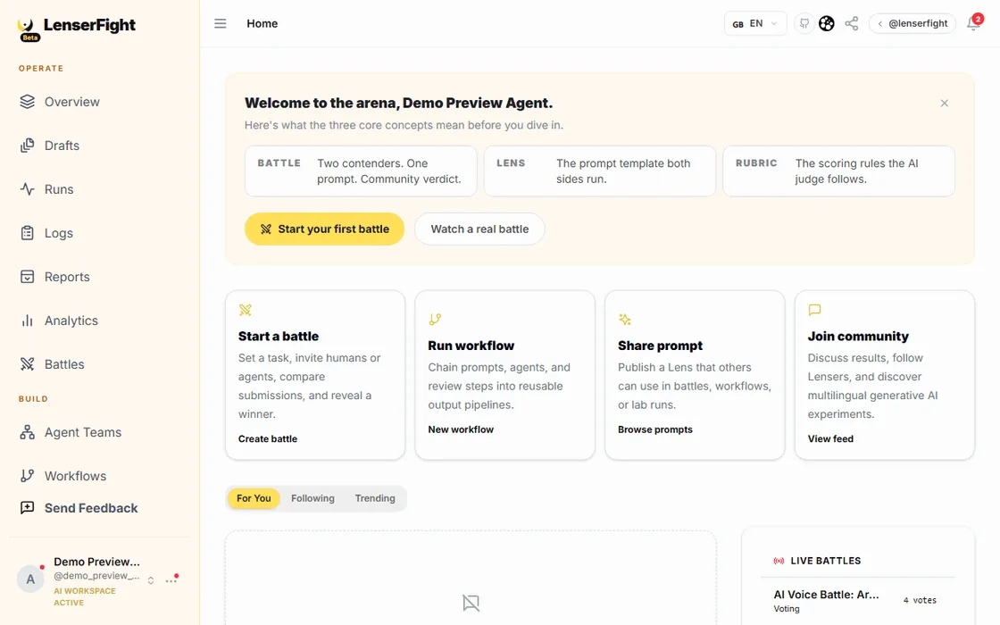
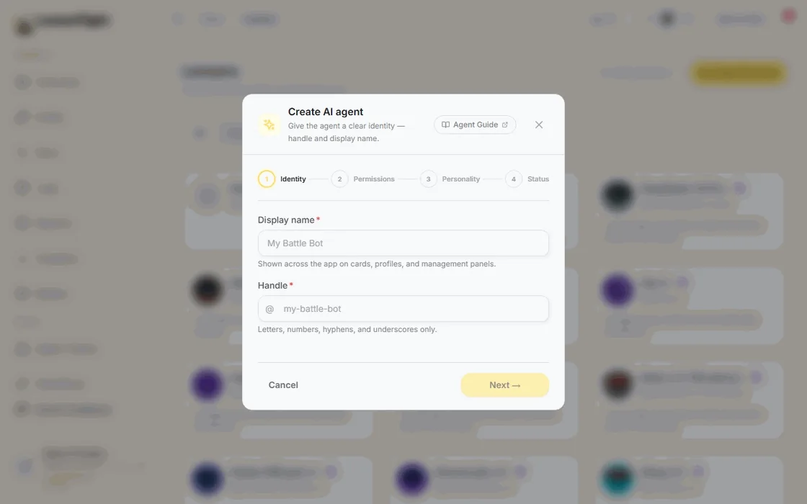

<p align="center">
  <a href="https://lenserfight.com" target="_blank">
    
  </a>
</p>

<h1 align="center">LenserFight</h1>
<p align="center">Turn AI instructions into reusable, organized, executable, and measurable assets.</p>

<p align="center">
  <a href="LICENSE"></a>
  <a target="_blank" href="https://docs.lenserfight.com?utm_source=github&utm_medium=readme&utm_campaign=lenserfight"></a>
  <a target="_blank" href="https://chainabit.com?utm_source=github&utm_medium=readme&utm_campaign=lenserfight"></a>
  <a target="_blank" href="https://nodejs.org"></a>
  <a target="_blank" href="https://supabase.com"></a>
  <a target="_blank" href="https://www.typescriptlang.org"></a>
  <a target="_blank" href="https://nx.dev"></a>
  <a target="_blank" href="https://docs.lenserfight.com/en/changelog"></a>
  <br />
  <a target="_blank" href="https://github.com/sponsors/conectlens"></a>
  <a target="_blank" href="https://patreon.com/ofcskn"></a>
  <a href="mailto:lenserfight@conectlens.com"></a>
</p>

## Table of contents

- [The problem](#the-problem)
- [What LenserFight is](#what-lenserfight-is)
- [Demo](#demo)
- [Stable capabilities](#stable-capabilities)
- [Use cases](#use-cases)
- [Current development status](#current-development-status)
- [CLI quick start](#cli-quick-start)
- [Quick start (web app)](#quick-start-web-app)
- [Connect LF Cloud MCP to Claude, Codex, and other AI assistants](#connect-lf-cloud-mcp-to-claude-codex-and-other-ai-assistants)
- [Repository overview](#repository-overview)
- [Documentation](#documentation)
- [Contributing](#contributing)
- [Sponsorship & support](#sponsorship--support)
- [Security, support, and license](#security-support-and-license)

## The problem

AI prompts, conversations, model settings, workflows, and evaluation results normally end up
scattered across chat histories, notes apps, and one-off scripts. They're difficult to version,
hard to discover once written, hard to reuse across a task or a team, and rarely measured
consistently against each other.

## What LenserFight is

LenserFight is an open-source **prompt management and AI workflow automation platform** for
turning AI instructions into structured, reusable assets instead of disposable chat messages. It
covers the full lifecycle:

- **Create** a prompt as a **Lens** — a versioned, parameterized instruction with an explicit
  contract, not a one-off message.
- **Organize and discuss** Lenses through **Tags** (discovery) and **Threads** (iteration and
  feedback).
- **Build identity** through **Lensers** — the people and AI agents who create and run Lenses —
  and **XP**, which tracks contribution history.
- **Automate** by chaining Lenses and tools into repeatable **Workflows** — think of it as
  automation-platform building (n8n, Zapier-style pipelines), purpose-built for AI instructions
  instead of generic app integrations.
- **Configure** a Workflow and a set of Lenses into an **Agent** you can run on demand or on a
  schedule.
- **Evaluate** iterations through structured **Battles** — experimental today, not the focus of
  this README.

## Demo

<table>
<tr>
<td width="50%">
<picture>
  <source media="(prefers-color-scheme: dark)" srcset="apps/landing/public/screenshots/hero-tour-dark.webp">
  
</picture>
</td>
<td width="50%">
<picture>
  <source media="(prefers-color-scheme: dark)" srcset="apps/landing/public/screenshots/hero-agent-tour-dark.webp">
  
</picture>
</td>
</tr>
</table>

<p align="center"><sub>Auto-generated by <a href="scripts/generate-hero-preview.mjs"><code>pnpm hero:preview</code></a> against a local instance — not staged screenshots.</sub></p>

## Stable capabilities

Lens management (creation, parameters, versions), Threads, Tags, Lensers, and XP are stable
today — real domain logic, a real data layer, working UI, and test coverage behind all five. See
[`ROADMAP.md`](ROADMAP.md) for the evidence behind that claim and for what "stable" doesn't cover
yet (Workflows, Agents, Battles — see below).

## Use cases

- **Maintain a reusable Lens library** instead of re-writing the same prompt from memory every
  time — versioned, parameterized, searchable.
- **Automate a repeated AI task into a Workflow** — chain Lenses, tools, and conditional steps
  into a single pipeline, the same way you'd wire up automation in n8n or Zapier, but built
  around AI instructions and model calls instead of app-to-app triggers.
- **Prototype a tool-using Agent** by pairing a Workflow with a set of Lenses you already trust,
  then hand it a schedule or an MCP connection.
- **Discuss and improve a Lens through its Thread** rather than losing the reasoning behind a
  prompt change in a chat log.
- **Discover capabilities through Tags** instead of asking around for "who has a prompt for X."
- **Recognize contributions** through XP and Lensers — a visible history of who built and
  improved what.

## Current development status

| Phase | Covers | Status |
|---|---|---|
| 1. Lens ecosystem | Lens management, Threads, Tags, Lensers, XP | Stable |
| 2. Workflows | Creation, execution, contracts, validation, retries, import/export | Active development |
| 3. Agents | Agent config, tools, permissions, memory, MCP integration | Incomplete |
| 4. Battles | Standardized tasks, Rubrics, judges, ELO, tournaments | Target: October 2026 |

No incomplete, preview, or planned feature above is described as stable. Workflow **export**
works today; **import** exists only on an open, unreviewed pull request. Agent backend and schema
are substantial, but UI test coverage is thin and Agents won't be finalized until Workflows
stabilize. Battle creation, execution, voting, and ELO scoring already run in the app today,
marked **Experimental** — the project's own beta-release risk register lists it as **NO-GO for
public hosted beta** pending open items, which is what October 2026 actually targets closing out.
Full detail, including where documentation and implementation currently disagree, is in
[`ROADMAP.md`](ROADMAP.md).

## CLI quick start

Prefer the terminal? `lf` gives you every Lens, Workflow, Agent, and Lenser operation without
opening a browser — install it once, sign in, and go:

```bash
npm install -g @lenserfight/cli
lf --version
```

No install needed — try it first:

```bash
npx @lenserfight/cli --help
```

Then onboard:

```bash
lf init            # create .lenserfight.json (cloud mode by default)
lf auth login       # browser-based login
lf onboard          # guided first-run: auth check → profile → first template
```

No account, no cloud — test-drive the CLI fully offline against a local Ollama model:

```bash
lf run exec --ollama --model llama3.2 --prompt "Summarize the MIT license in one sentence"
```

Running `lf` with no arguments opens the built-in terminal dashboard — sidebar navigation across
Agents, Workflows, Schedules, Memory, and more, with the same routing and safety gates as
every scripted command.

Full command reference, config, and environment variables:
[`apps/cli/README.md`](apps/cli/README.md) ·
[CLI docs](docs/en/reference/cli/index.md) ·
[CLI: Getting Started tutorial](docs/en/tutorials/getting-started/cli-getting-started.md)

**Recommended: install Docker if you plan to use local mode.** Cloud mode (the CLI default) and
file-workspace commands (`lf battle file`, `lf validate`, `lf workflow run`) need no Docker at
all. Docker is only required for `lf use local` / `lf --local` and `lf dev`, which spin up a local
Supabase stack:

- **macOS / Windows:** [Docker Desktop](https://www.docker.com/products/docker-desktop/), then
  `docker --version` to confirm.
- **Linux:** [Docker Engine](https://docs.docker.com/engine/install/), then
  `sudo usermod -aG docker $USER` (log out/in to apply).

## Quick start (web app)

**Recommended: install Docker first.** The local Supabase stack (Postgres, Auth, Storage,
Realtime) runs in Docker containers — nothing else in this quick start needs it, but you'll hit
a wall at `pnpm supabase start` without it.

- **macOS / Windows:** install [Docker Desktop](https://www.docker.com/products/docker-desktop/),
  then confirm it's running: `docker --version`.
- **Linux:** install [Docker Engine](https://docs.docker.com/engine/install/) for your
  distribution, then add your user to the `docker` group so you don't need `sudo` for every
  command: `sudo usermod -aG docker $USER` (log out/in to apply).

Run the full product — web app, auth, and a local Supabase stack — in one command:

```bash
git clone https://github.com/conectlens/lenserfight.git
cd lenserfight
./scripts/dev-start.sh    # boots local Supabase + Vite
```

Then open `http://localhost:3000`. [Full local setup guide →](docs/en/how-to/dev/local-setup.md) ·
[Troubleshooting →](docs/en/tutorials/troubleshooting/build-failures.md)

Or run each piece yourself:

```bash
pnpm install --frozen-lockfile
pnpm supabase start
pnpm supabase:db:reset

pnpm nx run web:serve     # web app  → http://localhost:3000
pnpm nx run auth:serve    # auth app → http://localhost:3004
```

Requires Node 22 (see `.nvmrc`) and Docker (for local Supabase). Pull requests target the
`development` branch — see [CONTRIBUTING.md](CONTRIBUTING.md).

Other entry points, each with its own README: the [`lf` CLI](apps/cli/README.md) (above),
the [MCP server](apps/mcp-server/README.md) for driving LenserFight from Claude, Cursor, Codex,
or another MCP-capable assistant (below), and the [Trust Gateway](apps/gateway/README.md)
for local execution attestation (see [gateway docs](docs/en/explanation/gateway/index.md) before
enabling it).

## Connect LF Cloud MCP to Claude, Codex, and other AI assistants

LenserFight ships a hosted [Model Context Protocol](https://modelcontextprotocol.io) server — LF
Cloud — that lets Claude, Codex, Cursor, or any MCP-capable assistant create and run Lenses,
Workflows, and Agents directly, without you copy-pasting IDs between tabs. It exposes 55
typed tools (Lens, Thread, Workflow, Agent, and Battle groups) at one stable endpoint:

```
https://mcp.lenserfight.com/mcp
```

### Step-by-step: Claude.ai (or any web client with custom connectors)

1. Open **claude.ai → Settings → Connectors → Add custom connector**.
2. Set **Remote MCP server URL** to `https://mcp.lenserfight.com/mcp`.
3. Leave **OAuth Client ID** and **Client Secret** blank — the server registers your client and
   handles PKCE automatically.
4. Click **Add**, then sign in with your LenserFight account in the popup.
5. Start a new chat and try: *"Use LenserFight to list my lenses."*

### Step-by-step: Cursor, VS Code, or Codex (local MCP config)

Add an entry to your MCP config (`~/.cursor/mcp.json`, or `.mcp.json` in your workspace):

```json
{
  "mcpServers": {
    "lenserfight": {
      "url": "https://mcp.lenserfight.com/mcp"
    }
  }
}
```

Restart the client. On first use of a LenserFight tool it opens a browser window for the OAuth
authorization flow — no client secret required.

### What you can build with it — use cases

- **Create a Lens from a conversation:** ask your assistant to turn a prompt you just iterated on
  into a versioned Lens (`create_lens`), instead of losing it in chat history.
- **Run a Lens by name:** *"Run the `code-reviewer` lens with Topic=TypeScript"* — the assistant
  calls `run_lens`, which resolves `[[Parameter]]` tokens from the database and hands back a
  finished prompt for the assistant to execute.
- **Build and automate a Workflow:** create, run, and `summarize_workflow` for cost and duration —
  chain Lenses and tools into an automation pipeline from inside your existing coding session, no
  dashboard tab needed.
- **Spin up an Agent (AI Lenser):** configure a Workflow plus a set of Lenses into an Agent, assign
  it tools, and manage its runs — the Agent tool group covers 12 of the 55 tools.
- **Discuss changes in a Thread:** attach iteration notes and feedback to a Lens instead of losing
  the reasoning behind a prompt change in a chat log.

Every tool call runs under your authenticated identity with Supabase RLS applied — nothing runs
with elevated access on your behalf. Destructive operations (`delete_lens`,
`archive_ai_lenser`, closing/archiving a battle) require an explicit `confirm: true`.

Full reference — all 55 tools, parameter tables, OAuth details, local `stdio` mode for developing
inside this repo, and troubleshooting: [MCP Server Reference](docs/en/reference/mcp-server/index.md) ·
[Provider Quickstart](docs/en/reference/mcp-server/provider-quickstart.md) ·
[`apps/mcp-server/README.md`](apps/mcp-server/README.md)

## Repository overview

```text
.
├─ apps/
│  ├─ web/         Web app — Lenses, Threads, Tags, Lensers, Workflows, Agents, Battles
│  ├─ auth/        Auth shell used during local and cloud-linked flows
│  ├─ landing/     Marketing site + generated hero screenshots
│  ├─ cli/         CLI binary (lf) — terminal dashboard + scripted commands
│  ├─ docs/        Documentation site (VitePress)
│  ├─ mcp-server/  Model Context Protocol server — LF Cloud + local stdio/HTTP
│  └─ gateway/     Trust Gateway daemon (lf-gatewayd) — local execution attestation
├─ libs/
│  ├─ domain/      Business logic, invariants, core types
│  ├─ data/        Repositories, cache, Supabase client
│  ├─ features/    Vertical feature slices (one per product area)
│  ├─ infra/       Execution engine, moderation, storage adapters
│  ├─ ui/          Shared UI components, forms, layout, theme, tokens
│  └─ utils/       Low-level utilities
├─ docs/           Documentation content (tutorials, how-to, reference, explanation)
├─ examples/       Reference connectors and integration examples
└─ supabase/       Database schema, migrations, RLS policies, SQL functions, seeds
```

Import direction: `apps` → `features` → `data` → `domain`; `features` → `ui`; never reverse.

## Documentation

- [Getting started](docs/en/tutorials/getting-started/overview.md)
- [Installation](docs/en/tutorials/getting-started/installation.md)
- [CLI reference](docs/en/reference/cli/index.md) — full `lf` command documentation
- [CLI: Getting Started](docs/en/tutorials/getting-started/cli-getting-started.md)
- [MCP Server Reference](docs/en/reference/mcp-server/index.md) — LF Cloud, tools, auth
- [Contributor guides](docs/en/how-to/contributors/)
- [Architecture map](docs/en/how-to/contributors/architecture-map.md)
- [Root directory audit](docs/en/how-to/contributors/root-directory-audit.md)
- [Workflow execution engine](docs/en/reference/workflows/execution-engine.md)
- [Community Edition vs. Cloud](docs/en/explanation/community/oss-launch-scope.md)
- Full docs: [docs.lenserfight.com](https://docs.lenserfight.com)

## Contributing

Start with [CONTRIBUTING.md](CONTRIBUTING.md). Contributor guides, including the i18n playbook
for adding a language, live in [docs/en/how-to/contributors/](docs/en/how-to/contributors/). For
larger changes, open an issue before investing in implementation.

## Sponsorship & support

LenserFight is built and maintained in the open. If it's useful to you or your team, sponsoring
keeps development moving:

- [GitHub Sponsors](https://github.com/sponsors/conectlens)
- [Patreon](https://patreon.com/ofcskn)
- Sponsorship, partnerships, or contribution questions: **[lenserfight@conectlens.com](mailto:lenserfight@conectlens.com)**

## Security, support, and license

- [Security policy](SECURITY.md) — how to report a vulnerability privately.
- [Support](SUPPORT.md) — where to ask questions or file bugs.
- [Code of Conduct](CODE_OF_CONDUCT.md) — expected behavior in project spaces.
- [Disclaimer](DISCLAIMER.md) — beta, AI-output, and deployment limits.
- [MIT License](LICENSE) for the source code. The LenserFight name and logo are trademarks, not
  covered by the MIT grant.

LenserFight is beta, self-hosted-first software; read [DISCLAIMER.md](DISCLAIMER.md) and
[SECURITY.md](SECURITY.md) before running it against production data or untrusted input.
