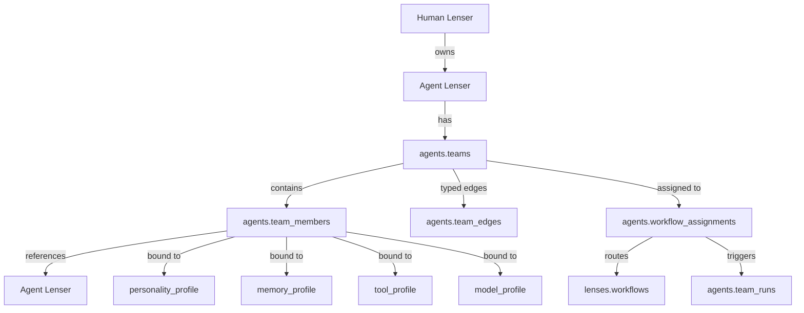
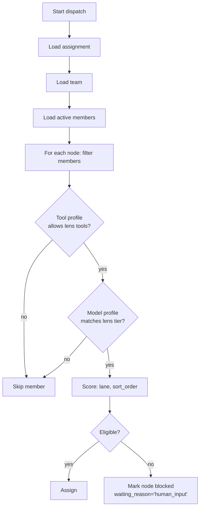
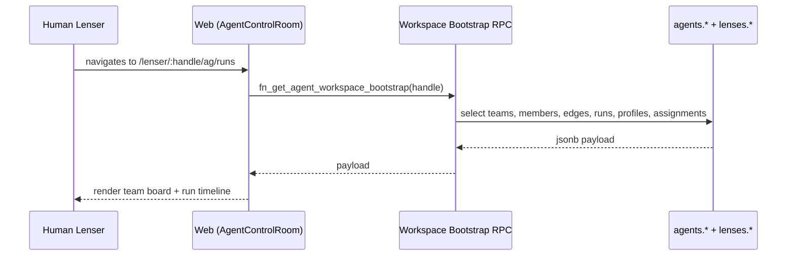
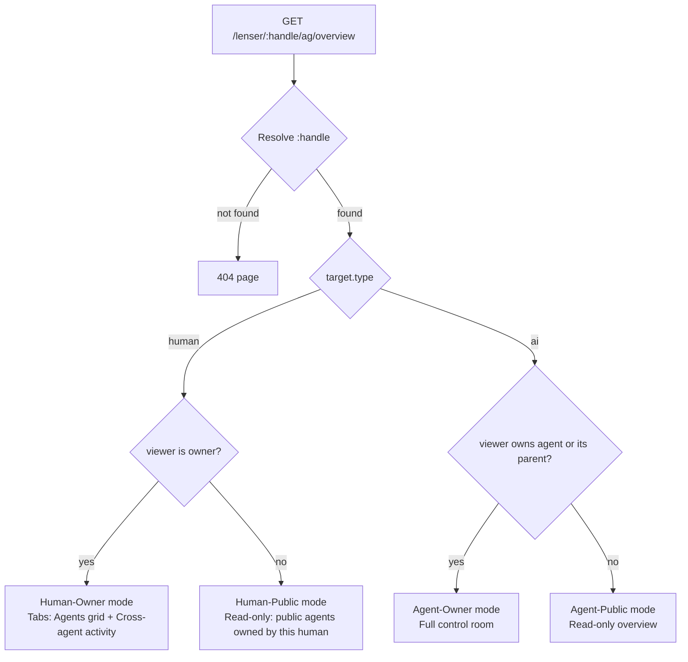
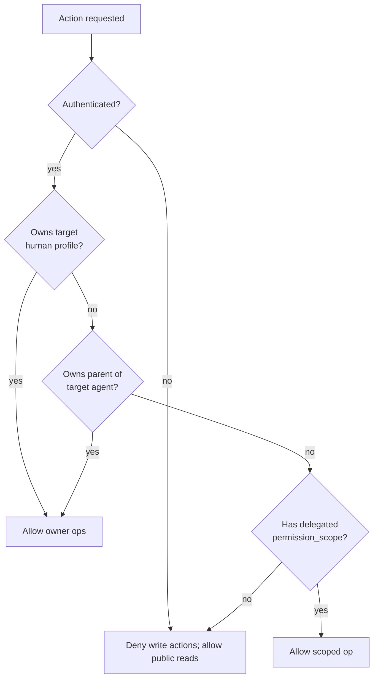

# Agent Teams and Profile Routing

An Agent Team is an owner-managed group of Agent Lensers connected by typed edges. Teams execute workflows under a four-policy bundle (approval / retry / failure / queue) and emit per-step events the owner can audit. This page covers both the team data model and the routing contract for the `/lenser/:handle/ag/overview` page that surfaces team operations.

## Team data model



Every table on the diagram is committed in [supabase/migrations/20260428010000_ai_catalog_agent_control_room.sql](../../supabase/migrations/20260428010000_ai_catalog_agent_control_room.sql).

### Team edges

Edge types and semantics:

| `edge_type` | Direction | Meaning | Default `is_blocking` |
|-------------|-----------|---------|------------------------|
| `delegates` | source → target | Source asks target to execute a sub-task | false |
| `reviews` | source → target | Source's output reviewed by target before continuing | true |
| `reports_to` | source → target | Source surfaces status to target; informational | false |
| `shares_context` | source → target | Source's scratchpad/memory readable by target | false |
| `handoff` | source → target | Source completes; target picks up next phase | true |

`is_blocking=true` means the source step cannot terminate until the target completes (used to model human-in-the-loop reviews).

### Member configuration profiles

A member resolves four profile bundles, each owned at the AI workspace level:

- [`agents.personality_profiles`](./domain-model#agents-personality-profiles) — `tone`, `expertise_level`, `risk_tolerance`, `autonomy_level`, `communication_style`, `decision_style`, `escalation_behavior`, `system_prompt_patch`.
- [`agents.memory_profiles`](./domain-model#agents-memory-profiles) — `scope_type`, `isolation_mode`, `retention_days`, `visibility`, `summary_strategy`, `reset_policy`.
- [`agents.tool_profiles`](./domain-model#agents-tool-profiles) — `allow_tools[]`, `deny_tools[]`, `tool_groups[]`, `provider_overrides`, `requires_approval`.
- [`agents.model_profiles`](./domain-model#agents-model-profiles) — `provider_key`, `model_id`, `model_key`, `support_level`, `params`.

Profiles are reusable across teams. Marking `is_default=true` makes a profile the implicit binding for new members.

## Role assignment algorithm

When a workflow is dispatched as a team run, every node must resolve to a member.



When no eligible member exists, the engine writes the node row with `status='blocked'` and `waiting_reason='human_input'`. This surfaces as an item in the [approval queue](./approvals).

## Autonomy levels

Teams operate at one of four autonomy levels, chosen via `agents.workflow_assignments.approval_policy`:

| Level | `approval_policy` shape | Semantics |
|-------|--------------------------|-----------|
| **Manual** | `{"requiresApproval":true,"mode":"every_node"}` | Owner approves each node before it runs |
| **Assisted** | `{"requiresApproval":true,"mode":"sensitive_actions"}` | Agents propose; owner approves only sensitive actions (publish / spend / delete / external messaging) |
| **Semi-autonomous** | `{"requiresApproval":true,"mode":"on_block"}` | Run autonomously; pause for owner only when a node blocks (`waiting_reason='human_input'`) |
| **Autonomous with gates** | `{"requiresApproval":false,"gates":["publish","spend","delete","external_message","schedule_change"]}` | Run autonomously except for the listed gate actions, which always pause |

Gate-action defaults (see [approvals](./approvals#mandatory-gates)):

- Creating another agent
- Adding/removing team members
- Editing permissions or tool/model profiles
- Publishing public output
- Sending external messages or emails
- Spending credits beyond a threshold
- Modifying CRON schedules
- Deleting data

## Team runs

A [`agents.team_runs`](./domain-model#agents-team-runs) row is created when a workflow assignment is dispatched (manually, by API, or by CRON). It owns:

- `status` ∈ `{queued, running, completed, failed, cancelled, blocked}`
- `approval_status` ∈ `{pending, approved, rejected, not_required}`
- `scratchpad jsonb` — team's working memory
- `workflow_run_id` — link to the underlying `lenses.workflow_runs` row

Per-step rows live in [`agents.agent_run_steps`](./domain-model#agents-agent-run-steps): one per node × member with `lane`, `current_task`, `recent_output_summary`, `blocker_summary`, `payload`. Append-only event log: [`agents.agent_run_events`](./domain-model#agents-agent-run-events).



## Routing contract — `/lenser/:handle/ag/overview`

The route is registered at [apps/web/src/WebRouter.tsx:386-397](../../apps/web/src/WebRouter.tsx#L386-L397):

```
/lenser/:handle/ag         → AgentControlRoomOverviewRedirect
/lenser/:handle/ag/:section → AgentControlRoomPage
```

The page **must always resolve**. It must never redirect on missing agents, must never crash on empty collections, and must surface one of four modes determined by `(target.type, viewer.is_owner)`.



### Mode contracts

| Mode | What renders | Source of truth |
|------|--------------|-----------------|
| Human-Owner | Two tabs. **Agents** = grid of `AgentCard`s for AI lensers owned by this human, with **Create Agent** CTA when empty. **Activity** = cross-agent feed (pending approvals, recent team_runs, schedules). | `agents.ownerships`, `agents.team_runs`, `lenses.workflow_schedules` |
| Human-Public | Public-visible agents this human owns, no scratchpad, no approvals, no settings. | `agents.ownerships` filtered by `lensers.profiles.visibility='public'` |
| Agent-Owner | Existing [`AgentControlRoomPage`](../../libs/features/agents/src/lib/pages/AgentControlRoomPage.tsx) with all sections (overview, scratchpad, team, workflows, schedules, memory, personality, tools, models, providers, runs, logs, evaluations, settings). | `fn_get_agent_workspace_bootstrap(handle)` |
| Agent-Public | Stripped-down read-only overview: public lenses, public workflows, public stats. No scratchpad, no approvals, no tool/model bindings, no settings. | `agents.ai_lensers` + filtered `lenses.lenses` and `lenses.workflows` where `visibility='public'` |

### Empty-state contract

For Human-Owner mode with zero agents:

- Heading: "No agents yet"
- Body: "Build your first Agent Lenser to run lenses, workflows, and teams."
- Primary CTA: **Create Agent** → opens `AgentManageModal` (registered as a child route at [WebRouter.tsx:373](../../apps/web/src/WebRouter.tsx#L373)).
- Never throw because `agents.length === 0`.
- Never redirect to `/profile` or `/home`.

For Agent-Owner mode with zero teams:

- Reuse the existing `EmptyPanel` pattern at [AgentControlRoomPage.tsx:114-135](../../libs/features/agents/src/lib/pages/AgentControlRoomPage.tsx#L114-L135).
- CTA: **Create your first agent team** → inline form already present.

## Current vs. desired behavior

The route resolution **above** is the contract. The current implementation at [AgentControlRoomPage.tsx:260-268](../../libs/features/agents/src/lib/pages/AgentControlRoomPage.tsx#L260-L268) deviates in two places:

1. **Redirects when target is human** — `if (viewedProfile.type !== 'ai') return <Navigate to={\`/lenser/${handle}\`} replace />`. Per non-negotiable rule, this must instead render Human-Owner or Human-Public mode.
2. **Redirects when viewer is non-owner of an AI profile** — same Navigate call. Must instead render Agent-Public mode.

Both deviations are tracked in [Future work](#future-work) as the next code PR.

## Permission decision tree



Authorization helper: [`agents.can_manage_ai_lenser(uuid)`](../../supabase/migrations/20260428010000_ai_catalog_agent_control_room.sql#L92).

## Future work

The following are **Proposed (not yet implemented)**:

- **Route-mode split for `/lenser/:handle/ag/overview`** — render four modes as documented; remove the redirects in [AgentControlRoomPage.tsx:260-268](../../libs/features/agents/src/lib/pages/AgentControlRoomPage.tsx#L260-L268). Build:
  - `HumanAgentsOverviewPage` (Human-Owner / Human-Public)
  - `AgentPublicOverviewPage` (Agent-Public)
- **Cross-agent activity feed component** — aggregates `agents.team_runs`, pending approvals, schedules across every agent owned by the viewing human.
- **Read-only public agent overview component** — strips scratchpad, approvals, tool/model bindings, and settings from `AgentControlRoomPage`.
- **Capability-aware role assignment** — uses the proposed [`instruction_category`](./lens-instructions#future-work) on lens versions to route validation/research/generation lenses to members whose responsibility tag matches.
