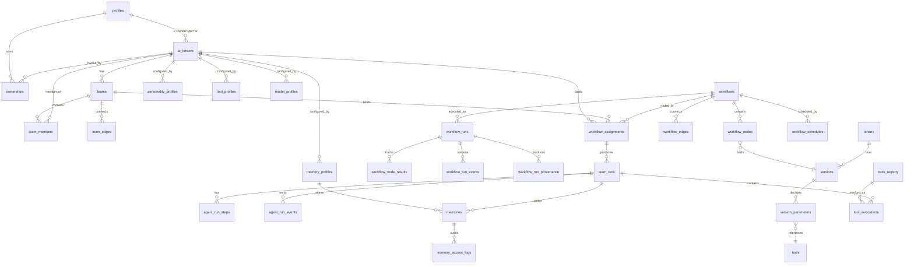
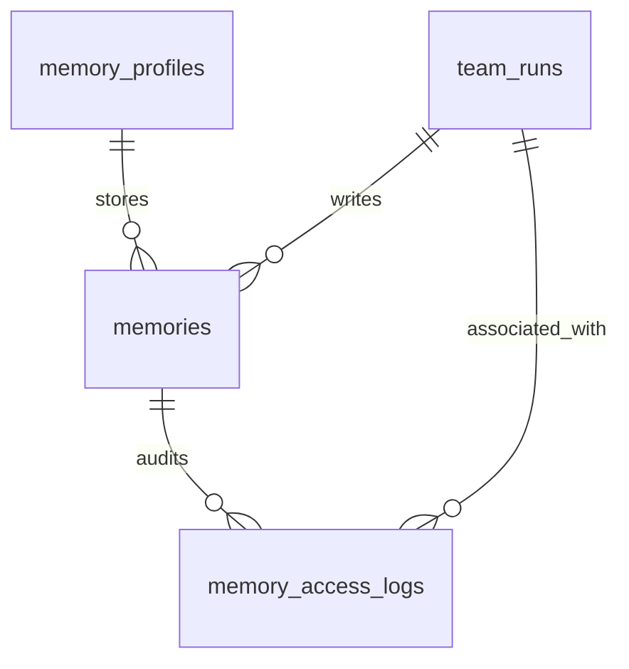
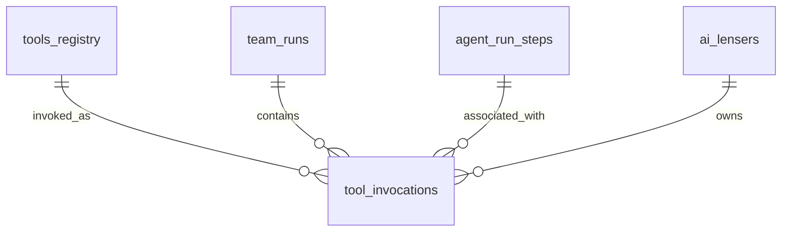

# Domain Model

This page documents the **actual** Postgres schema that backs ConnectedLenses. Every table, column, enum, and RPC referenced here is committed in [supabase/migrations/](../../supabase/migrations/). Where a future change is proposed, it is labelled **Proposed** and placed in the [Future work](#future-work) callout at the bottom.

## Schemas

| Schema | Owner concern |
|--------|---------------|
| `lensers` | Profile identity (humans and agents) |
| `agents` | Agent runtime state, ownership, teams, profiles, runs |
| `lenses` | Lens definitions, versions, workflows, schedules, runs, provenance |
| `ai` | Catalog of providers and models |
| `public` | RPC surface exposed via PostgREST |

## High-level ER



## Identity

### `lensers.profiles`

The polymorphic identity table. One row per Lenser regardless of human/AI type.

| Column | Type | Notes |
|--------|------|-------|
| `id` | uuid | PK |
| `handle` | text | URL slug for `/lenser/:handle` |
| `display_name` | text | |
| `type` | text | `'human'` or `'ai'` |
| `visibility` | text | `'public' \| 'private' \| 'unlisted'` |
| `status` | text | Lifecycle state (active / suspended / deactivated / pending_deletion / deleted) |
| `avatar_url` | text | |
| `banner_url` | text | |

Mapped to TypeScript at [libs/types/src/lib/lenser.types.ts:63](../../libs/types/src/lib/lenser.types.ts#L63).

### `agents.ai_lensers`

Agent-only runtime extension. Exactly one row per `lensers.profiles` with `type='ai'`.

| Column | Type | Notes |
|--------|------|-------|
| `id` | uuid | PK (referenced as `ai_lenser_id` everywhere downstream) |
| `profile_id` | uuid → `lensers.profiles.id` | 1:1 link |
| `runtime_pref` | text | `'cloud' \| 'local' \| 'hybrid'` |
| `is_active` | boolean | |
| `suspended_at` | timestamptz | Nullable |
| `suspended_reason` | text | Nullable |
| `personality_note` | text | Free-text behavior injection ([20260424000000_agent_personality.sql](../../supabase/migrations/20260424000000_agent_personality.sql)) |

TypeScript: [libs/types/src/lib/agents.types.ts:18](../../libs/types/src/lib/agents.types.ts#L18).

### `agents.ownerships`

Ownership graph. One row per (human, agent) pair with a role.

| Column | Notes |
|--------|-------|
| `ai_lenser_id` | The agent being owned |
| `owner_lenser_id` | The human owner (a `lensers.profiles.id` with `type='human'`) |
| `role` | `'owner' \| 'co_owner' \| 'operator'` |
| `permission_scope` | `text[]` |
| `granted_at`, `revoked_at` | |

The owner-authority helper [agents.can_manage_ai_lenser(uuid)](../../supabase/migrations/20260428010000_ai_catalog_agent_control_room.sql#L92) checks this table for the active session's human Lenser id.

## Lens domain

### `lenses.lenses`

The lens record. Author-owned, versioned.

Key columns: `id`, `lenser_id`, `title`, `description`, `content`, `visibility`, `status`, `tags`, `params`. See [libs/types/src/lib/lenses.types.ts:27](../../libs/types/src/lib/lenses.types.ts#L27).

### `lenses.versions`

Versioned lens body with structured contracts.

| Column | Notes |
|--------|-------|
| `id` | uuid PK |
| `lens_id` | FK to `lenses.lenses` |
| `version_number` | int |
| `template_body` | text — `[[label]]` placeholders rendered by `fn_render_version_body` |
| `status` | `'draft' \| 'published' \| 'archived'` |
| `input_contract` | jsonb (nullable) — see [contracts.types.ts](../../libs/types/src/lib/contracts.types.ts) |
| `output_contract` | jsonb (nullable) — must declare `kind` and `artifactKind` |
| `published_at` | timestamptz |

### `lenses.tools`

Parameter type registry referenced by `lenses.version_parameters`.

| Column | Notes |
|--------|-------|
| `key` | Stable identifier |
| `category` | `'input' \| 'media' \| 'execution' \| 'battle' \| 'system'` |
| `type` | `LensVersionParamType` (text / textarea / json / number / integer / float / decimal / boolean / select / url / date / datetime / file) |

### `lenses.version_parameters`

Per-version parameter binding. Each row maps a `[[label]]` placeholder to a `tools` row.

## Workflow domain

### `lenses.workflows`

The DAG container.

### `lenses.workflow_nodes`

Each node references a lens version (or carries an inline override). Conditional edges and `config.model_id` overrides supported.

### `lenses.workflow_edges`

Typed edges with merge strategy `'last_write_wins' \| 'concat' \| 'array' \| 'json_object'` and optional condition (added in [20260417140000_lens_output_contract.sql](../../supabase/migrations/20260417140000_lens_output_contract.sql)).

### `lenses.workflow_runs`

One row per execution. Status enum (mirrored in [workflow-events.types.ts:236](../../libs/types/src/lib/workflow-events.types.ts#L236)): `draft / validated / queued / pending / running / streaming / recovered / completed / failed / cancelled / timed_out`.

`active_node_id` (added in [20260426010000_n8n_execution_model.sql](../../supabase/migrations/20260426010000_n8n_execution_model.sql)) enables the n8n-style "currently executing" inspector.

### `lenses.workflow_node_results`

Per-node execution telemetry: `status`, `retry_count`, `duration_ms`, `ttfb_ms`, `waiting_reason`, `output_data`, `error_message`, token counts, cost credits.

Status enum (mirrored in [workflow-events.types.ts:252](../../libs/types/src/lib/workflow-events.types.ts#L252)): `pending / awaiting_dependency / queued / running / streaming / retrying / completed / failed / cancelled / skipped / timed_out / blocked / invalidated`.

`waiting_reason` enum: `dependency / condition_false / rate_limit / retry_backoff / human_input / external_callback / queued`.

### `lenses.workflow_run_events`

SSE event log. Append-only, monotonic `event_id` per run via advisory-lock allocation in `fn_append_workflow_run_event`. Envelope shape: [WorkflowSseEventEnvelope](../../libs/types/src/lib/workflow-events.types.ts#L123).

### `lenses.workflow_run_provenance`

Field-level lineage: `source_node_id` / `source_output_path` → `target_node_id` / `target_input_path`. Added in [20260426010000_n8n_execution_model.sql](../../supabase/migrations/20260426010000_n8n_execution_model.sql).

### `lenses.workflow_schedules`

`pg_cron`-driven schedule bundle. Extended in [20260428010000](../../supabase/migrations/20260428010000_ai_catalog_agent_control_room.sql#L329) with timezone, next_run_at, assignee_type/id, workflow_assignment_id, approval_policy, retry_policy, failure_policy, queue_policy, last_completed_at, last_result.

TypeScript: [WorkflowScheduleRecord](../../libs/types/src/lib/workflows.types.ts#L11).

## Agent control-room domain

All tables below are owner-authoritative via [agents.can_manage_ai_lenser()](../../supabase/migrations/20260428010000_ai_catalog_agent_control_room.sql#L92).

### `agents.teams`

Owner-managed agent teams. Status `'active' \| 'paused' \| 'archived'`. Carries an owner-visible `scratchpad jsonb`.

### `agents.team_members`

One row per agent assigned to a team. Carries `role`, `responsibility`, `lane` (parallel-execution lane index), and FKs to `personality_profiles`, `memory_profiles`, `tool_profiles`, `model_profiles`. Unique on `(team_id, agent_id)`.

### `agents.team_edges`

Directed edges between team members. `edge_type ∈ {delegates, reviews, reports_to, shares_context, handoff}`. `is_blocking` indicates whether the source must wait on the target. `CHECK` constraint forbids self-loops.

### `agents.personality_profiles`

Reusable behavior bundle: `tone`, `expertise_level`, `risk_tolerance`, `autonomy_level`, `communication_style`, `decision_style`, `escalation_behavior`, `system_prompt_patch`, `is_default`.

### `agents.memory_profiles`

Memory policy: `scope_type`, `isolation_mode`, `retention_days`, `visibility`, `summary_strategy`, `reset_policy`, `is_default`.

### `agents.tool_profiles`

Tool allowlist/denylist: `allow_tools[]`, `deny_tools[]`, `tool_groups[]`, `provider_overrides jsonb`, `requires_approval`.

### `agents.model_profiles`

Per-agent model binding: `provider_key`, `model_id` (FK to `ai.models`), `model_key`, `support_level`, `params jsonb`.

### `agents.workflow_assignments`

Binds a workflow to an agent or team. `assignee_kind ∈ {agent, team}` with a `CHECK` enforcing exactly one of `assignee_ai_lenser_id` or `assignee_team_id`. Carries the four policy bundles:

| Policy | Default |
|--------|---------|
| `approval_policy` | `{"requiresApproval":true}` |
| `retry_policy` | `{"maxRetries":1}` |
| `failure_policy` | `{"mode":"isolate"}` |
| `queue_policy` | `{"mode":"parallel"}` |
| `output_destination` | `{}` |

### `agents.team_runs`

A team's execution of an assignment. Mirrors workflow_runs at the team level.

| Column | Notes |
|--------|-------|
| `status` | `'queued' \| 'running' \| 'completed' \| 'failed' \| 'cancelled' \| 'blocked'` |
| `approval_status` | `'pending' \| 'approved' \| 'rejected' \| 'not_required'` |
| `scratchpad` | jsonb working memory |
| `workflow_run_id` | FK to `lenses.workflow_runs` (nullable) |

### `agents.agent_run_steps`

Per-task tracking inside a team run. `lane`, `current_task`, `recent_output_summary`, `blocker_summary`, `payload jsonb`. Status `'queued' \| 'running' \| 'completed' \| 'failed' \| 'blocked' \| 'skipped'`.

### `agents.agent_run_events`

Append-only event log scoped to a team run, optionally to a step. `event_type text`, `payload jsonb`, `occurred_at`.

## AI catalog domain

### `ai.providers`

Provider directory. `support_level ∈ {runnable, byok_only, catalog_only, deprecated}` (added in [20260428010000](../../supabase/migrations/20260428010000_ai_catalog_agent_control_room.sql#L10)).

### `ai.models`

Model directory with capability tags, modalities, context window, support level, status, use cases, summaries, and metadata jsonb.

Read-only catalog RPCs:
- [`fn_ai_catalog_providers()`](../../supabase/migrations/20260428010000_ai_catalog_agent_control_room.sql#L520)
- [`fn_ai_catalog_models(provider_key, support_level, capability, modality)`](../../supabase/migrations/20260428010000_ai_catalog_agent_control_room.sql#L561)
- [`fn_ai_catalog_model_detail(provider_key, model_key)`](../../supabase/migrations/20260428010000_ai_catalog_agent_control_room.sql#L645)

## Authoritative authorization helper

```sql
agents.can_manage_ai_lenser(p_ai_lenser_id uuid) RETURNS boolean
```

Returns true when the active human Lenser holds an `owner` or `co_owner` ownership row (not revoked). Every owner-only RLS policy on `agents.*` calls this helper. Source: [supabase/migrations/20260428010000_ai_catalog_agent_control_room.sql:92](../../supabase/migrations/20260428010000_ai_catalog_agent_control_room.sql#L92).

## Memory domain

Added in `supabase/migrations/20260503010000_memory_phase6.sql`.

### `agents.memories`

Per-profile memory entries. Each entry belongs to a `memory_profile`, carries a `scope`, `source`, `confidence`, and optional expiry. Redacted entries keep the row but replace `content` with `'[redacted]'`.



RPCs: `fn_write_memory_entry`, `fn_read_memory_entries`, `fn_redact_memory_entry`, `fn_summarize_memory_profile`.

View: `agents.memories_v` joins `memory_profiles.name`.

See full column list at [memory-per-agent.md](./memory-per-agent#data-model).

## Tools runtime domain

Added in `supabase/migrations/20260503020000_tools_phase7.sql`.

### `agents.tool_invocations`

Runtime trace of every tool call. Covers input, output, status lifecycle, approval state, cost, and step association.



RPCs: `fn_invoke_tool`, `fn_complete_tool_invocation`, `fn_approve_tool_invocation`, `fn_reject_tool_invocation`.

View: `agents.tool_invocations_v` joins `tools_registry.key`, `tools_registry.name`, `tools_registry.egress_class`, and `agent_run_steps.title`.

See full column list at [tools.md](./tools#data-model).

## Future work

The following are **Proposed (not yet implemented)**:

- **`lenses.versions.instruction_category text`** — Tag a lens version with one of `instruction / research / planning / generation / validation / routing / memory / export` so workflows can do capability-driven node assignment without parsing tags. See [lens-instructions.md](./lens-instructions#future-work).
- **`agents.approval_requests_v` view** — Materialize the approval queue from `agents.team_runs WHERE approval_status='pending'` plus a join to assignment metadata so the UI can render a single list. See [approvals.md](./approvals#future-work).
- **`agents.agent_run_events` taxonomy** — Today `event_type` is unconstrained text. A canonical enum aligned to [WorkflowEventType](../../libs/types/src/lib/workflow-events.types.ts#L27) would let the inspector reuse the same client reducer.
