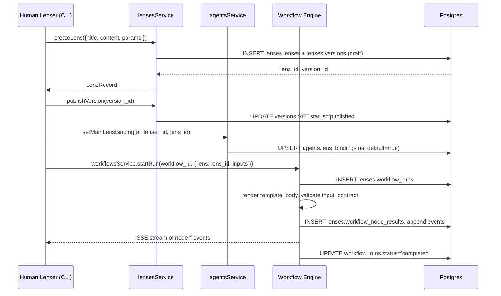
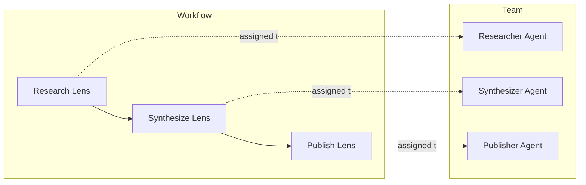

# Examples

These walkthroughs trace concrete request paths through the documented APIs and surface the contract between the schema, services, CLI, and frontend. Each example labels which steps are working today vs. **Proposed** behavior gated on the changes in [Future work](./agent-teams#future-work).

## Example 1 — Create a lens, bind it to an agent, run it

**Goal**: An owner authors a Research lens, binds it as the default research lens for an Agent Lenser, and runs it once with a custom prompt.



**CLI walkthrough** (today):

```bash
# 1. Create the lens (interactive editor, citty wizard)
lenserfight lens version create

# 2. Publish the head version
lenserfight lens version publish --lens <lens-id>

# 3. Bind to the agent (Proposed: no direct CLI today; use API)
# In code:
agentsService.setMainLensBinding(aiLenserId, lensId)

# 4. Execute via workflow run
lenserfight run --workflow <workflow-id> --inputs '{"topic":"agent orchestration"}'
```

**What you can verify**:

- The lens row appears in `lenses.lenses` with `head_version_id` set.
- The version row in `lenses.versions` carries the `input_contract` and `output_contract`.
- After binding, `agents.lens_bindings` has one row with `is_default=true`.
- After running, `lenses.workflow_runs.status` = `completed` and `lenses.workflow_node_results` has one row per node with timing and cost.

## Example 2 — Connected workflow, team execution, approval gate

**Goal**: An owner builds a three-node ConnectedLens workflow (Research → Synthesize → Publish), assigns it to an agent team with autonomy level **assisted**, dispatches a run, and the publish step pauses for owner approval.



### Setup

1. **Author lenses** (Example 1 covers this).
2. **Build the workflow**:

   ```ts
   const workflow = await workflowsService.createWorkflow({ title: 'Research → Publish', lenser_id })
   const nodes = await workflowsService.upsertNodes(workflow.id, [
     { lens_version_id: researchV1, label: 'Research' },
     { lens_version_id: synthV1, label: 'Synthesize' },
     { lens_version_id: publishV1, label: 'Publish' },
   ])
   await workflowsService.upsertEdges(workflow.id, [
     { source: nodes[0].id, target: nodes[1].id, merge: 'last_write_wins' },
     { source: nodes[1].id, target: nodes[2].id, merge: 'last_write_wins' },
   ])
   ```

3. **Build the team**:

   ```ts
   const team = await agentWorkspaceService.createTeam({ ai_lenser_id, name: 'Research Squad' })
   // (Proposed) addTeamMember calls — currently INSERT agents.team_members directly:
   await supabase.from('agents.team_members').insert([
     { team_id: team.id, agent_id: researcherAgentId, role: 'researcher', lane: 0 },
     { team_id: team.id, agent_id: synthesizerAgentId, role: 'synthesizer', lane: 1 },
     { team_id: team.id, agent_id: publisherAgentId, role: 'publisher', lane: 2 },
   ])
   ```

4. **Create assignment with assisted autonomy**:

   ```ts
   await supabase.from('agents.workflow_assignments').insert({
     ai_lenser_id,
     workflow_id: workflow.id,
     assignee_kind: 'team',
     assignee_team_id: team.id,
     approval_policy: { requiresApproval: true, mode: 'sensitive_actions', gates: ['publish_output'] },
     retry_policy: { maxRetries: 2, retryOn: ['rate_limit', 'provider_error'] },
   })
   ```

### Dispatch and approve

```mermaid
sequenceDiagram
    participant H as Human Owner
    participant API as Backend
    participant E as Engine
    participant DB as Postgres

    H->>API: dispatch team run (manual or CRON)
    API->>DB: INSERT workflow_runs + team_runs(approval_status='approved')
    Note over API,DB: Sensitive-actions mode → only gate is publish
    E->>DB: claim run; execute Research, Synthesize
    E->>DB: Publish node detects gate → status='blocked', waiting_reason='human_input'
    E->>DB: UPDATE team_runs SET approval_status='pending'
    DB-->>H: appears in approval queue
    H->>DB: UPDATE team_runs SET approval_status='approved' [+ optional modifications]
    DB->>E: row event
    E->>DB: unblock Publish, complete run
    E->>DB: agent_run_events: 'approval_granted'
```

**What you can verify**:

- After dispatch, `agents.team_runs.status='running'` and the Research+Synthesize nodes complete.
- The Publish node sits in `lenses.workflow_node_results.status='blocked'` with `waiting_reason='human_input'`.
- `agents.team_runs.approval_status` flips to `'pending'`.
- After approval, `approval_status='approved'` and the run completes.
- `agents.agent_run_events` contains `approval_granted` (or `approval_rejected`).

## Example 3 — Autonomous scheduled research with publish gating

**Goal**: A weekly Monday-08:00-Europe/Istanbul schedule dispatches the same Research → Synthesize → Publish workflow under an **autonomous-with-gates** assignment. The CRON runs without owner intervention until the publish step, which always pauses.

```bash
# Create the assignment with autonomous-with-gates policy
# (Proposed CLI; today via SQL or REST INSERT)
INSERT INTO agents.workflow_assignments (
  ai_lenser_id, workflow_id, assignee_kind, assignee_team_id,
  approval_policy, retry_policy, failure_policy, queue_policy
) VALUES (
  $1, $2, 'team', $3,
  '{"requiresApproval":false,"gates":["publish_output","spend_threshold"]}',
  '{"maxRetries":2}',
  '{"mode":"isolate"}',
  '{"mode":"serial","onMissed":"skip"}'
);
```

```bash
# Create the schedule
SELECT public.fn_upsert_workflow_schedule(
  p_workflow_id              => $1,
  p_cron_expr                => '0 8 * * 1',          -- Monday 08:00
  p_timezone                 => 'Europe/Istanbul',
  p_assignee_type            => 'team',
  p_assignee_id              => $2,
  p_workflow_assignment_id   => $3,
  p_approval_policy          => '{"requiresApproval":false,"gates":["publish_output","spend_threshold"]}',
  p_inputs_template          => '{"topic":"weekly digest"}'
);
```

### Run-time flow

```mermaid
sequenceDiagram
    participant Cron as pg_cron
    participant Tick as schedule tick fn
    participant E as Engine
    participant H as Human Owner
    participant DB as Postgres

    Cron->>Tick: Monday 08:00 Europe/Istanbul
    Tick->>DB: validate cron, owner, policies
    Tick->>DB: INSERT workflow_runs + team_runs (approval_status='approved' for non-gate)
    E->>DB: claim run; execute Research, Synthesize autonomously
    E->>E: Publish lens triggers gate 'publish_output'
    E->>DB: team_runs.approval_status='pending'; team_runs.metadata.gate_kind='publish_output'
    DB-->>H: notification + queue entry
    alt H approves
      H->>DB: approve
      E->>DB: complete Publish; run ends
      E->>DB: schedule.last_completed_at, last_result
    else H rejects
      H->>DB: reject
      E->>DB: workflow_run.status='failed'
      E->>DB: schedule.last_dispatch_status='dispatched' but run failed
    else Owner does not respond (timeout)
      E->>DB: workflow_run.status='timed_out'
      E->>DB: agent_run_events: 'approval_timed_out'
    end
```

**What you can verify**:

- The schedule is in `lenses.workflow_schedules` with `is_active=true` and `next_run_at` populated.
- After Monday 08:00, a new `workflow_runs` row exists with `status` advancing through `queued → running → ...`.
- Two of three nodes complete autonomously.
- The Publish node sits in `blocked` with `waiting_reason='human_input'`.
- `team_runs.approval_status='pending'` with `metadata.gate_kind='publish_output'`.
- `schedule.last_dispatch_status='dispatched'` (the dispatch itself succeeded; pending approval is run-level).
- After a decision, the run terminates and `schedule.last_completed_at` and `last_result` populate.

## Common patterns

### Idempotent dispatch

Pass an `idempotency_key` (Proposed envelope field) on dispatch. The engine refuses duplicate writes within a window. Today, prevent duplicate CRON dispatches by setting `queue_policy.mode='serial'`.

### Failure isolation

Set `failure_policy.mode='isolate'` (the default). When one branch fails, sibling branches continue. Combine with `retry_policy.maxRetries=2` for transient provider errors.

### Per-environment policy split

Use one assignment per environment (dev / stage / prod) bound to the same workflow but different teams and policy bundles. Schedules can target the appropriate assignment via `workflow_assignment_id`.

### Streaming the inspector

Open SSE on `lenses.workflow_run_events` filtered by `run_id`; render each event using [WorkflowEventType](../../libs/types/src/lib/workflow-events.types.ts#L27). On reconnect, fetch all events with `event_id > last_seen` from `workflowsService.listRunEvents`.

## Anti-patterns

- **Don't** call Supabase directly from the frontend or CLI for `agents.team_runs` mutations. Use `agentWorkspaceService` and (when shipped) `fn_decide_approval` so events and audit trails are written atomically.
- **Don't** disable approval gates by setting `approval_status='approved'` directly on a sensitive `team_run`. The proposed bypass-attempt audit will flag this.
- **Don't** hard-code a `next_run_at` on the schedule row. Let the tick fn compute it from `cron_expr` + `timezone`.
- **Don't** create parallel "agent profile" tables. Agents are `lensers.profiles` rows with `type='ai'`.

## Related

- [Lens instructions](./lens-instructions)
- [Workflow execution](./workflow-execution)
- [Agent teams](./agent-teams)
- [Scheduling](./scheduling)
- [Approvals](./approvals)
