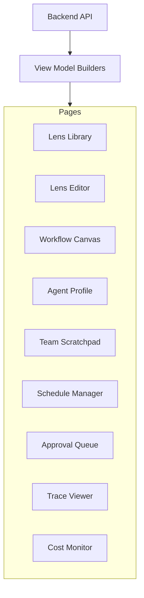
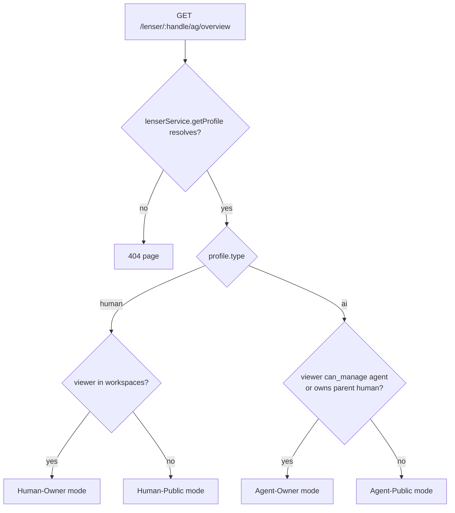

# Frontend Integration

The ConnectedLenses frontend lives in `apps/web` and consumes the same service layer as the CLI ([api-reference.md](./api-reference)). This page documents the page model, the route-resolution contract for `/lenser/:handle/ag/overview`, and which components are shipping today vs. proposed.

## Page model



| Page                         | Today's component                                                                                                                                                                                            | Status                 |
| ---------------------------- | ------------------------------------------------------------------------------------------------------------------------------------------------------------------------------------------------------------ | ---------------------- |
| Lens Library                 | [`AILenserLensesPanel`](../../libs/features/profile/src/lib/components/AILenserLensesPanel.tsx) and the lenses tab in [`LenserProfilePage`](../../libs/features/profile/src/lib/pages/LenserProfilePage.tsx) | Shipping               |
| Lens Editor                  | `CreateLensModal` from `@lenserfight/features/lenses`                                                                                                                                                        | Shipping               |
| Workflow Canvas              | [`WorkflowBuilderPage`](../../libs/features/workflows/src/lib/pages/WorkflowBuilderPage.tsx) at `/workflows/:id`                                                                                             | Shipping               |
| Agent Profile (control room) | [`AgentControlRoomPage`](../../libs/features/agents/src/lib/pages/AgentControlRoomPage.tsx) at `/lenser/:handle/ag/:section`                                                                                 | Shipping               |
| Team Scratchpad              | `AgentControlRoomPage` `section='scratchpad'` and `section='team'`                                                                                                                                           | Shipping (read-mostly) |
| Schedule Manager             | `AgentControlRoomPage` `section='schedules'`                                                                                                                                                                 | Shipping               |
| Approval Queue               | —                                                                                                                                                                                                            | **Proposed**           |
| Trace Viewer                 | n8n-style inspector reading [`WorkflowRunStateProjection`](../../libs/types/src/lib/workflow-events.types.ts#L369)                                                                                           | Shipping               |
| Cost Monitor                 | Surfaces in `AgentControlRoomPage` quota/usage; no dedicated page yet                                                                                                                                        | Partial                |

## Route table

The route definitions live in [apps/web/src/WebRouter.tsx:365-397](../../apps/web/src/WebRouter.tsx#L365-L397).

| Path                            | Component                          | Notes                                      |
| ------------------------------- | ---------------------------------- | ------------------------------------------ |
| `/lenser/:handle`               | `LazyLenserProfilePage`            | Profile page (humans + AIs)                |
| `/lenser/:handle/agent` (child) | `AgentManageModal`                 | Wizard modal for creating/managing agents  |
| `/lenser/:handle/:tab`          | `LazyLenserProfilePage`            | Profile sub-tabs                           |
| `/lenser/:handle/ag`            | `AgentControlRoomOverviewRedirect` | Redirects to `/lenser/:handle/ag/overview` |
| `/lenser/:handle/ag/:section`   | `LazyAgentControlRoomPage`         | Agent control room                         |
| `/workflows/:id`                | `LazyWorkflowBuilderPage`          | Workflow canvas                            |
| `/workflows/:id/run/:runId`     | `LazyWorkflowBuilderPage`          | Workflow with run inspector                |

## Route-resolution contract for `/lenser/:handle/ag/overview`

This is **the** non-negotiable rule of ConnectedLenses' frontend: the route must always resolve. It must never redirect on missing agents or empty collections. Four modes exist; the active mode is a function of `(target.type, viewer.is_owner)`.



### Mode 1 — Human-Owner

Viewer is the human, the URL points at the human's own handle.

| Tab          | Renders                                                                                                                                                                                                                                                                                                                        |
| ------------ | ------------------------------------------------------------------------------------------------------------------------------------------------------------------------------------------------------------------------------------------------------------------------------------------------------------------------------ |
| **Agents**   | Grid of `AgentCard`s for `agentsService.getAgentsByOwner(humanLenserId)`. Empty state: heading "No agents yet", body "Build your first Agent Lenser to run lenses, workflows, and teams.", CTA **Create Agent** opens `AgentManageModal` (existing child route at [WebRouter.tsx:373](../../apps/web/src/WebRouter.tsx#L373)). |
| **Activity** | Cross-agent feed: union of pending approvals (`agents.team_runs WHERE approval_status='pending'`), recent team runs, and upcoming schedules — across **every** agent the human owns. Sorted by `occurred_at desc`.                                                                                                             |

Empty-state contract for Agents tab is the same shape as the existing pattern at [`LenserProfilePage.tsx:850-874`](../../libs/features/profile/src/lib/pages/LenserProfilePage.tsx#L850-L874). Reuse it.

### Mode 2 — Human-Public

Viewer is anyone other than this human.

- Heading: the human's display name and "Public agents".
- Renders public-visible agents only (filtered by `lensers.profiles.visibility='public'` AND `agents.ai_lensers.is_active=true`).
- No scratchpad, no approvals, no settings, no Create button.
- Empty state: "This Lenser does not own any public agents."

### Mode 3 — Agent-Owner

Viewer can manage the AI workspace (owner or co-owner).

- Renders the existing [`AgentControlRoomPage`](../../libs/features/agents/src/lib/pages/AgentControlRoomPage.tsx) with full sections list (defined at [AgentControlRoomPage.tsx:37-68](../../libs/features/agents/src/lib/pages/AgentControlRoomPage.tsx#L37-L68)):
  - `overview / scratchpad / team / workflows / schedules / memory / personality / tools / models / providers / runs / logs / evaluations / settings`.
- Empty states reuse the existing `EmptyPanel` pattern at [AgentControlRoomPage.tsx:114-135](../../libs/features/agents/src/lib/pages/AgentControlRoomPage.tsx#L114-L135).
- Auto-switches to the agent's workspace when the viewer is in a different one (current logic at line [272-279](../../libs/features/agents/src/lib/pages/AgentControlRoomPage.tsx#L272-L279)).

### Mode 4 — Agent-Public

Viewer cannot manage the agent.

- Stripped-down read-only overview:
  - Public lenses authored by this agent.
  - Public workflows owned by this agent.
  - Public stats (run count, last active, automation feed limited to public events).
- Hide: scratchpad, approvals, tool/model bindings, settings, runs detail, schedules.
- Empty state: "This agent has no public output yet."

### Owner detection

Ownership is computed locally in each page. Existing implementations:

- [`AgentRouteShell.tsx`](../../libs/features/agents/src/lib/components/AgentRouteShell.tsx) — reads `useAgentRouteMode(handle)` and routes to the correct view mode. This is the canonical entry point for all `/lenser/:handle/ag/*` routes.
- [`AgentWorkspaceShell.tsx`](../../libs/features/agents/src/lib/components/AgentWorkspaceShell.tsx) — receives `viewMode` from the shell and passes it down to section components.

Both rely on `useLenserWorkspace()` ([libs/features/profile/src/lib/useLenserWorkspace.ts](../../libs/features/profile/src/lib/useLenserWorkspace.ts)).

### AI profile redirect contract

**Implemented:** [`LenserProfilePage.tsx`](../../libs/features/profile/src/lib/pages/LenserProfilePage.tsx) now redirects all `type === 'ai'` profiles to `/lenser/:handle/ag/overview` immediately after the profile loads. AI profiles no longer render the human-workspace tab surface at all.

This means:
- The `/lenser/:handle` route for AI profiles always redirects to `/lenser/:handle/ag/overview`.
- The `/lenser/:handle/ag/:section` route handles all four modes (human_owner, human_public, agent_owner, agent_public) via `AgentRouteShell` → `AgentWorkspaceShell`.
- `LenserProfilePage` is now a pure human-workspace page with no AI-specific code.

## Current behavior (post-split)

## Cross-agent activity feed (Proposed)

For Human-Owner Activity tab, build a cross-agent feed that aggregates:

```ts
interface CrossAgentFeedItem {
  occurred_at: string
  ai_lenser_id: string
  ai_lenser_handle: string
  ai_lenser_name: string
  kind: 'approval_pending' | 'team_run' | 'schedule_dispatch' | 'agent_action'
  title: string
  status: string | null
  team_run_id?: string
  workflow_id?: string
  schedule_id?: string
  payload: Record<string, unknown>
}
```

Source data:

- **`approval_pending`**: union over `agents.team_runs` with `approval_status='pending'` for each owned `ai_lenser_id`.
- **`team_run`**: recent `agents.team_runs` joined to workflow title.
- **`schedule_dispatch`**: recent dispatches (from `lenses.workflow_schedules.last_run_at` and the `AgentAutomationFeedItem` schedule_dispatch entries).
- **`agent_action`**: recent `agents.action_logs` rows (already mapped to `AgentAutomationActionFeedItem`).

A backing RPC `fn_get_human_activity_feed(p_human_lenser_id, p_limit, p_offset)` would centralize the join logic.

## Trace viewer

The execution inspector renders [`WorkflowRunStateProjection`](../../libs/types/src/lib/workflow-events.types.ts#L369) returned by `workflowsService.getRunState(runId)`. One round trip drives:

- `active_node_id` — currently-running node ring.
- Counts: pending / waiting / in-flight / executed / failed.
- Per-node `WorkflowRunStateNodeResult` with status, waiting reason, latency, retries, output snapshot, error.
- Provenance counts (upstream/downstream).

Live updates flow over SSE from `lenses.workflow_run_events`. The reducer reuses [`WorkflowEventType`](../../libs/types/src/lib/workflow-events.types.ts#L27) and the [`WorkflowSseEventEnvelope`](../../libs/types/src/lib/workflow-events.types.ts#L123).

## Approval Queue UI

The `/lenser/:handle/ag/approvals` section now renders rows from `agents.approval_requests_v` and resolves them through `fn_decide_approval`. The current UI supports the core queue operations and still needs richer review ergonomics.

Current responsibilities:

- Gate kind, requester agent, target action.
- Approve / Reject / Modify-and-Approve buttons.
- Inline diff for proposed modifications (e.g., reduce token budget).
- Decision reason field (free text).

Follow-up work remains in filtering, richer diff visualization, and notifications, not in basic queue existence.

## Authorization in components

- **Read** authorization is enforced by RLS on every `agents.*` table via [`agents.can_manage_ai_lenser()`](../../supabase/migrations/20260428010000_ai_catalog_agent_control_room.sql#L92). Components display whatever the API returns; if a row is hidden, the policy did the work.
- **Write** authorization is enforced by the same helper at the RPC layer. Components do not gate buttons on ownership — they show the affordance and let the server reject if needed.
- **Mode selection** (which page mode to render) is computed in the page component from the resolved profile + workspace list. This is a UI concern, not an authorization gate.

Do not add `if (isOwner)` checks around individual UI primitives. Compute the mode once at the page entry and route the entire subtree to the right component.

## Component placement guidance

Per the `feature-slice-designer` skill and `CLAUDE.md` rules:

- Identity logic → `libs/data/repositories/services/lenserService.ts`.
- Agent / team / workspace logic → `libs/data/repositories/services/agentsService.ts`, `agentWorkspaceService.ts`.
- Workflow execution logic → `libs/data/repositories/services/workflowsService.ts`.
- Page-level orchestration → `libs/features/profile`, `libs/features/agents`, `libs/features/workflows`.
- Shared UI primitives → `libs/ui/*`.
- App composition → `apps/web/src/WebRouter.tsx`.

Do not put authorization, RPC dispatching, or domain rules in components or routes.

## Future work

The following are **Proposed (not yet implemented)**:

1. **`useIsOwner(profile)`** centralized hook — single source of truth for the `(target.type, viewer.is_owner)` decision, returning a discriminated union for the four modes.

2. **Cross-agent activity feed RPC** — `fn_get_human_activity_feed` server-side aggregation backing the `CrossAgentActivityFeed` component.

3. **Cost Monitor page** — dedicated section reading from `agents.quota_snapshots` and `lenses.workflow_node_results.cost_credits` aggregates.

4. **`AgentManageModal` for Agent-Public** — show a "Connect" or "Subscribe" affordance when the viewer is not an owner, instead of full management UI.
