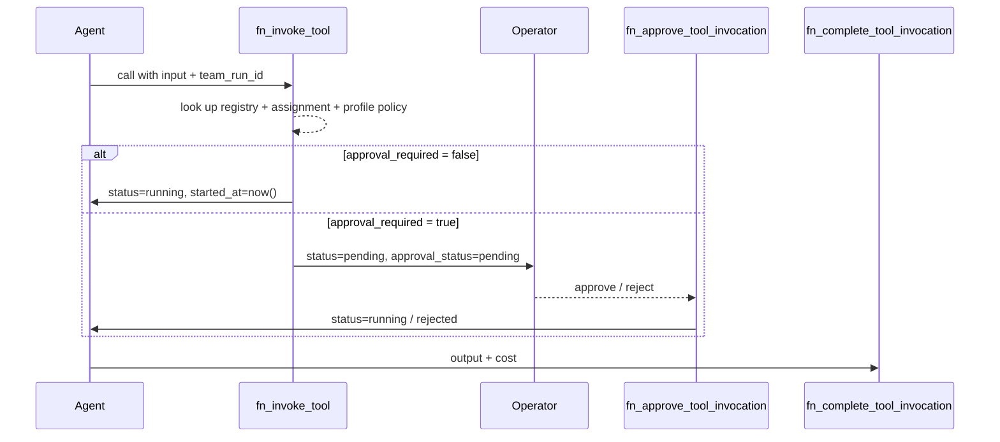

# Tools

The Tools layer lets AI agents call external capabilities — HTTP APIs, code executors, data fetches — while keeping operators in control of what leaves the platform and when.

## Primitives

| Primitive | What it is |
|-----------|-----------|
| **Tool Registry** | Catalog of available tools. Each tool has a key, schema, egress class, and risk metadata. |
| **Tool Assignment** | Binds a registry tool to a specific AI Lenser, optionally scoped to a tool profile. |
| **Tool Profile** | Policy bundle: overrides for `requires_approval`, cost limits, rate limits per agent. |
| **Tool Invocation** | Runtime trace of one tool call: input, output, status, approval state, cost, timestamps. |

## Egress classes

Every tool in the registry declares an `egress_class`:

| Class | Meaning | Auto-approval |
|-------|---------|---------------|
| `none` | No external network contact | Yes |
| `read_only` | External reads only (GET, SELECT) | Yes |
| `write` | Mutates external state | **No — always requires approval** |

When a tool's `egress_class` is `write`, a database trigger (`trg_tools_registry_egress_guard`) auto-flips `requires_approval=true` on INSERT or UPDATE. The client cannot bypass this server-side enforcement.

## Approval flow



An invocation is `approval_required` if any of these are true:
- `tools_registry.requires_approval = true`
- `tools_registry.egress_class = 'write'` (auto-set by trigger)
- Tool profile policy overrides `requires_approval`

## Data Model

### `agents.tools_registry` (extended)

The existing registry gains one column in the Phase 7 migration:

| Column | Type | Notes |
|--------|------|-------|
| `egress_class` | text | `'none' \| 'read_only' \| 'write'`; default `'none'` |

### `agents.tool_invocations`

| Column | Type | Notes |
|--------|------|-------|
| `id` | uuid | PK |
| `team_run_id` | uuid | FK → `agents.team_runs(id)` CASCADE |
| `agent_run_step_id` | uuid | FK → `agents.agent_run_steps(id)` SET NULL |
| `tool_id` | uuid | FK → `agents.tools_registry(id)` RESTRICT |
| `ai_lenser_id` | uuid | Denormalized for RLS |
| `input` | jsonb | Caller-provided payload |
| `output` | jsonb | Populated on completion |
| `status` | text | `'pending' \| 'approved' \| 'rejected' \| 'running' \| 'completed' \| 'failed'` |
| `approval_status` | text | `'pending' \| 'approved' \| 'rejected' \| 'not_required'` |
| `approval_required` | boolean | Computed at invoke time |
| `approval_decided_by` | uuid | Auth UID of the human who approved/rejected |
| `approval_reason` | text | Reason supplied on reject |
| `error` | text | Populated on failure |
| `cost_estimate` | numeric | Agent-reported cost (model tokens, API credits) |
| `started_at` | timestamptz | Set when status transitions to `'running'` |
| `completed_at` | timestamptz | Set by `fn_complete_tool_invocation` |
| `created_at` | timestamptz | |

Indexes: `(team_run_id, created_at DESC)`, `(ai_lenser_id, status)`, `(tool_id, created_at DESC)`, partial `(approval_status) WHERE approval_status='pending'`.

### View — `agents.tool_invocations_v`

Joins `tools_registry.key` as `tool_key`, `tools_registry.name` as `tool_name`, `tools_registry.egress_class`, and `agent_run_steps.title` as `step_title`.

## RPCs

| RPC | Purpose | Returns |
|-----|---------|---------|
| `fn_invoke_tool(p_team_run_id, p_tool_id, p_ai_lenser_id, p_input, p_agent_run_step_id?)` | Create invocation record. Compute `approval_required` from registry + profile. Set `status='running'` or `status='pending'`. | `uuid` (invocation id) |
| `fn_complete_tool_invocation(p_invocation_id, p_status, p_output?, p_error?, p_cost?)` | Write output, error, cost, `completed_at`. | `void` |
| `fn_approve_tool_invocation(p_invocation_id)` | Set `approval_status='approved'`, `status='running'`, `started_at=now()`. | `void` |
| `fn_reject_tool_invocation(p_invocation_id, p_reason)` | Set `approval_status='rejected'`, `status='rejected'`, record reason. | `void` |

### RLS

`agents.tool_invocations`: `USING/WITH CHECK agents.can_manage_ai_lenser(ai_lenser_id)`.

## Dispatch Integration

`useTeamRunDispatch` listens to `onEvent`. When a `tool_invocation_started | tool_invocation_completed | tool_invocation_failed` event arrives:

- `started` → `toolsService.invokeTool({ team_run_id, agent_run_step_id, tool_id, ai_lenser_id, input })`. The returned `invocation_id` is stored in a `Map<callId, invocationId>` local to that dispatch.
- `completed` / `failed` → `toolsService.completeInvocation({ invocation_id, status, output, error, cost_estimate })`.

Egress gating is **server-side only** — the dispatch hook trusts the RPC's verdict and surfaces the resulting `status` via `appendTeamRunEvent`. No client-side gate is needed.

## UI

Open the **Tools** tab in any agent workspace.

| Tab | Purpose |
|-----|---------|
| Registry | Browse registered tools with egress class, risk, and approval policy badges. |
| Assignments | Tools assigned to this agent with active tool profile. |
| Profiles | Tool policy profiles configuring per-agent overrides. |
| Invocations | Full invocation history, filterable by status/tool/date. Click a row to open `ToolInvocationDrawer`. |
| Approvals | Pending invocations that require human authorization. A badge counter on this tab shows the queue depth. |

### `ToolInvocationDrawer`

Modeled after `FailedCaseDrawer`. Sections:

- **Header** — status, approval status, egress class, and cost badges.
- **Input** — JSON viewer of the tool input payload.
- **Output / Error** — JSON viewer, shown when the invocation has completed or failed.
- **Approval footer** (visible to owner, only on `pending`) — Approve button + Reject button (opens `AlertDialog` requesting a reason via `TextArea`).

## CLI

```bash
# List registry tools (default), assignments, or profiles
lenserfight tool list [--registry|--assignments|--profiles] [--agent <ai-lenser-id>]

# Register a new tool from a TOOL.md contract (dry-run by default)
lenserfight tool register --file ./my-tool/TOOL.md [--apply]

# Validate a TOOL.md contract locally
lenserfight tool test ./my-tool/TOOL.md [--json]

# Assign a tool to an agent
lenserfight tool assign --tool <tool-id> --agent <ai-lenser-id> [--profile <profile-id>]

# Revoke an assignment
lenserfight tool revoke --tool <tool-id> --agent <ai-lenser-id>

# List invocations (all or filtered)
lenserfight tool invocations [--status pending|running|completed|failed] [--agent <id>] [--team-run <id>] [--limit 50]

# Approve or reject a pending invocation
lenserfight tool approve <invocation-id>
lenserfight tool reject  <invocation-id> --reason "unsafe egress target"
```

Source: [apps/cli/src/commands/tool.ts](../../apps/cli/src/commands/tool.ts)

## Verification

```bash
# 1. Services pass
pnpm nx test data-repositories --testFile toolsService.spec.ts

# 2. Dispatch tool-routing test
pnpm nx test agents --testFile useTeamRunDispatch.spec.ts

# 3. CLI smoke
lenserfight tool list --registry
lenserfight tool invocations --status pending
```

**Manual walkthrough:**

1. Register a `read_only` tool, assign it to an agent, run a workflow that invokes it → Invocations tab shows a row that reaches `completed`.
2. Register a `write` tool. Verify the registry shows `requires_approval=true` (trigger auto-set it). Trigger an invocation → row appears in the Approvals tab.
3. Click **Approve** in the UI → `approval_status` flips to `approved`, `status` to `running`.
4. Use `lenserfight tool approve <id>` for the same flow from the CLI.

## Risks and open decisions

- **`--force-no-approval` escape hatch** for write-class tools in dev environments is not implemented. Add it to `fn_invoke_tool` as a `p_bypass_approval` flag gated on `service_role` if needed.
- **Approval unification** — Phase 4 already has approval primitives. Cross-link via `tool_invocations.approval_id` in a future migration if unification becomes useful.
- **Cost reporting** is self-reported by the agent runtime. No server-side validation yet.
