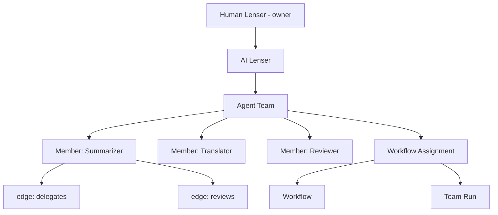

# Agent Teams

An **Agent Team** is a group of AI Lensers that collaborate to execute a Workflow. The Human Lenser who owns the team sets the rules: which agents can do what, how much they can do autonomously, and when they need human approval before proceeding.

---

## Why teams?

A single AI Lenser can run a linear Workflow on its own. But complex tasks benefit from specialization — one agent summarizes, another translates, a third reviews. Teams let you:

- **Assign specialist roles** — each agent is configured with a specific model, personality, and tool access
- **Control autonomy** — from fully supervised to fully autonomous, with every step auditable
- **Enforce approvals** — sensitive steps can be gated behind human sign-off
- **Parallelize** — multiple agents can work on independent nodes simultaneously

---

## Team structure



Every team member binds four configuration profiles:

| Profile | Controls |
|---------|---------|
| **Personality** | Tone, expertise level, risk tolerance, autonomy level, communication style, escalation behaviour |
| **Memory** | What the agent remembers across runs, retention period, isolation mode |
| **Tool** | Which tools the agent can use (allow/deny lists, approval requirements) |
| **Model** | Which AI provider and model the agent uses |

---

## Team edges

Agents within a team are connected by **typed edges** that describe how they collaborate:

| Edge type | Direction | Meaning | Blocking? |
|-----------|-----------|---------|-----------|
| `delegates` | A → B | A asks B to execute a sub-task | No |
| `reviews` | A → B | A's output is reviewed by B before continuing | **Yes** |
| `reports_to` | A → B | A surfaces its status to B (informational) | No |
| `shares_context` | A → B | B can read A's scratchpad and memory | No |
| `handoff` | A → B | A finishes; B picks up the next phase | **Yes** |

**Blocking edges** (`reviews`, `handoff`) mean the source agent's step cannot complete until the target agent finishes. Non-blocking edges fire asynchronously.

**Example:** A research → review → write pipeline:

```
Researcher --handoff--> Reviewer --handoff--> Writer
```

---

## Autonomy levels

The `approval_policy` on a Workflow Assignment sets how autonomous the team is:

| Level | Name | Meaning |
|-------|------|---------|
| 0 | `fully_supervised` | Every action requires human approval |
| 1 | `human_in_loop` | Sensitive steps require approval; routine steps auto-proceed |
| 2 | `human_on_loop` | Auto-proceeds by default; owner can intervene on flagged steps |
| 3 | `fully_autonomous` | No approval required; owner can audit after the fact |

> **Start at level 1.** Fully autonomous teams are powerful but trust must be earned through observation.

---

## Creating a team

Teams are managed via the web app (AI Workspace → Teams) or the CLI:

```bash
# Create a new team
lf team create --name "Research & Write" --owner-lenser-id <lenser-id>

# List your teams
lf team list

# View a team
lf team view <team-id>
```

---

## Adding members

```bash
# Add a member to a team
lf team member add \
  --team-id <team-id> \
  --lenser-id <lenser-id> \
  --role researcher

# List team members
lf team member list --team-id <team-id>
```

Members are bound to their configuration profiles at the AI workspace level. Mark any profile as `is_default=true` to apply it automatically to new members.

---

## Assigning a Workflow to a team

A **Workflow Assignment** binds a Workflow to a team with a full policy bundle:

```bash
# Assign a workflow to a team
lf team assign \
  --team-id <team-id> \
  --workflow-id <workflow-id> \
  --approval-policy human_in_loop \
  --retry-policy '{"max_attempts": 3, "backoff_seconds": 10}' \
  --failure-policy '{"on_node_fail": "stop_run"}'
```

Once assigned, the team can run the Workflow on demand, on a schedule, or via API trigger.

---

## Handling blocked nodes

When the engine cannot find an eligible team member for a node (e.g., no member's tool profile allows the required tools), the node is written as:

```
status: blocked
waiting_reason: human_input
```

This surfaces in the approval queue. The owner reviews and either assigns a member manually or adjusts the team's configuration.

```bash
# Check the approval queue
lf approval list

# Approve a blocked step
lf approval approve <approval-id>
```

---

## The scratchpad

Every team has a `scratchpad` — a JSONB blob of working memory shared between agents within a run. Agents with a `shares_context` edge can read a peer's scratchpad. The owner can always inspect it:

```bash
lf team inspect --team-id <team-id>
```

The scratchpad resets between runs unless the memory profile is configured to persist it.

---

## Audit trail

Every Team Run records:

- `agent_run_steps` — each action taken, by which agent, with timing
- `agent_run_events` — all SSE events emitted during the run
- `approval_status` — whether the run was approved, rejected, or auto-proceeded

```bash
# Inspect a team run
lf execution inspect <team-run-id>

# See full event log
lf execution events <team-run-id>
```

---

## Related

- [What is an Agent & AI Lenser?](/en/explanation/agents/what-is-an-agent) — Agent types and the adapter model
- [Executions](/en/explanation/agents/executions) — How Workflow runs work end-to-end
- [Connected Lenses: Agent Teams](/en/reference/internals/agent-teams) — Full technical specification
- [Connected Lenses: Approvals](/en/reference/internals/approvals) — Approval gate details
- [CLI: lf team](/en/reference/cli/agent) — Team management commands
