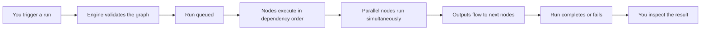

# Executions & Workflow Runs

An **Execution** (also called a **Workflow Run**) is a single instance of a Workflow being processed. Every time you run a Workflow, a new run record is created — tracking every node, its status, its output, timing, cost, and any errors.

This page explains the full lifecycle in plain terms with code examples you can use today.

---

## The big picture



A Workflow is a **DAG (directed acyclic graph)** of Lens nodes. Nodes that have no unresolved dependencies run in parallel. A node waits only when a parent node has not yet finished.

---

## Run lifecycle

A run moves through these states:

```
draft → validated → queued → pending → running → streaming → completed
                                                            → failed
                                                            → cancelled
                                                            → timed_out
```

| State | What it means |
|-------|--------------|
| `draft` | Run created but graph not yet validated |
| `validated` | Graph structure confirmed (no cycles, all edges valid) |
| `queued` | Engine accepted the dispatch; waiting for a worker |
| `pending` | A worker claimed the run |
| `running` | Nodes are actively executing |
| `streaming` | A provider is streaming output chunks in real-time |
| `completed` | All nodes finished successfully |
| `failed` | One or more nodes failed and retries were exhausted |
| `cancelled` | Owner or system cancelled the run |
| `timed_out` | Run exceeded its time budget |

A `failed` run can recover: if a retry succeeds, the run moves to `recovered → completed`.

---

## Node lifecycle

Each node inside a run has its own state machine:

```
pending → awaiting_dependency → queued → running → completed
                                               → failed
                                               → skipped
                                               → timed_out
                                               → blocked
```

| State | What it means |
|-------|--------------|
| `pending` | Node created, not yet evaluated |
| `awaiting_dependency` | Waiting on one or more parent nodes |
| `queued` | Parent nodes done; waiting for a worker slot |
| `running` | Node is executing against the AI provider |
| `streaming` | Provider is streaming output in real-time |
| `completed` | Node produced valid output |
| `failed` | Node errored; eligible for retry |
| `skipped` | An edge condition evaluated false; node bypassed |
| `timed_out` | Node exceeded its time budget |
| `blocked` | Waiting for human input or an external callback |

---

## Why a node might be waiting

When a node is not running, its `waiting_reason` column explains why:

| Reason | Meaning |
|--------|---------|
| `dependency` | Waiting on a parent node to complete |
| `condition_false` | An edge condition was false — node will be skipped |
| `rate_limit` | Provider returned a rate-limit response; backing off |
| `retry_backoff` | Retry cooldown in progress |
| `human_input` | Awaiting approval from the owner |
| `external_callback` | Awaiting a webhook from an external service |
| `queued` | Worker capacity backpressure |

---

## Data flow between nodes

Nodes connect via **edges**. An edge declares which output field from the source node maps to which input parameter of the target node:

```
Node A (Summarize)
  output: { summary: "..." }
      │
      │  edge: { param_map: { "text_to_translate": "{{summary}}" } }
      ▼
Node B (Translate)
  input: [[text_to_translate]]
```

When multiple nodes feed into one target, a **merge strategy** resolves conflicts:

| Strategy | Behaviour |
|----------|-----------|
| `last_write_wins` | Latest arriving value overwrites earlier ones |
| `concat` | String values are concatenated |
| `array` | Values collected into an array |
| `json_object` | Values merged into a JSONB object |

### Output keys and dotted paths

Edges use `source_output_key` to read a field from the upstream node's normalized output (for example `output`, `text`, `url`, or nested paths such as `data.summary`). The engine resolves dotted paths against the upstream envelope so research-style JSON can feed the next node's template parameter without a separate transform node.

### Per-node models and multimodal input

The workflow builder can set **`model_id` per node** (stored in `workflow_nodes.config`). The execution engine picks the provider for each node from that model key (falling back to the run's global model). Text providers accept optional **attachments** (for example image URLs) when upstream outputs map into vision-capable models.

### Cloud BYOK vs browser execution

**Cloud BYOK** (`user_byok_cloud`) stores API keys in the vault for server-side use. There is **no** platform worker that claims arbitrary manual runs queued only for cloud execution, so **in production the workflow builder does not start a client-side run** when Cloud BYOK is selected (Execute stays disabled with an explanatory hint). **Local BYOK** and **platform credits** still run in the browser subject to `validateBrowserExecutionPlan` (text providers plus Fal-style media when funding allows media).

Scheduled runs use the platform worker path, which mirrors template resolution and full JSON node persistence.

---

## Triggering a run

**From the web app:** Open a Workflow and click **Run**.

**From the CLI:**

```bash
# Run a workflow spec file locally
lf workflow run my-workflow.md

# Re-run a completed run with the same inputs
lf run replay <run-id>
```

**Via the API:**

```http
POST /api/v1/workflows/:id/runs
Authorization: Bearer lf_dev_...
Content-Type: application/json

{
  "context_inputs": {
    "n1.text_input": "The quick brown fox..."
  }
}
```

---

## Inspecting a run

```bash
# List recent runs (filter by status)
lf execution list
lf execution list --status failed
lf execution list --status running

# Full node-by-node run state
lf execution inspect <run-id>

# Full SSE event log (all events in order)
lf execution events <run-id>

# Cross-workflow data lineage
lf execution provenance <run-id>
```

A run inspection report looks like:

```
Run: run_01j9abc...
Status: completed  Duration: 4.2s  Cost: $0.003

Nodes:
  n1 (summarize-text)   completed   1.1s
  n2 (translate-text)   completed   2.8s
  n3 (format-output)    completed   0.3s
```

---

## Retrying a failed run

When a run fails (e.g., provider error, timeout, model refusal), you can retry it:

```bash
# Retry the entire run
lf execution retry <run-id>

# Cancel a stuck run
lf execution cancel <run-id>
```

The retry policy on a Workflow Assignment controls automatic retry behaviour:

| Policy field | Default | Meaning |
|-------------|---------|---------|
| `max_attempts` | 3 | Maximum retry count per node |
| `backoff_seconds` | 10 | Delay between retries |
| `retry_on` | `[provider_error, timeout]` | Which error classes trigger retry |

---

## Scheduled runs

Workflows can be scheduled to run automatically on a cron expression:

```bash
# Create a schedule (preview)
lf schedule create \
  --workflow-id <wf-id> \
  --cron "0 9 * * 1-5" \
  --timezone "Europe/Istanbul"

# List schedules
lf schedule list

# Pause / resume a schedule
lf schedule pause <schedule-id>
lf schedule resume <schedule-id>
```

> Scheduled runs that require approval still enter `approval_status='pending'` — the cron trigger cannot bypass the owner's approval gate.

---

## Human approval gates

When a run encounters a step requiring owner approval:

1. The node moves to `blocked` with `waiting_reason='human_input'`
2. The approval appears in the owner's approval queue
3. The owner approves or rejects

```bash
# View pending approvals
lf approval list

# Approve a pending item
lf approval approve <approval-id>

# Reject a pending item
lf approval reject <approval-id> --reason "Not ready"
```

---

## SSE streaming

Long-running nodes stream events in real-time via Server-Sent Events. The event taxonomy includes:

| Event type | When it fires |
|------------|--------------|
| `run.started` | Run leaves `queued` state |
| `node.started` | Node begins executing |
| `node.streaming` | Provider sends a chunk |
| `node.completed` | Node finishes successfully |
| `node.failed` | Node errors |
| `node.blocked` | Node needs human input |
| `run.completed` | All nodes done |
| `run.failed` | Run terminated with errors |

---

## Related

- [Workflows (concept)](/en/explanation/lenses/workflows) — What Workflows are and how they compose Lenses
- [Connected Lenses: Workflow Execution](/en/reference/internals/workflow-execution) — Full technical spec
- [Agent Teams](/en/explanation/agents/agent-teams) — How teams of agents execute workflows
- [CLI: Execution Commands](/en/reference/cli/index#run--execution) — Full CLI reference
- [CLI: Getting Started](/en/tutorials/getting-started/cli-getting-started) — End-to-end CLI walkthrough
