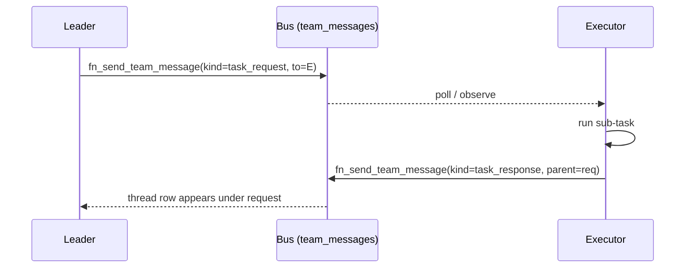
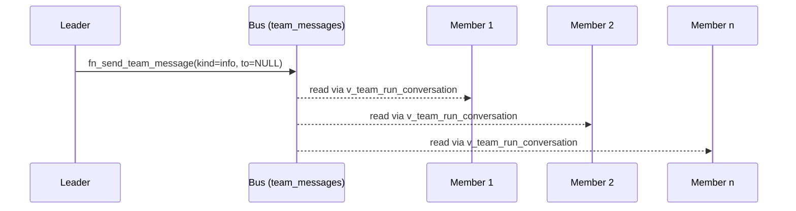
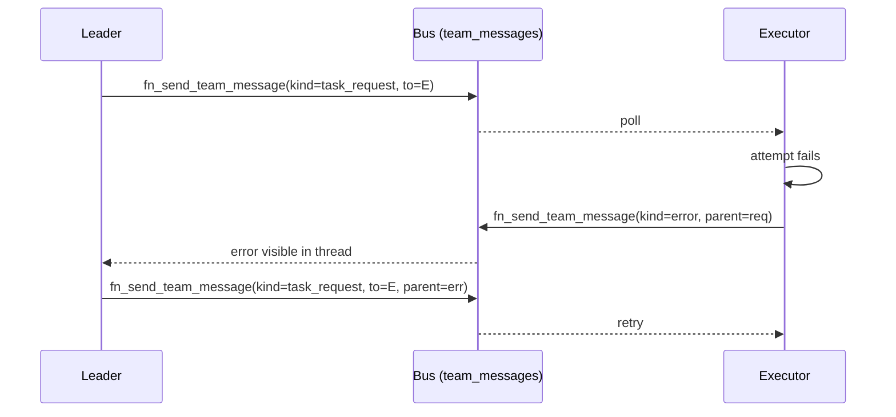

# Team Coordination

Phase X introduced five primitives that turn a team graph (see [Agent Teams](/en/explanation/agents/agent-teams)) into a runtime coordination surface:

1. **Inter-agent messages** — append-only log of structured messages scoped to a `team_run`.
2. **Conversation thread** — recursive view that reconstructs parent/child message chains.
3. **Shared scratchpad** — JSON document on `team_runs`, mutated through an optimistic-lock RPC.
4. **Role gates** — `team_members.role` constrains who can lead, execute, review, observe, or operate.
5. **Delegation policy** — per-node configuration that declares whether delegation is allowed.

These primitives are owner-scoped: the underlying tables and the conversation view enforce ownership through `agents.can_manage_ai_lenser(ai_lenser_id)`.

---

## Message kinds

Every row in `agents.team_messages` carries a `kind`:

| Kind | Use |
|---|---|
| `task_request` | Leader (or peer) asks another agent to do work. |
| `task_response` | Reply tied to a `task_request` via `parent_message_id`. |
| `info` | Status, progress, broadcast. |
| `error` | An agent reports a failure; observers can react. |

`to_agent_id IS NULL` means **broadcast** to every member of the team_run.

---

## Sequence: delegation

A leader asks an executor to run a sub-task and waits for the response.



Both messages share the same `team_run_id`. The response carries `parent_message_id = <request id>`, which lets `agents.v_team_run_conversation` link them in the thread.

---

## Sequence: broadcast

A leader signals every team member at once. `to_agent_id` is `NULL`.



Broadcasts are useful for status updates and shared context that does not require a reply.

---

## Sequence: error recovery

An executor fails, emits a `kind='error'`, and the leader retries with a new message.



Errors do not unwind the run; they are signals. Callers decide whether to retry, escalate, or abandon.

---

## Roles

`agents.team_members.role` is constrained to a fixed set:

| Role | Meaning |
|---|---|
| `leader` | May delegate without an additional approval gate. |
| `executor` | Runs assigned tasks; cannot delegate further. |
| `reviewer` | Implicit human-equivalent approval at node end. Presence of an active reviewer flips `agents.fn_node_requires_review` to `true`. |
| `observer` | Read-only on the scratchpad and message bus. |
| `operator` | Back-compat default; existing rows that predate Phase X stay here and silently bypass the new gates. |

The CHECK was added by [migration `20270505000000_phase_x_agent_messages.sql`](../../../supabase/migrations/20270505000000_phase_x_agent_messages.sql). Existing non-conforming rows must be backfilled before the constraint can be re-validated.

---

## Shared scratchpad

`agents.team_runs.shared_scratchpad` is a `jsonb` document. It is **only** mutable via `agents.fn_merge_shared_scratchpad(p_team_run_id, p_patch, p_expected_version)`:

- Merge semantics use the `||` operator — keys in `p_patch` win at the **top level**. There is no deep-merge; pass nested objects explicitly if you want to preserve sibling keys.
- The function is an atomic check-and-update: the predicate `shared_scratchpad_version = p_expected_version` guards concurrent writers.
- On version drift, the function raises `ERRCODE 40001` with message `scratchpad_version_conflict: expected <X> current <Y>`.
- Successful merges return the new document and the new version (old + 1).

### Retry pattern

```text
loop:
  read shared_scratchpad, shared_scratchpad_version
  compute patch from local state
  call fn_merge_shared_scratchpad(run, patch, version)
  on 40001: re-read and retry (with bounded attempts)
```

`SQLSTATE 40001` is the standard serialization-failure code. Treat it as transient and retry — do not propagate it as a hard error.

---

## Message cap

A BEFORE INSERT trigger enforces **1000 messages per `team_run`**. On the 1001st insert, Postgres raises `ERRCODE 54000` with `team_messages_cap_exceeded`. The append is rejected; existing messages are untouched.

Operators that need a higher ceiling must coordinate via the SQL agent: today the limit is a constant inside `agents.fn_enforce_team_messages_cap()`. There is no per-team_run override field.

---

## Delegation policy

`WorkflowNodeConfig.delegationPolicy` accepts three values:

| Value | Meaning |
|---|---|
| `auto` | Default. Delegation is allowed without an extra gate. |
| `approval_required` | Delegation must pass a human-approval check before executing. |
| `forbidden` | Delegation is rejected outright; the engine refuses to fan out the call. |

Helpers `resolveDelegationPolicy()` and `assertDelegationAllowed()` live in [`libs/infra/execution/src/lib/workflow-execution.service.ts`](../../../libs/infra/execution/src/lib/workflow-execution.service.ts).

::: warning Forward declaration
The policy field, type, and helpers ship in Phase X, but the execution engine does not yet have a live delegation path. The policy will be enforced when the delegation runtime ships. Setting `forbidden` today is documentation-only — it has no enforcement target.
:::

---

## Related

- [Agent Teams](/en/explanation/agents/agent-teams) — team graph, edges, profiles
- [Build a Multi-Agent Team](/en/how-to/agents/build-a-multi-agent-team) — end-to-end walkthrough
- [`lf team` reference](/en/reference/cli/team) — CLI surface
- [Known Limitations](/en/reference/known-limitations#agentic-teams) — caps and gaps
