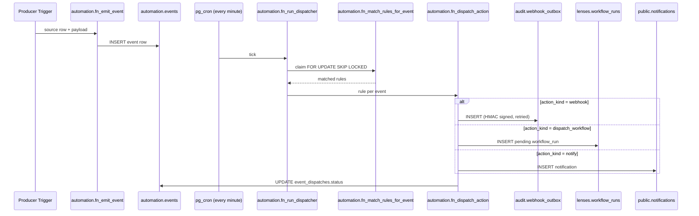

# Event Bus Architecture

LenserFight's automation engine turns platform events into automated reactions — without polling, without bespoke scripts, and without leaving Postgres. This page explains how it works.

## What this solves

Before the automation engine, operators chained CRON jobs and external workers to react to platform activity. There was no way to say "when a battle finalizes, post to Slack" without writing and hosting a poller. The automation engine fills that gap with three primitives:

- **Producers** — Postgres triggers that emit typed events into `automation.events`.
- **Trigger rules** — declarative matchers that map event types and payload filters to actions.
- **Actions** — three built-in handlers: `dispatch_workflow`, `webhook`, and `notify`.

## Architecture



## Producers and event types

The engine ships with five seed event types, wired via sibling `AFTER` triggers. Existing application functions are not modified.

| Event type | Source table | Fires when |
|---|---|---|
| `battle.finalized` | `battles.battles` | `status` transitions to `closed` |
| `battle.flagged` | `audit.moderation_decisions` | INSERT with `decision_type='flagged'` |
| `workflow_run.completed` | `lenses.workflow_runs` | `status` transitions to `succeeded` |
| `workflow_run.failed` | `lenses.workflow_runs` | `status` transitions to `failed` or `timed_out` |
| `approval.granted` | `agents.team_runs` | `approval_status` transitions to `approved` |
| `approval.timed_out` | `agents.team_runs` | `approval_status` transitions to `timed_out` |

Producer payloads carry IDs and timestamps only. Free-form user content is never included by default — operators that need richer payloads can write their own producers and explicitly opt content in.

## Filter DSL

`match_filter` is a JSON object mapping a JSON-Pointer path (RFC 6901) to a single matcher object:

```yaml
match_filter:
  /winner_contender_id:
    eq: "00000000-0000-0000-0000-000000000001"
  /finalized_at:
    gt: "2026-08-01T00:00:00Z"
```

The DSL is intentionally minimal and **frozen**:

| Operator | Semantics |
|---|---|
| `eq` | Strict JSONB equality |
| `neq` | Strict JSONB inequality |
| `gt` / `lt` | Numeric or ISO-8601 timestamp comparison |
| `contains` | String LIKE for scalars; `?` containment for arrays |

A filter of `{}` matches every event of the configured type. Multiple top-level keys are combined with logical AND.

## Idempotency

`automation.event_dispatches` has a composite primary key `(event_id, rule_id)`. The dispatcher claims unprocessed events with `FOR UPDATE SKIP LOCKED` and inserts dispatch rows with `ON CONFLICT DO NOTHING`. Re-running the cron tick — or running the dispatcher manually — can never double-fire an action.

## Action handlers

- **`dispatch_workflow`** — inserts a row into `lenses.workflow_runs` with `metadata.origin='automation'` and `metadata.trigger_rule_id`. The existing workflow worker picks it up unchanged.
- **`webhook`** — enqueues into `audit.webhook_outbox`. Phase P3 owns delivery: HMAC-SHA256 signing, exponential backoff, dead-lettering, strict-signing mode.
- **`notify`** — calls `public.fn_create_automation_notification`, which fans out through the existing notification system.

Failures are recorded in `event_dispatches.status='failed'` with the SQL error message. Operators see them via [`lf automation history`](/en/reference/cli/automation-rules) or the `/automations` web page.

## What's NOT in scope

- **Sub-second latency.** `pg_cron` ticks at minute granularity. Dispatch p99 is ≤ 60 s. Push-mode via `LISTEN/NOTIFY` is a future optimization documented in the migration's `TODO(phase-u-followup)` block.
- **Cross-tenant rules.** Rules are scoped to a single `lenser_id`. There is no global rule.
- **Generic SQL conditions.** The DSL is deliberately tiny. Operators that need richer logic should write a `dispatch_workflow` rule and put the logic in the workflow.

## Related

- [Build your first trigger](/en/how-to/automation/build-your-first-trigger) — concrete walkthrough
- [Trigger rule schema](/en/reference/automation/trigger-rule-schema) — full YAML reference
- [`lf automation` CLI](/en/reference/cli/automation-rules) — command reference
- [Webhook outbox (Phase P3)](/en/explanation/community/task-schema-governance) — signing, retries, dead-lettering
