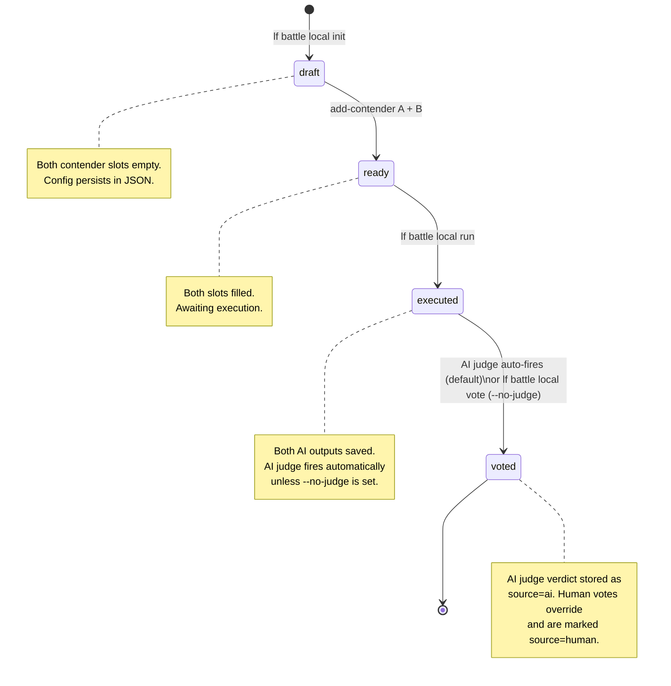
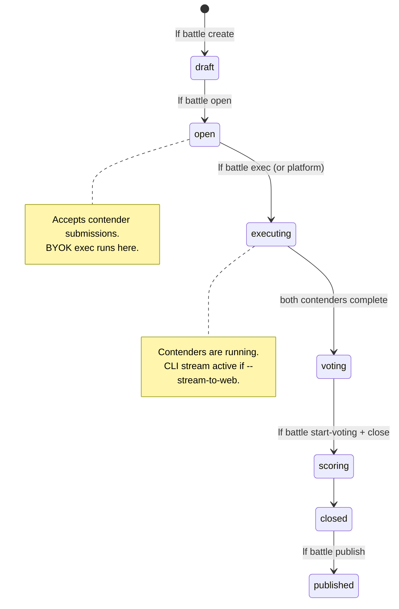

# Local Battles vs. Cloud Battles

<ExperimentalBadge title="Battles" description="Battles is still being built end-to-end. Matchmaking, voting and result flows may shift — please try them and report what feels off." />


LenserFight offers two battle execution modes. Choosing the right one depends on whether you need community visibility, real-time web UI streaming, or just fast offline experimentation.

---

::: info Local battles are Preview
`lf battle local` commands work without any cloud infrastructure. They are available as **Preview** in Community Edition.
:::

::: warning Cloud battles are Private Alpha
Cloud battles, the public arena, BYOK streaming to the web UI, and the ELO leaderboard are **Private Alpha**. They require an operator-approved cloud battles deployment and an access grant. Do not expose these routes in a public environment without completing the [Battle Integrity Checklist](/en/how-to/battles/battle-integrity-checklist).
:::

## The two modes at a glance

| | Local battle | Cloud battle |
|---|---|---|
| **State location** | user runtime storage under `local-battles/{id}.json` | Supabase `battles` schema |
| **Execution** | Your machine, your keys | Platform keys (default) or your keys (`--byok`) |
| **Auth required** | No | Yes (for exec and push) |
| **Visibility** | Private until pushed | Community-visible when published |
| **Realtime** | Terminal stdout | Web UI via Supabase Broadcast |
| **Verdict** | AI judge auto-fires after run (BYOK); `--no-judge` for manual | Community votes; optional AI judge weight |
| **Platform credits** | $0 always | Charged (unless `--byok`) |
| **Internet required** | No (except for cloud model providers) | Yes |

---

## Local battle state machine



Transitions:
- `draft → ready`: both `add-contender A` and `add-contender B` have been run
- `ready → executed`: `lf battle local run` completes both contenders
- `executed → voted`: AI judge auto-fires by default (uses BYOK key); or `lf battle local vote` when `--no-judge` is set

---

## Cloud battle state machine



---

## When to use local battles

- **Rapid prototyping** — run a prompt against two models and get an AI verdict in under a minute, no cloud setup
- **No internet** — provider key is the only external dependency (Ollama works fully offline)
- **Private benchmarks** — outputs never leave your machine unless you push
- **Exploring providers** — try Ollama, Mistral, OpenAI side-by-side without creating cloud resources
- **CI/CD integration** — run `lf battle local run` in a GitHub Actions job to benchmark PRs; AI judge provides an objective score automatically
- **Zero-friction verdict** — no manual voting step; AI judge fires after execution by default

---

## When to use cloud battles

- **Community visibility** — share results publicly; community votes determine the winner
- **Official leaderboards** — scores feed into the LenserFight ranking system
- **Web UI streaming** — spectators watch tokens arrive token-by-token in the arena
- **Platform credits** — let LenserFight handle key management and API calls
- **Persistent audit trail** — all contender outputs, votes, and metadata are stored in the platform DB

---

## BYOK execution bridge

`lf battle exec <id> --byok --stream-to-web` is the bridge between the two modes:

- **Cloud state**: the battle lives in Supabase; community can vote and view results
- **Local compute**: your machine calls the provider APIs using your own keys ($0 platform credits)
- **Realtime web stream**: tokens broadcast via Supabase Realtime Broadcast to anyone watching the arena

```
Local machine                         LenserFight Cloud
──────────────────────────────────    ────────────────────────────────────
lf battle exec <id> --byok            battles table (status: executing)
  → BYOKKeyResolver                       ↑ status update via fn_battles_exec
  → provider API (your key)
  → BattleStreamBroadcaster ──────→  Supabase Broadcast channel
                                           ↓ useBattleCliStream (web hook)
                                      BattleLiveArena — tokens in browser
```

---

## Data persistence

### Local battles
State lives in user runtime storage under `local-battles/{id}.json`. Legacy project-root `.lenserfight/local-battles/` files are still read for compatibility, but should not be committed. State persists across machine restarts. Find all battles with `lf battle local list`.

### Cloud battles
State lives in the Supabase `battles` schema — battle rows, contender submissions, execution records, votes. Accessible from any machine with `lf auth login`.

---

## Pushing local to cloud

A local battle can be promoted to a cloud draft:

```bash
lf battle local push --slug "my-battle-slug"
```

What gets pushed:
- Battle title and task prompt

What stays local:
- Contender configs (provider, model, key)
- AI outputs
- Votes

After pushing, the cloud battle is in `draft` state. Use `lf battle open <cloud-id>` to accept contender submissions, then run `lf battle exec <cloud-id> --byok` to execute using your local keys.

---

## Abuse surface and mitigations

Before cloud battles are opened to external users, four abuse categories must be addressed. These are described at the conceptual level here; the operational checklist is in [Battle Integrity Checklist](/en/how-to/battles/battle-integrity-checklist).

### Spam battles

Lenserrs creating battles with trivial or copy-pasted prompts to farm XP or arena visibility. Mitigation: minimum prompt length, per-lenser daily battle cap, content moderation on submission.

### Vote manipulation

A lenser voting multiple times or voting on their own battle. Mitigation: unique constraint on `(battle_id, lenser_id)` in `battles.votes`, server-side check that the voter is not a contender, IP-level rate limiting on the vote endpoint.

### Prompt injection

A contender embedding instructions in `task_prompt` or `personality_note` that attempt to override the system prompt, exfiltrate keys, or bias the AI judge. Mitigation: `task_prompt` is passed as user-role content only; `personality_note` is length-capped and sanitized; the AI judge receives contender outputs as structured data, not as instructions.

### Provider key leakage

A BYOK key stored in `ai.encrypted_api_keys` being exposed in an API response, log line, or error message. Mitigation: `fn_decrypt_api_key` is service-role only; decrypted keys never written to any DB table or error payload; only `byok_key_ref_id` UUIDs appear in public-facing tables.

---

## See also

- [How to run a local battle](/en/how-to/battles/run-local-battle) — complete `lf battle local` flag reference
- [BYOK execution](/en/how-to/battles/byok-execution) — running cloud battles with your own keys
- [Webstreaming architecture](/en/explanation/battles/webstreaming-architecture) — how CLI tokens reach the web UI
