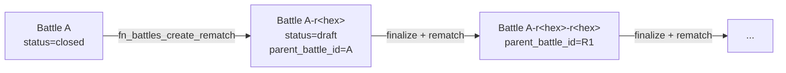

# Rematches, Replays, and Series

<ExperimentalBadge title="Battles" description="Battles is still being built end-to-end. Matchmaking, voting and result flows may shift — please try them and report what feels off." />

Phase V (Battles v2) introduces three new primitives on top of the existing battle lifecycle:

- **Rematches** — a finalized battle can be cloned into a new draft that carries a `parent_battle_id` pointer back to its source. Owners trigger this manually; series trigger it automatically.
- **Replays** — the `/battles/:slug/replay` page renders a `BattleReplayTimeline` that walks the recorded execution events in order. Replays are read-only and do not require the battle to be live.
- **Series** — owner-curated chains of battles where the most recent member is used as the parent for the next rematch on a cron schedule. The dispatcher runs hourly via `pg_cron`.

Rematches are scoped to terminal-state battles (`closed`, `published`, `archived`). Drafts and in-flight battles cannot be rematched.

---

## Rematch lineage

Every battle row carries a nullable `parent_battle_id` that points at the battle it was forked from. Organic battles leave this column `NULL`; rematches set it to the source battle's id. The relationship is enforced by `battles.battles.parent_battle_id REFERENCES battles.battles(id) ON DELETE SET NULL` so deleting an upstream parent does not orphan the child — the link simply clears, and the rematch remains visible.

The structural fields copied to the child are: `task_prompt`, `rubric_id`, `max_contenders`, `battle_type`, `voter_eligibility`, `handicap_config`, `workflow_id`, `lens_id`, `content_type`. Active contenders are reseated with a one-slot rotation (two-contender battles swap A↔B; three-or-more rotate by one position). Withdrawn, disqualified, and eliminated parent contenders are not carried forward.

The authenticated entry point is `public.fn_battles_create_rematch(uuid)`. It enforces that the caller owns the parent battle and that the parent is in a terminal status. A parallel internal function `battles.fn_create_rematch_internal(uuid)` exists for the series dispatcher and is restricted to `service_role`.

---

## Tournament series

A **series** is an owner-curated chain of battles that produces one new rematch per matching cron tick.

| Column | Purpose |
|---|---|
| `seed_battle_id` | The original battle the chain was forked from. Inserted at `series_battles.position = 1`. Used as a defensive fallback when the chain is empty. |
| `cron_expr` | Standard 5-field cron expression. Evaluated by `lenses.fn_cron_matches_now`. |
| `next_dispatch_at` | Cheap index-friendly filter. The cron expression is the authoritative gate; this column is just used to skip series that clearly aren't due yet. |
| `is_active` | Owner-controlled toggle. Inactive series are skipped by the dispatcher. |

### Dispatcher cadence

The hourly job `series-rematch-dispatcher` is registered with `pg_cron` at `0 * * * *` and calls `battles.fn_dispatch_series_rematches()`. On each tick the dispatcher:

1. Iterates every active series whose `next_dispatch_at <= now()`.
2. Evaluates `cron_expr` against the current hour. If it does not match, the pointer advances to the next top-of-hour and the series is skipped.
3. If it matches, looks up the most recent member of `series_battles` (or falls back to `seed_battle_id` if the chain is empty), spawns a rematch via `battles.fn_create_rematch_internal`, and appends the new battle at `position = max(position) + 1`.
4. Advances `next_dispatch_at` regardless of outcome — a non-matching tick is "checked but skipped". A failing tick is logged as `WARNING` and the pointer still advances so one bad series cannot stall the rest.

### Cron granularity

The dispatcher cadence is the upper bound on series granularity. A `cron_expr` of `*/5 * * * *` is accepted by the validator but will still only fire once per hour, because the dispatcher runs hourly. See [Known Limitations → Battles](/en/reference/known-limitations#battles).

---

## ELO continuity

ELO settlement is unchanged for rematches. Phase O3's `reputation.elo_battle_log` is keyed per-battle and idempotent per `(battle_id, contender_id)` pair. Each rematch is a distinct battle row, so it generates its own delta row when it finalizes — there is no cross-battle accumulation logic that needs to know about lineage.

The share card surface (`GET /v1/battles/:slug/share-card.svg`) reads ELO deltas from `reputation.elo_battle_log` for the rendered battle directly. Rematches and seed battles render the same way; only the `parent_battle_id` column changes.

---

## What rematches do not preserve

Rematches preserve **structure** only. Everything else is intentionally reset:

- **Vote totals and per-voter records.** The child battle starts with zero votes. Voters must re-cast.
- **Contender comments and reactions.** Comment threads are scoped to a single battle id and are not carried forward.
- **Execution outputs.** A rematch is a fresh `draft`. The owner must republish, re-execute (or accept submissions), and run the lifecycle from `open` → `voting` → `finalize` again.
- **Eliminated / withdrawn / disqualified contenders.** Only `contender_status='active'` parent rows are reseated. Anyone removed mid-battle is not auto-restored.

This is by design. A rematch expresses "same matchup, fresh attempt" — not "redo with the previous results visible". If you need to compare runs, the `parent_battle_id` link plus the [share-card API](/en/reference/battles/share-card-api) lets you stitch together a presentation surface without re-running anything.

---

## Related

- [How to: rematch and series](/en/how-to/battles/rematch-and-series) — CLI and SQL recipes
- [`lf battle rematch`](/en/reference/cli/battle#battle-rematch) — single-shot CLI rematch
- [Battle share-card API](/en/reference/battles/share-card-api) — `og:image` surface used by `BattleSEOHead`
- [Known Limitations → Battles](/en/reference/known-limitations#battles) — what rematches don't preserve
