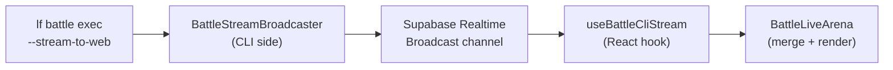

# Webstreaming Architecture

<ExperimentalBadge title="Battles" description="Battles is still being built end-to-end. Matchmaking, voting and result flows may shift — please try them and report what feels off." />


When you run `lf battle exec <id> --byok --stream-to-web`, every token from your local AI provider appears in the LenserFight web arena within milliseconds. This page explains how that pipeline works end-to-end.

---

## Overview



---

## The broadcast channel

LenserFight uses **Supabase Realtime Broadcast** rather than `postgres_changes` for token delivery.

| | `postgres_changes` | Broadcast |
|---|---|---|
| Latency | 200–500ms (WAL flush cycle) | < 50ms per message |
| Payload size | Row diff only | Arbitrary JSON |
| Authentication | RLS policy | Auth token on channel subscribe |
| Use case | DB row state sync | Per-token streaming |

Channel naming convention:
```
battle-cli-stream-{battleId}-{slot}
```

One channel per contender slot (`A` or `B`). Both open simultaneously when `--stream-to-web` is passed.

---

## Token event schema

Each message on the channel has an `event` field and a typed `payload`:

| Event | Payload | Description |
|---|---|---|
| `token` | `{ delta: string, t: number }` | One streamed token; `t` is the millisecond offset from stream start |
| `end` | `{ usage: { inputTokens, outputTokens, totalTokens } }` | Stream complete; includes final token usage |
| `error` | `{ message: string }` | Provider error mid-stream |

The `delta` field contains exactly what the provider returned — partial word, word, or punctuation. The web UI appends deltas in arrival order.

---

## CLI side: BattleStreamBroadcaster

`BattleStreamBroadcaster` (`apps/cli/src/utils/battle-stream-broadcaster.ts`) is a **GRASP Indirection** layer: the `exec` command calls `broadcaster.broadcastToken(delta, t)` and never touches the Supabase client directly.

Key design decisions:

- **Fire-and-forget**: `broadcastToken` is synchronous from the caller's perspective. The underlying `channel.send()` is awaited inside the class but failures are swallowed — a dropped broadcast frame never breaks CLI execution.
- **Auth token**: `BattleStreamBroadcaster.open()` calls `resolveBearerToken()` and attaches it to the Supabase client. This scopes the channel to the authenticated user's session and prevents spoofing.
- **Own client**: creates its own `createClient()` instance (does not reuse the shared CLI client) so the Realtime socket lifecycle is isolated from the RPC client.

```typescript
const broadcaster = new BattleStreamBroadcaster();
await broadcaster.open(battleId, 'A');

// Inside provider stream loop:
broadcaster.broadcastToken(delta, Date.now() - streamStart);

// On stream end:
broadcaster.broadcastEnd({ inputTokens, outputTokens, totalTokens });

await broadcaster.close();
```

---

## Web side: useBattleCliStream

`useBattleCliStream` (`libs/features/battles/src/lib/hooks/realtime/useBattleCliStream.ts`) is a React hook that subscribes to the broadcast channel and accumulates tokens.

```typescript
const { output, state, tokenCount, reset } = useBattleCliStream(
  battle.id,  // undefined when battle ID is unknown — hook stays idle
  'A',
);
// state: 'idle' | 'streaming' | 'complete' | 'error'
```

Lifecycle:
1. On mount (or when `battleId` changes): subscribes to `battle-cli-stream-{battleId}-A`
2. On `token` event: appends `delta` to output buffer, increments `tokenCount`
3. On `end` event: transitions state to `'complete'`
4. On `error` event: transitions state to `'error'`
5. On unmount or `battleId` change: calls `supabase.removeChannel()` to clean up the WebSocket subscription

The hook returns the **accumulated string** (all deltas joined), not a stream. The arena renders the full current output on each update.

---

## BattleLiveArena merge logic

`BattleLiveArena` combines three data sources for each contender:

1. **`useBattleCliStream`** — live tokens from the CLI broadcast channel
2. **`useBattleLiveSubmission`** — polling-based DB snapshot (existing behavior)
3. **Local execution state** — tokens from a battle the current user is actively running in-browser

Priority in spectator mode (no local execution):
```
content = cliStream.output || liveSubmission.liveOutput || ''
```

When `cliStream.state === 'streaming'`, the arena renders a **"Streaming from CLI"** badge in the contender header. This badge is visible to all spectators watching the battle page at the same time the CLI is executing.

---

## Fallback behavior

If the CLI process is killed mid-stream or the WebSocket disconnects:
- `useBattleCliStream` retains the output received so far (state stays `'streaming'` until the component unmounts)
- `BattleLiveArena` falls back to `useBattleLiveSubmission`, which polls the DB for the partial submission record
- Partial CLI outputs are written to the submission record in the DB every 500ms during execution, so the DB fallback is not empty

The arena does not attempt to reconnect to the broadcast channel — reconnect is the user's responsibility (re-run `lf battle exec`).

---

## Security

| Concern | Mitigation |
|---|---|
| Unauthorized broadcasting | Channel subscription requires a valid auth token (`lf auth login`) |
| Key leakage | Provider API keys are never included in broadcast payloads |
| Replay attacks | Each battle+slot channel is unique; old channels receive no new events after close |
| Spoofed tokens | The anon key alone cannot open an authenticated channel; bearer token is required |

`--stream-to-web` will fail with an auth error if `lf auth login` has not been run:
```
Error: --stream-to-web requires authentication. Run: lf auth login
```

---

## See also

- [BYOK execution](/en/how-to/battles/byok-execution) — how to use `--stream-to-web` in practice
- [Stream a cloud battle with BYOK](/en/tutorials/battle-walkthroughs/byok-cloud-battle) — end-to-end tutorial
- [useBattleCliStream hook](/en/reference/battles/index) — React hook API reference
