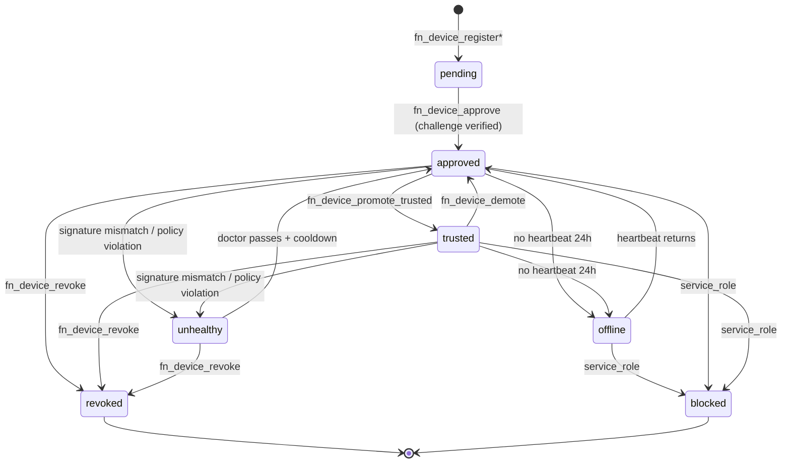

# Trust Model

The LTG defines two ladders — **device trust** and **execution trust** — and a small set of derived statuses. Both ladders are persisted in `devices` / `execution` schemas and surfaced via signed RPCs and the `lf gateway` CLI.

## Device trust ladder

`devices.registered_devices.trust_level` enum:

| Level | Meaning | Set by |
|-------|---------|--------|
| `pending` | Device row exists; no public key on file. | `fn_device_register` (legacy) or `fn_device_register_with_key` |
| `approved` | Owner approved AND device's public key is recorded AND device successfully answered the challenge. | `fn_device_approve` after challenge verification |
| `trusted` | Device has demonstrated continuous heartbeats and at least one signature-verified attestation in the last 30 days. | `fn_device_promote_trusted` (server-evaluated) |
| `offline` | Device has no recent heartbeat (>24h). | Server-evaluated, advisory only. |
| `unhealthy` | Heartbeat failures, signature mismatches, or policy violations. | Server-evaluated. Refused for new attestations. |
| `revoked` | Owner explicitly revoked. Permanent. | `fn_device_revoke` |
| `blocked` | Platform-side block (abuse, security incident). | Service-role only. |

Transitions allowed:



## Execution trust ladder

`execution.trust_evaluations.trust_level` enum (preserved from [`supabase/migrations/20270511400000_execution_attestations_and_trust.sql`](../../../supabase/migrations/20270511400000_execution_attestations_and_trust.sql)):

| Level | Required facts |
|-------|----------------|
| `unverified` | No attestation; or run not owned by submitter. |
| `account_verified` | Submitter owns the run. |
| `agent_verified` | Run's contender is an `ai_agent` / `ai_runner` owned by submitter. |
| `device_verified` | Above, plus an attestation row where `device_trusted = true`. (Server-set.) |
| `runner_verified` | Above, plus the attestation has a `device_id` AND the `device_id` is in `runner_device_bindings(status='active')` for the lenser that produced the run. |
| `execution_verified` | Above, plus signature verifies AND `gateway_verified = true`. (Server-set.) |
| `fully_trusted` | Above, plus `policy_passed = true` AND non-null `workflow_hash` AND non-null `lens_hash`. |

`device_trusted`, `gateway_verified`, and `policy_passed` are **server-derived from server-known facts** in Phase F onward. The client may submit values; the server overrides them before persisting.

## Who can elevate which level

| Level | Elevator | Authorization |
|-------|----------|---------------|
| Device `pending → approved` | Owner via two-step approve | RLS-checked; owner = caller |
| Device `approved → trusted` | Server cron / DEFINER | Heartbeat history + attestation history |
| Device `* → revoked` | Owner | RLS-checked; owner = caller |
| Device `* → blocked` | Platform | `service_role` only |
| Execution `unverified → account_verified` | Server, on submission | Implicit via run ownership |
| Execution `→ agent_verified` | Server, on submission | Contender type |
| Execution `→ device_verified` | Server, on attestation | `device_trusted = true` (server-derived) |
| Execution `→ runner_verified` | Server, on attestation | Active lenser-device binding |
| Execution `→ execution_verified` | Server, on attestation | Signature verifies + gateway_verified server-set |
| Execution `→ fully_trusted` | Server, on attestation | All above + policy_passed server-set + hashes recorded |

## Derived statuses

`devices.registered_devices.gateway_status` is a free-form short string set by the daemon during heartbeat. Recommended values:

- `disconnected` (default for newly-created rows)
- `connected` (daemon up, sync loops healthy)
- `degraded` (daemon up, one or more sync loops failing)
- `error: <short>` (daemon up but rejecting work)

This column is informational only — never used for authorization.

## Anti-cheat path for battles

A battle submission's reputation impact depends on its execution trust level:

| Trust level | Reputation effect |
|-------------|-------------------|
| `unverified` / `account_verified` | Counts toward XP only via `BATTLE_SUBMISSION_COMPLETED` (low XP). |
| `agent_verified` | Adds nothing extra. |
| `device_verified` / `runner_verified` | Visual badge on the submission. No XP yet. |
| `execution_verified` | Submission is eligible for `VERIFIED_LOCAL_EXECUTION_COMPLETED` rule (Phase G trigger). |
| `fully_trusted` | Same as above + counts toward leaderboard tiebreakers. |

Reputation pipelines (`reputation.lenser_scores`) consume only server-derived levels; a tampered client cannot inflate scores.

## One Lenser, many of everything

The trust model assumes:

```
1 Lenser
 ├── many AI agents (agents.ai_lensers)
 ├── many devices (devices.registered_devices)
 │    └── many runners (execution.runner_device_bindings)
 │         └── many runs (execution.runs)
 │              └── many attestations (execution.attestations)
 │                   └── many submissions (battles.submissions)
 └── many battle participations
```

Foreign-key invariants enforced at the database:

- `devices.registered_devices.lenser_id` → `lensers.profiles.id`
- `execution.runner_device_bindings.device_id` → `devices.registered_devices.id`
- `execution.attestations.device_id` → `devices.registered_devices.id`
- (NEW) `execution.attestations.device_id` resolves to a device whose `lenser_id` matches `execution.runs.requester_lenser_id` for the linked run.
- `battles.submissions` → `execution.runs` via `execution.links` (Phase A reconciliation).

These invariants make tamper attempts (binding a high-trust device to someone else's run) detectable and rejectable in DEFINER RPCs.
