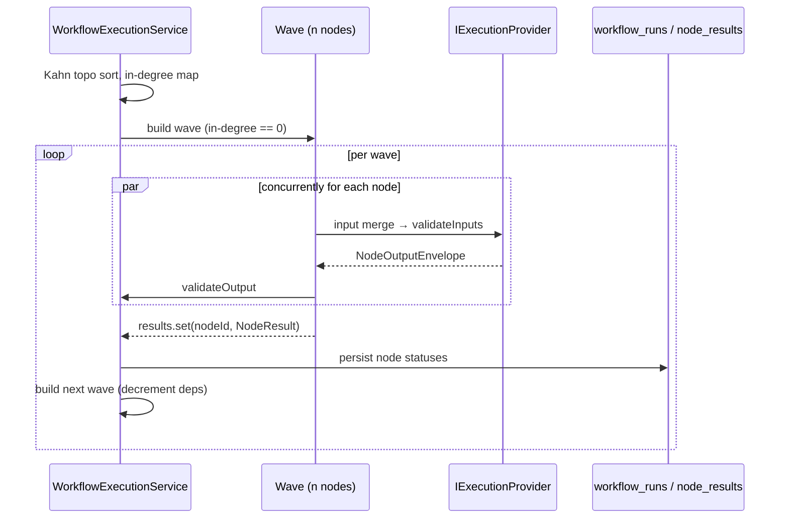
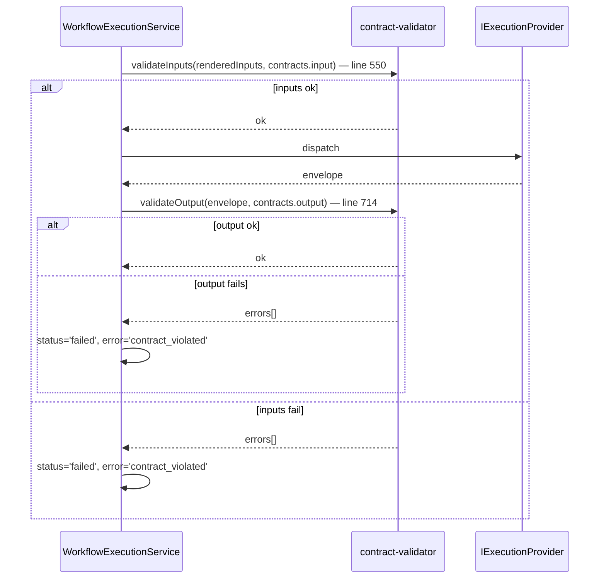
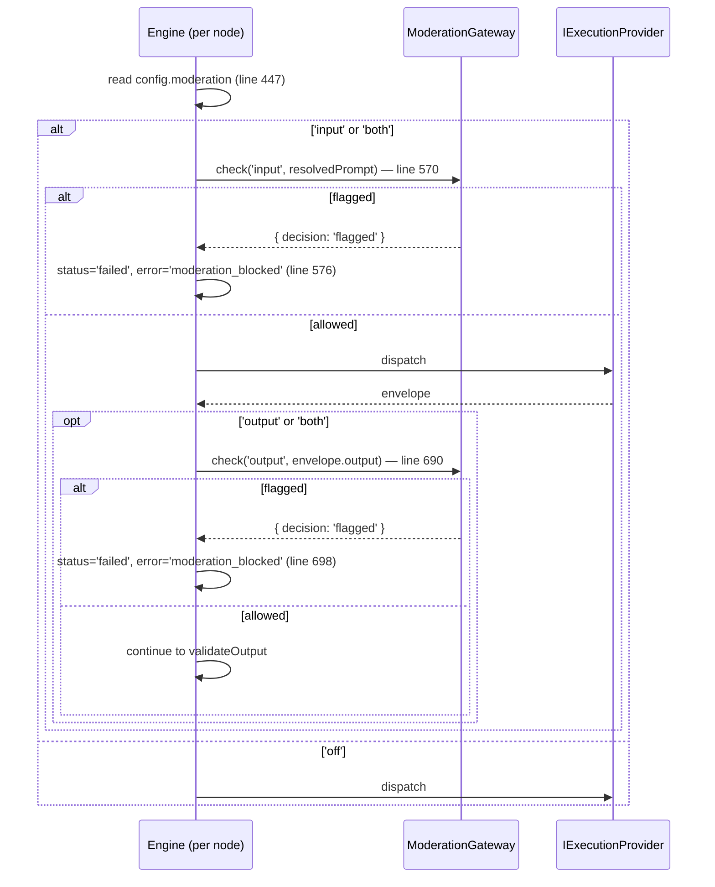
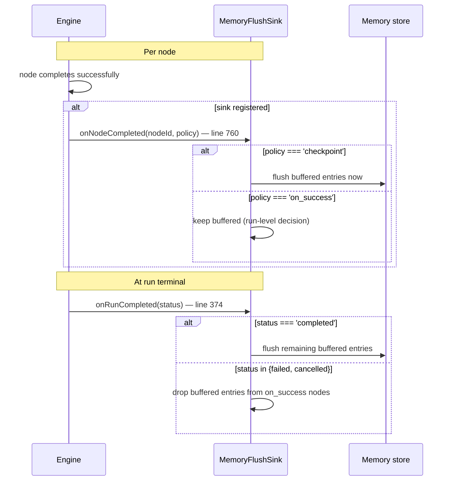
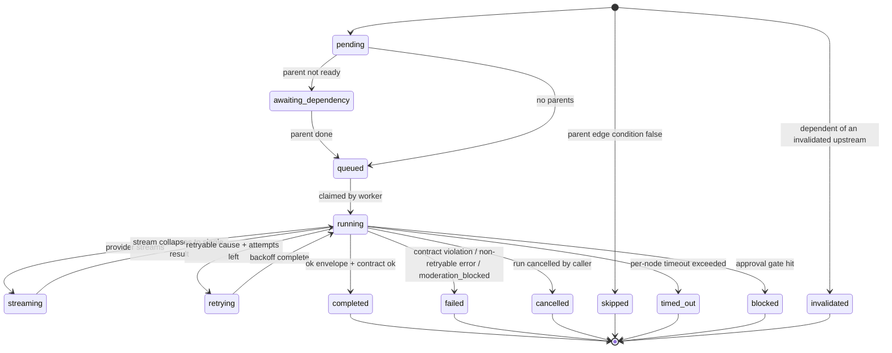

# Execution Engine — Internals

This page is the internals view of the workflow execution engine. It complements [Workflow Engine Architecture](./workflow-engine-architecture.md) (the high-level model) and [Code Walk: workflow-execution.service.ts](./code-walk-workflow-execution-service.md) (the annotated tour). The diagrams below cite specific line numbers in `libs/infra/execution/src/lib/workflow-execution.service.ts` so a reader can move between this page and the source without grepping.

## Wave scheduling

The engine uses Kahn's topological sort to bucket nodes into execution waves. All nodes in a wave run concurrently via `Promise.all`. The next wave is built only when the current one settles.

The orchestration loop lives in `libs/infra/execution/src/lib/workflow-execution.service.ts:384` (`while (wave.length > 0)`). The inner concurrent dispatch is the `Promise.all` over `wave.map(async (nodeId) => …)` starting at line 393. The next-wave computation runs at `libs/infra/execution/src/lib/workflow-execution.service.ts:779` and only decrements in-degrees for edges whose `condition` evaluated truthy.



## Retry loop

Each node executes inside a per-node retry loop. The loop wraps the provider call plus the per-node timeout. A retryable cause (`timeout`, `provider_error`, `rate_limit`) plus `attempt < retryCfg.attempts` triggers a backoff and another pass. A non-retryable cause or the final attempt surfaces the failure.

The loop entry is at `libs/infra/execution/src/lib/workflow-execution.service.ts:596` (`while (attempt < retryCfg.attempts)`). The shouldRetry guard is at line 624. The backoff timer between attempts is computed by `computeBackoff` at `libs/infra/execution/src/lib/workflow-execution.service.ts:839`.

```mermaid
sequenceDiagram
    participant Loop as Retry loop (line 596)
    participant Provider as IExecutionProvider
    participant Status as onNodeStatusChange
    participant Timer as computeBackoff (line 839)

    Loop->>Provider: provider.execute()
    alt success
      Provider-->>Loop: ok envelope
    else retryable cause
      Provider-->>Loop: retryable error (timeout / provider_error / rate_limit)
      Loop->>Status: status='retrying' (line 633)
      Loop->>Timer: delay = computeBackoff(base, max, attempt)
      Timer-->>Loop: ms
      Loop->>Loop: await delay; attempt++
      Loop->>Provider: provider.execute()
    else non-retryable
      Provider-->>Loop: terminal error
      Loop->>Status: status='failed'
    end
```

## Contract validation

A node validates inputs before it dispatches and validates the output envelope before it persists. Both validators come from `libs/infra/execution/src/lib/contract-validator.ts` and are imported at `libs/infra/execution/src/lib/workflow-execution.service.ts:1`.

Input validation runs at `libs/infra/execution/src/lib/workflow-execution.service.ts:550` (`validateInputs(renderedInputs, contracts.input)`). A failure short-circuits with `status='failed'` and `error='contract_violated'`. Output validation runs at `libs/infra/execution/src/lib/workflow-execution.service.ts:714` (`validateOutput(envelope, contracts.output)`).



## Moderation gates

Moderation is opt-in per node via `config.moderation`: `'off' | 'input' | 'output' | 'both'`. The default is `'off'`. The engine consults `ctx.moderation` (a `ModerationGateway`) and short-circuits the node when a phase reports `flagged`.

The moderation policy is read at `libs/infra/execution/src/lib/workflow-execution.service.ts:447`. The input gate fires at line 570 and produces `error: 'moderation_blocked'` at line 576 on a flag. The output gate fires at line 690 and produces the same error at line 698 on a flag.



## Memory flush hooks

The engine offers two hooks for buffered memory writes: `onNodeCompleted(nodeId, policy)` after each successful node and `onRunCompleted(status)` once the run reaches a terminal state. The shape lives at `libs/infra/execution/src/lib/workflow-execution.service.ts:233` (`MemoryFlushSink`). The two policies — `on_success` and `checkpoint` — are documented inline at lines 54–66.

`onNodeCompleted` is invoked at `libs/infra/execution/src/lib/workflow-execution.service.ts:760`. `onRunCompleted` is invoked from the helper around line 374 and only fires when a sink is registered.



## Node status state machine

The status enum is defined at `libs/infra/execution/src/lib/workflow-execution.service.ts:22` and mirrored in the Postgres CHECK constraint shipped with `supabase/migrations/20260420000000_workflow_status_alignment.sql:64`. Both must change together.



## Related

- [Workflow Engine Architecture](./workflow-engine-architecture.md) — high-level model and rationale.
- [Code Walk: workflow-execution.service.ts](./code-walk-workflow-execution-service.md) — annotated tour of the same file.
- [Workflow status migration](../../../supabase/migrations/20260420000000_workflow_status_alignment.sql) — Postgres CHECK constraints that mirror the engine state machine.
