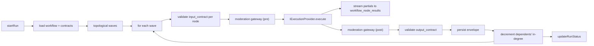

# Open Source Workflows

LenserFight Community Edition ships a multi-step, DAG-based **workflow engine** that connects versioned **Lenses** through typed **IO contracts**. This document is the single source of truth for how the system is organised, what guarantees it provides, and how contributors should extend it.

It is written to support nine concrete lens **kinds** — `text`, `image`, `video`, `research`, `pdf`, `transform`, `orchestration`, `validation`, `routing` — and the twenty-five supported workflow tasks enumerated at the end.

## Layered architecture

The codebase follows the Nx layer direction enforced by [`eslint.config.js`](../../../eslint.config.js):

```text
apps/web (composition root)
   │
   ▼
libs/features/workflows · libs/features/lenses · libs/features/lens-kinds
   │
   ▼
libs/domain · libs/data · libs/api · libs/infra/execution · libs/infra/moderation · libs/infra/storage · libs/infra/providers
   │
   ▼
libs/shared · libs/ui · libs/utils
   │
   ▼
libs/types
```

Every workflow change must respect these boundaries. Orchestration belongs in `libs/infra/execution`; presentation belongs in `libs/features/workflows`; contracts and DTOs belong in `libs/types`.

## Core concepts

| Concept | Description | Primary table |
|---------|-------------|---------------|
| **Lens** | Versioned prompt template with typed input and output contracts | `lenses.lenses`, `lenses.versions` |
| **Lens Kind** | Classifier describing the media modality and role of a lens | `content.tag_map` with `kind:*` tag |
| **Parameter** | Typed slot filled at execution time from user input or upstream node output | `lenses.version_parameters` joined to `lenses.tools` |
| **Workflow** | DAG of lens nodes connected by edges | `lenses.workflows` |
| **Node** | A single lens invocation inside a workflow, with its own config overrides | `lenses.workflow_nodes` |
| **Edge** | `source_output_key` → `target_param_label` mapping with a merge strategy | `lenses.workflow_edges` |
| **Run** | One execution of a workflow with root inputs, status, and budget | `lenses.workflow_runs` |
| **Node Result** | Per-node status, output envelope, tokens, cost, timing | `lenses.workflow_node_results` |
| **Artifact (Ray)** | Durable output of a single lens run (text, json, image, video, pdf) | `execution.artifacts` joined to `media.objects` |

## Typed IO contracts

Every published lens version carries two optional contracts:

- `lenses.versions.input_contract` — describes the required and optional parameters, their kinds, and validation rules.
- `lenses.versions.output_contract` — describes the envelope the engine must produce on success.

The envelope is the runtime shape passed between nodes:

```ts
type NodeOutputEnvelope = {
  kind: LensKind                     // 'text' | 'image' | 'video' | 'research' | 'pdf' | ...
  artifact_kind: ArtifactKind        // 'text' | 'image' | 'audio' | 'video' | 'json' | ...
  output: string                     // canonical text projection (always present)
  data?: Record<string, unknown>     // structured fields matched against output_contract.schema
  media?: { url: string; mime?: string; width?: number; height?: number; duration_s?: number }
  metadata?: Record<string, unknown> // non-normative metadata (model, latency, tokens, etc.)
}
```

Contracts are validated in two places:

1. **Before provider call** — the engine checks that the node's rendered inputs satisfy its `input_contract`.
2. **After provider call** — the engine validates the provider response against `output_contract` before writing `workflow_node_results.output_data` and before exposing it to downstream nodes.

Contract failures are surfaced as `contract_violated` events and may be retried according to `config.retry`.

## Lens kinds

| Kind | Purpose | Typical artifact | Default providers |
|------|---------|------------------|-------------------|
| `text` | Blog posts, reports, summaries, docs, captions | `text` | `openai`, `anthropic`, `google`, `mistral`, `ollama` |
| `image` | Concept art, thumbnails, product visuals, branding | `image` | `fal-ai`, `openai` (dall-e) |
| `video` | Short-form videos, storyboards, scene sequences | `video` | `fal-ai` |
| `research` | Deep search + synthesis, research packets | `json` (findings + sources) | platform retrieval + any text provider |
| `pdf` | Document export of text or research outputs | `json` with `output_type='pdf'` + `media.objects` | `PdfExportProvider` |
| `transform` | Reshapes an envelope (text → prompt, research → slides) | matches input | text providers |
| `orchestration` | Plans other lens calls, manages state | `json` plan | text providers |
| `validation` | Scores an output against criteria, returns pass/fail + report | `json` | text providers |
| `routing` | Classifies user intent, selects a downstream branch | `json` | text providers |

See [`create-a-lens-kind`](../../how-to/workflows/create-a-lens-kind.md) for authoring new kinds.

## Execution model

The engine is a **Kahn topological scheduler** that runs nodes in **waves**: each wave is a layer of the DAG where every member has zero remaining in-degree. Within a wave, nodes execute with `Promise.all`. Across waves, execution is strictly sequential.



### Guarantees

- **No cycles**: enforced at edit time via `WorkflowExecutionService.detectCycle` and at run time by refusing to schedule.
- **No double-trigger**: `workflow_runs` carries an `idempotency_key` derived from `(workflow_id, rootInputsHash)`.
- **Deterministic fan-in**: each edge carries an explicit merge strategy. The default is `last_write_wins` to preserve historical behaviour; new nodes should pick an explicit strategy.
- **Deterministic cancellation**: `stopExecution` aborts the `AbortController`; in-flight nodes become `cancelled`; pending nodes are marked `cancelled` via `markRemainingCancelled`.

### Failure propagation

Each node declares an `on_parent_failure` policy on its config:

| Policy | Behaviour |
|--------|-----------|
| `skip` | Node is marked `skipped`; its own dependents inherit the same policy decision. (**Default for new nodes.**) |
| `propagate` | Node is marked `failed` with `error_message: "upstream_failure"`. |
| `substitute_default` | Missing upstream values are substituted with the empty string. (Legacy behaviour.) |

### Retry, timeout, cancellation

Per-node config:

```ts
config.retry = {
  attempts: 3,
  backoff_ms: 500,           // exponential with jitter
  retry_on: ['timeout', 'provider_error', 'rate_limit']
}
config.timeout_ms = 60000
```

Cancellation is cooperative: the engine passes an `AbortSignal` into every provider call. Providers that respect abort (fetch-based) return early; others are bounded by `timeout_ms`.

## Fan-in merge strategies

When two or more edges target the same `target_param_label` on the same node, the **target node's** `config.merge` (or the edge's `merge_strategy`) decides the outcome:

| Strategy | Result |
|----------|--------|
| `last_write_wins` | The last edge in `edges` array order replaces the value. |
| `concat` | Values are joined with `\n\n`. |
| `array` | Values are wrapped as a JSON array and rendered as JSON. |
| `json_object` | Values are collected into a JSON object keyed by the source node label. |

## Moderation gateway

The engine calls `ModerationGateway.check(envelope, policy)` before the provider call (on rendered input) and after the provider call (on the output envelope). Policy is per-node:

```ts
config.moderation = 'off' | 'input' | 'output' | 'both'
```

Default implementation is the already-built `ContentModerationService` in `libs/infra/moderation`. A violation marks the node `failed` with `error_message: "moderation_blocked"` and writes an `execution.execution_tags` row with `tag = 'policy_violation'`.

## Provider dispatch

Providers are registered in [`libs/infra/execution/src/lib/execution.registry.ts`](../../../libs/infra/execution/src/lib/execution.registry.ts) under canonical keys: `openai`, `anthropic`, `google`, `mistral`, `ollama`, `fal-ai`. The browser executor picks a provider based on the lens's `output_contract.kind` plus the funding source:

| Funding source | Path | Notes |
|----------------|------|-------|
| `user_byok_local` | Direct fetch, AES-GCM key from IndexedDB | No key ever leaves the browser |
| `user_byok_cloud` | Delegates to the Cloud Worker path | Cloud edition only |
| `platform_credit` | Wallet-backed execution via `walletApiClient` | Community and Cloud |
| `sponsored` | Same path as `platform_credit` with `sponsor_id` | Cloud only |

## The 25 supported tasks

| # | Task | Owning kind(s) |
|---|------|----------------|
| 1 | Text generation lens for articles, reports, posts | `text` |
| 2 | Image generation lens from a structured visual brief | `image` |
| 3 | Video generation lens from script + storyboard input | `video` |
| 4 | Lens chains that connect multiple lenses into one result | any + `orchestration` |
| 5 | Workflows with sequential and parallel-safe steps | any |
| 6 | Validate concurrent workflow steps for race-condition safety | `validation` |
| 7 | Deep-search lens that gathers and synthesises research | `research` |
| 8 | PDF creation lens converting research into final documents | `pdf` |
| 9 | Routing lens that picks the correct media workflow | `routing` |
| 10 | Prompt-planning lens that turns intent into executable steps | `orchestration` |
| 11 | Refinement lens improving weak outputs without changing intent | `transform` |
| 12 | Validation lens for formatting, completeness, schema correctness | `validation` |
| 13 | Orchestration lens managing multi-step execution | `orchestration` |
| 14 | Reusable templates for common lens patterns | seed pack (Phase 4) |
| 15 | Fallback logic for failed steps or incomplete outputs | engine retry + `on_parent_failure` |
| 16 | Summarisation lens for long research or large outputs | `text` + `transform` |
| 17 | Transformation lens converting text → image prompt | `transform` |
| 18 | Transformation lens converting text → video scenes | `transform` |
| 19 | Transformation lens converting research → PDF-ready sections | `transform` |
| 20 | Style-control lens applying tone/brand/visual consistency | `transform` |
| 21 | Evaluation lens scoring output quality against requirements | `validation` |
| 22 | Merge step combining outputs from multiple branches | engine merge strategies |
| 23 | Input and output schemas for all major lens types | `input_contract`/`output_contract` |
| 24 | Workflow test plan covering edge cases and concurrency | [`test-plan.md`](../../reference/workflows/test-plan.md) |
| 25 | Scalable architecture supporting future parallel chains | Phase 6 observability + idempotency |

## Related

- [Execution Engine Reference](../../reference/workflows/execution-engine.md)
- [Contract Schema Reference](../../reference/workflows/contract-schema.md)
- [Create a Lens Kind (how-to)](../../how-to/workflows/create-a-lens-kind.md)
- [Build a Lens Chain (how-to)](../../how-to/workflows/build-a-lens-chain.md)
- [Connected Lens Workflows](../lenses/workflows.md)
