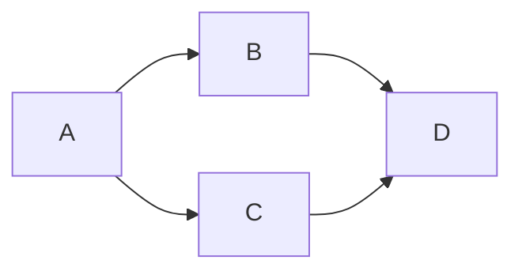
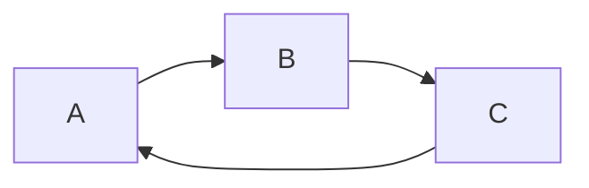
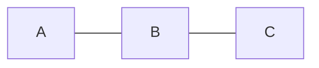
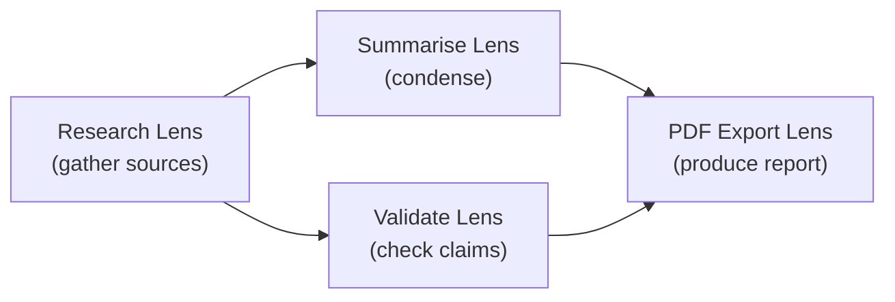
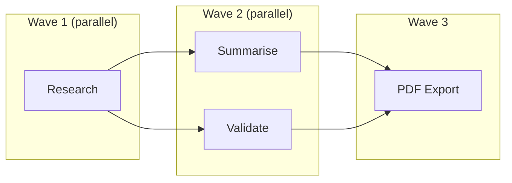

# What is a DAG?

A **DAG** is a **Directed Acyclic Graph**. It is the data structure that describes *how steps depend on each other* in a LenserFight workflow — and the same structure powers `make`, Airflow, Dagster, GitHub Actions, Nx, Bazel, Git, and most modern build, data, and CI systems.

This page explains what a DAG is, why workflows use one, and how the engine walks it.

## The three words, one at a time

| Word | Meaning |
|------|--------|
| **Graph** | A set of **nodes** connected by **edges**. Nothing more. |
| **Directed** | Each edge has a direction — it points *from* one node *to* another. Data flows that way, not back. |
| **Acyclic** | You cannot follow the arrows from any node and end up back at the same node. No loops. |

Put them together: a DAG is a graph where every connection has a direction and there are no circular dependencies.



This is a valid DAG. Four nodes, four directed edges, no way to start at any node and walk back to it.

## What is *not* a DAG



This is **directed but cyclic**: `A → B → C → A` forms a loop. A workflow engine cannot execute this — node `A` would need its own output as input before it can run. LenserFight rejects edits that would introduce a cycle at save time.



This is **undirected**. An edge tells you that two nodes are connected, but not *which way data flows*. Workflows need direction — the output of one node is the input of the next.

## Why workflows use a DAG

Every step in a workflow either:

- depends on the output of an earlier step, **or**
- starts from a root input you provided at run time.

That is exactly the shape a DAG describes. Three properties fall out of using one:

1. **There is always a valid execution order.** Any DAG can be linearised so that every node comes after all the nodes it depends on. This is called a **topological order** (proven by Kahn, 1962). The engine uses it to know what to run, and when.
2. **Independent branches run in parallel.** If two nodes have no path between them, neither depends on the other — so they can execute simultaneously without coordination.
3. **Failures have a bounded blast radius.** When a node fails, the engine can compute exactly which downstream nodes are affected (its *descendants*) and leave the rest alone.

If cycles were allowed, none of these guarantees would hold: you could not pick a starting node, you could not bound failure, and you could not even tell whether the workflow would ever finish.

## Nodes, edges, and a small example

In a LenserFight workflow:

- a **node** is one Lens invocation
- an **edge** carries an output value from one node into a parameter slot of another



Reading this DAG:

- `Research` has no incoming edges → it is a **root node**, fed by user-provided inputs.
- `Summarise` and `Validate` both depend only on `Research` → they run **in parallel** once `Research` finishes.
- `PDF Export` depends on both → it waits for both before running.
- `PDF Export` has no outgoing edges → it is a **leaf node**, its output is part of the final result.

## How the engine walks a DAG

The standard algorithm is **Kahn's topological sort**, executed in *waves* so that independent nodes run together.

### Kahn's algorithm (the textbook form)

```
in_degree[n] = number of incoming edges into n, for every node n
ready        = { n : in_degree[n] == 0 }
order        = []

while ready is not empty:
    pick any node n from ready
    append n to order
    for each edge (n -> m):
        in_degree[m] -= 1
        if in_degree[m] == 0:
            add m to ready

if order does not contain every node:
    the graph has a cycle
```

The output `order` is a valid execution order. The cycle-check at the bottom is what lets the workflow editor reject a bad save: if Kahn's sort cannot drain every node, an edge somewhere is feeding back on itself.

### The LenserFight twist: topological *waves*

Instead of picking one ready node at a time, the engine takes **the whole ready set** as one wave and runs them in parallel:

```
wave_index = 0
while there are nodes left:
    wave = { every node with in_degree == 0 }
    execute every node in wave concurrently (Promise.all)
    for each finished node n:
        for each edge (n -> m):
            in_degree[m] -= 1
    wave_index += 1
```



Each wave is one `Promise.all`. Independent branches naturally collapse into the same wave. This is the same model used by Nx's task runner, Bazel's action graph, and Dagster's asset materialisation.

## Where DAGs show up in the wild

DAGs are not a workflow-engine invention — they are one of the most reused structures in software:

| System | What the DAG represents |
|--------|------------------------|
| **GNU Make / Ninja / Bazel / Nx** | File or task dependencies in a build |
| **Apache Airflow / Dagster / Prefect** | Data pipeline steps |
| **GitHub Actions / GitLab CI / Argo Workflows** | Job dependencies in CI |
| **Git** | Commit history (every commit points to its parents) |
| **TensorFlow / PyTorch (compiled mode)** | The computation graph for a neural network |
| **Spreadsheet engines (Excel, Sheets)** | Cell dependency recalculation |
| **React / Vue reactivity** | Reactive value derivation order |
| **`tsort`, `dpkg`, `npm`** | Package install order |

If you have used any of these, you have used a DAG — usually without being told.

## Useful references

- Kahn, A. B. (1962). *Topological sorting of large networks.* Communications of the ACM, 5(11). The original wave-style algorithm the engine uses.
- Cormen, Leiserson, Rivest, Stein — *Introduction to Algorithms*, chapter on graph algorithms (DFS-based topological sort + cycle detection).
- [Apache Airflow concepts](https://airflow.apache.org/docs/apache-airflow/stable/core-concepts/dags.html) — workflow DAGs in production scheduling.
- [Dagster concepts](https://docs.dagster.io/concepts) — DAG-based data orchestration with typed inputs/outputs.
- [Nx task graph](https://nx.dev/concepts/task-pipeline-configuration) — DAG-based build orchestration used by this monorepo.
- [`graphlib` (npm)](https://www.npmjs.com/package/graphlib) and [`graphology`](https://graphology.github.io/) — open-source graph libraries with topological-sort implementations you can read.
- [NetworkX `topological_generations`](https://networkx.org/documentation/stable/reference/algorithms/generated/networkx.algorithms.dag.topological_generations.html) — Python's standard implementation of the *wave* variant used above.

## Related

- [Workflow Concepts](/en/explanation/workflows/workflow-concepts) — Nodes, edges, runs, and how the DAG is stored
- [Workflow Phases](/en/explanation/workflows/workflow-phases) — The human-readable layer that sits on top of the DAG
- [Execution Engine Internals](/en/explanation/workflows/execution-engine-internals) — How the wave executor handles retries, failures, and budgets
- [Workflow Types](/en/explanation/workflows/workflow-types) — Sequential, parallel, conditional, and scheduled workflows
