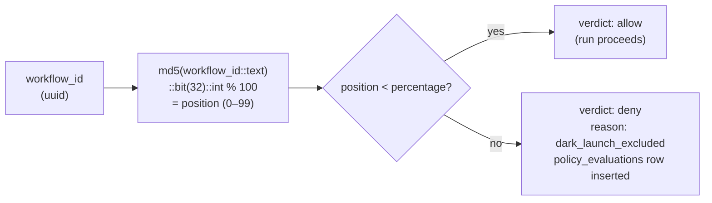

# Dark Launch Rollout

## What it does

Dark launch lets you expose a new or changed workflow to a controlled percentage of runs without modifying any workflow code or adding feature-flag conditionals. The policy engine gates each run using a deterministic hash of the workflow ID, so the same workflow ID always falls inside or outside the launch window at a given percentage.

The routing formula is:

```
position = md5(workflow_id::text)::bit(32)::int % 100
```

If `position < dark_launch_percentage`, the run is **included** and allowed to proceed. Otherwise the run is denied with `reason='dark_launch_excluded'` and a `policy_evaluations` row is inserted.

---

## Why deterministic, not random

A random gating function would produce different results for the same workflow on every pre-run check. This makes rollout impossible to reason about — you cannot predict which workflows are in the window, and you cannot audit why a specific run was allowed or denied.

With `md5(workflow_id) % 100`:

- The same workflow ID always produces the same position value.
- You can compute in advance exactly which workflow IDs are included at 10%, 50%, and 100%.
- The audit trail in `policy_evaluations` is reproducible — re-running the formula on a past `context` row gives the same answer.
- Operators can share the formula with each other and get consistent results without querying the database.

---

## Hash routing diagram



---

## Ramp procedure

### Step 1 — Enable at 10%

Start conservatively. At 10%, roughly 10 out of every 100 workflow IDs will be included. This is a good initial signal on error rate and cost.

```bash
lf dark-launch enable @my-lenser --workflow wf_abc123 --percentage 10
```

```
Dark launch enabled for workflow wf_abc123
  percentage:  10%
  routing:     md5(workflow_id) % 100 < 10
```

### Step 2 — Monitor

Check for incidents, elevated cost, or error spikes:

```bash
lf policy stats @my-lenser --period 1d
lf run incidents <run-id>
lf budget status @my-lenser
```

Wait until you have a meaningful sample (suggested: 50+ runs at the current percentage) before ramping up.

### Step 3 — Ramp to 50%

If the 10% window looks healthy:

```bash
lf dark-launch enable @my-lenser --workflow wf_abc123 --percentage 50
```

```
Dark launch updated for workflow wf_abc123
  percentage:  50%
```

Repeat the monitoring step. At 50% you will have enough volume to detect tail-latency and cost anomalies that were invisible at 10%.

### Step 4 — Full rollout

When 50% is stable, move to 100% (or simply disable dark launch):

```bash
lf dark-launch enable @my-lenser --workflow wf_abc123 --percentage 100
```

Or disable entirely — with `percentage=100` every run is included, so the check is a no-op:

```bash
lf dark-launch disable @my-lenser --workflow wf_abc123
```

```
Dark launch disabled for workflow wf_abc123
  all runs for this workflow will now proceed normally
```

### Step 5 — Verify

Confirm no dark launch gate is blocking runs:

```bash
lf dark-launch status @my-lenser
```

```
Dark launch status for @my-lenser
  no active dark launch configurations
```

---

## CLI commands reference

| Command | Description |
|---------|-------------|
| `lf dark-launch enable @handle --workflow <id> --percentage <n>` | Enable or update dark launch for a workflow |
| `lf dark-launch disable @handle --workflow <id>` | Disable dark launch for a workflow |
| `lf dark-launch status @handle` | Show all active dark launch configurations |
| `lf policy log @handle --verdict deny` | Filter policy log for `dark_launch_excluded` denials |

Check which workflow IDs are currently inside a 10% window without starting any runs:

```bash
lf run policy-check @my-lenser --workflow wf_abc123
```

---

## Limitations

| Limitation | Detail |
|-----------|--------|
| **Workflow-scoped only** | Dark launch gates by workflow ID. You cannot gate by caller, user segment, or time window without code changes. |
| **Not a traffic splitter** | Dark launch does not split traffic between two workflow versions. It gates the *new* workflow entirely. To A/B test two versions, you need two distinct workflow IDs. |
| **Position is fixed** | The hash position of a workflow ID does not change. If your workflow ID happens to fall at position 99 and you ramp to 90%, it will never be included until you reach 100%. |
| **Denied runs produce no output** | Runs denied by `dark_launch_excluded` do not execute any steps and produce no run report. They appear only in `policy_evaluations`. |
| **Percentage update is immediate** | Changing the percentage takes effect on the next pre-run check, with no grace period for in-flight runs. |

---

## When to use dark launch

- Rolling out a significantly changed workflow where early failure detection matters more than coverage.
- Validating cost estimates for a new workflow before full exposure.
- Gradually exposing a workflow to production load after local and staging testing.

Dark launch is not a substitute for staging environment testing. Use staging to confirm correctness, then use dark launch to de-risk production exposure at scale.

---

## Related

- [Autonomous Agent OS](/en/explanation/agents/autonomous-agent-os) — dark launch in the governance controls table
- [Policy Engine](/en/reference/platform-api/policy-engine) — `dark_launch` policy type and `dark_launch_excluded` reason
- [Agent Lifecycle Commands (Phase 8)](/en/reference/cli/agent-lifecycle) — full `lf dark-launch` CLI reference
- [Using the Kill Switch](/en/how-to/kill-switch) — emergency stop if a dark-launched workflow misbehaves
