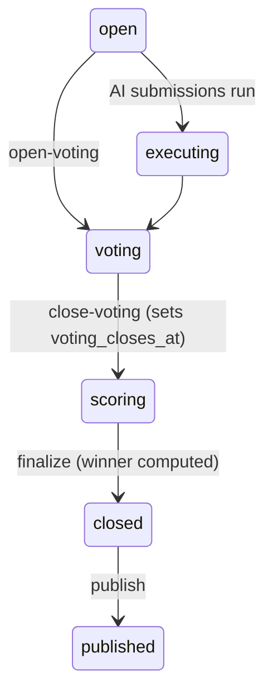
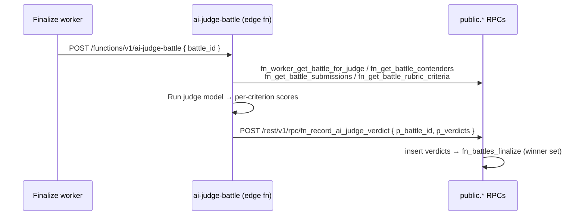

# Finalization & Judging

<ExperimentalBadge title="Battles" description="Battles is still being built end-to-end. Matchmaking, voting and result flows may shift — please try them and report what feels off." />

Finalization is the step that turns a battle in `scoring` into a `closed` battle with a `winner_contender_id`. It is driven by `public.fn_battles_finalize` and computes the winner from either community votes, AI-judge verdicts, or a blend of both.

::: warning Not yet shipped end-to-end
The mode-aware winner selection, deterministic tie-break, the finalize worker, and the `fn_record_ai_judge_verdict` REST wrapper described here are the **intended contract**. Until the supporting migration and worker are deployed, finalization is not driven automatically and AI-judge battles may not resolve. This page documents the target behavior, not necessarily what is live in your environment.
:::

---

## Where it fits in the lifecycle

Finalization is the `scoring → closed` edge. Voting must be closed first (which sets `voting_closes_at`), then the battle is finalized, then it can be published.



See [Concepts & Lifecycle](/en/reference/battles/index) for the full state table.

---

## Judging modes

`fn_battles_finalize` derives an effective scoring mode, then ranks contenders by a single `score`. The mode is inferred from `judging_mode`, `ai_judge_enabled`, and whether community votes and AI-judge verdicts exist.

| Mode | When it applies | Winner score |
|---|---|---|
| `community` | Default; community votes present and no AI judging | `raw_vote_count` |
| `ai_judge` | `judging_mode = ai_judge`, or `ai_judge_enabled` with no community votes, or `rubric_score`/`auto_score` with verdicts present | Rubric-weighted mean of `battles.ai_judge_verdicts` scores |
| `hybrid` | `ai_judge_enabled` **and** community votes both present | `0.5 × community_norm + 0.5 × (judge_mean / 10)` |

Notes:

- **AI-judge score** is a rubric-weighted mean: `SUM(score × weight) / SUM(weight)`, where `weight` comes from `battles.rubric_criteria` (criteria with no rubric link default to weight `1.0`). Verdict scores are on a `0..10` scale.
- **Hybrid** normalizes community votes by the max vote count in the battle and the judge mean by `10`, then blends `50/50`. There is no `hybrid` value in `judging_mode_enum` and no weight-config column — the blend is inferred and the `0.5/0.5` split is fixed.

---

## Tie-break policy

The winner is **never** left `NULL`. Contenders are ordered by the following deterministic key and the top row wins:

1. `score` — descending
2. `raw_vote_count` — descending
3. `weighted_vote_sum` — descending
4. `submitted_at` — ascending (earliest submission wins)
5. `contender_id` — ascending (final stable backstop)

The same ordering is used to persist `rank_position` on `battles.vote_aggregates` rows. AI-judge battles with no aggregates row simply receive no rank rows.

After the winner is set, finalize best-effort runs `fn_compute_elo_after_battle` and `fn_notify_battle_result`. Both are guarded so a failure there never rolls back the finalize.

---

## Finalize worker

Automated finalization is handled by a Node.js worker that polls `public.fn_worker_run_finalize_cycle` on an interval. The RPC is `service_role` only.

| Variable | Default | Purpose |
|---|---|---|
| `PLATFORM_API_BATTLE_FINALIZE_WORKER_ENABLED` | enabled (set to `false` to disable) | Gates the finalize poller. Enabled by default, like the auto-promote worker. |
| `BATTLE_FINALIZE_INTERVAL_MS` | `60000` (60 s) | Poll interval between finalize cycles. |

::: tip Rollout ordering
The worker is **enabled by default**. Apply the finalize migration before (or with) the worker image, or set `PLATFORM_API_BATTLE_FINALIZE_WORKER_ENABLED=false` until the migration lands, to avoid RPC-not-found errors on every cycle.
:::

### What a cycle does

`fn_worker_run_finalize_cycle` is durable and concurrency-safe:

- **Single-flight** — guarded by an xact-scoped advisory lock (`hashtext('battles:finalize-cycle')`); overlapping cycles return early.
- **Bounded** — selects at most `50` battles per cycle with `FOR UPDATE SKIP LOCKED`.
- **Selection** — battles in `status = scoring` with `voting_closes_at <= now()` and `deleted_at IS NULL`, oldest deadline first.
- **Dispatch** — for `ai_judge_enabled` battles with **no** verdicts yet, it dispatches the [AI-judge edge function](#ai-judge-edge-function-flow) (via `pg_net`) instead of finalizing, so a winner is never picked before verdicts exist. All others finalize immediately.
- **Idempotent** — finalize only acts on `voting`/`scoring`, so re-entry after a battle is `closed` is a no-op.

---

## AI-judge edge function flow

For AI-judged battles, verdicts are produced by the `ai-judge-battle` edge function and persisted through a public REST wrapper, because the `battles` schema is not exposed via PostgREST.



`fn_record_ai_judge_verdict(p_battle_id, p_verdicts)` inserts the verdict rows and then finalizes the battle when it is still `ai_judge_enabled` and open. `p_verdicts` is an array of objects shaped:

```json
[
  {
    "contender_id": "uuid",
    "criterion_id": "uuid",
    "score": 8.5,
    "rationale": "…",
    "model_key": "claude-sonnet-4-6",
    "run_id": "uuid"
  }
]
```

`criterion_id`, `model_key`, and `run_id` are optional. The wrapper is `service_role` only.

---

## RPC reference

| RPC | Caller | Notes |
|---|---|---|
| `public.fn_battles_finalize(p_battle_id)` | worker, MCP, score aggregator | `scoring`/`voting` → `closed(+winner)`. Mode-aware, deterministic tie-break. |
| `public.fn_worker_run_finalize_cycle()` | finalize worker | Bounded, advisory-locked sweep. `service_role` only. |
| `public.fn_record_ai_judge_verdict(p_battle_id, p_verdicts)` | `ai-judge-battle` edge fn | Inserts verdicts, then finalizes. `service_role` only. |
| `public.fn_mcp_battle_finalize(p_battle_id)` | MCP `finalize_battle` tool | Creator-checked (service_role bypasses). |
| `fn_worker_get_battle_for_judge` / `fn_get_battle_contenders` / `fn_get_battle_submissions` / `fn_get_battle_rubric_criteria` | edge fn | Read RPCs the judge uses to assemble its prompt. |

---

## See also

- [Concepts & Lifecycle](/en/reference/battles/index) — full status table and battle types
- [Battle schema reference](/en/reference/battles/schema) — tables, columns, enums, RPCs
- [lf battle CLI reference](/en/reference/cli/battle) — `lf battle close-voting`, `publish`, etc.
