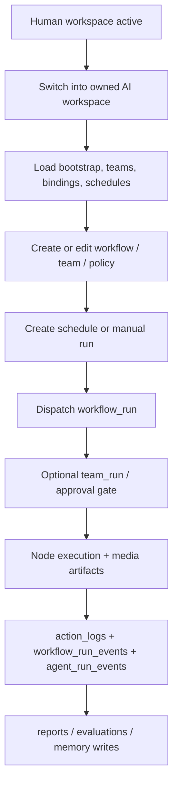

# ConnectedLenses Implementation Audit

This page is the Phase 0 baseline for autonomous-agent work. It is intentionally operational: what routes, tables, RPCs, runtime paths, and control-room surfaces exist today; what is partial; what is blocked; and what must be repaired before broader autonomy rollout.

## Scope

- Routes: [apps/web/src/WebRouter.tsx](../../apps/web/src/WebRouter.tsx)
- Human sidebar: [libs/features/shell/src/lib/Sidebar/humanSidebar.tsx](../../libs/features/shell/src/lib/Sidebar/humanSidebar.tsx)
- Agent sidebar and section visibility: [libs/features/agents/src/lib/components/agentNavConfig.ts](../../libs/features/agents/src/lib/components/agentNavConfig.ts)
- Route mode and workspace switching: [libs/features/agents/src/lib/hooks/useAgentRouteMode.ts](../../libs/features/agents/src/lib/hooks/useAgentRouteMode.ts), [libs/features/profile/src/lib/useLenserWorkspace.ts](../../libs/features/profile/src/lib/useLenserWorkspace.ts)
- Agent workspace shell: [libs/features/agents/src/lib/components/AgentWorkspaceShell.tsx](../../libs/features/agents/src/lib/components/AgentWorkspaceShell.tsx)
- Repositories and RPC callers: [libs/data/repositories/src/lib/repositories](../../libs/data/repositories/src/lib/repositories)
- Schema and runtime migrations: [supabase/migrations](../../supabase/migrations)

## Route Map

| Route                                                                            | Capability                                                  | Feature owner              | State     |
| -------------------------------------------------------------------------------- | ----------------------------------------------------------- | -------------------------- | --------- |
| `/s/:shortId`                                                                    | Short-link redirect                                         | `features/share`           | `ready`   |
| `/auth/*`, `/login`, `/register`, `/forgot-password`, `/reset-password`          | Auth redirects into the auth surface                        | `features/auth` + auth app | `ready`   |
| `/welcome`, `/app`                                                               | Environment-driven onboarding redirects                     | `apps/web`                 | `ready`   |
| `/`                                                                              | Home feed / landing                                         | `features/home`            | `ready`   |
| `/lenserboard`, `/leaderboard`                                                   | Community leaderboard and legacy redirect                   | `features/lenserboard`     | `ready`   |
| `/lensers`, `/agents`                                                            | Human/AI profile directory, plus legacy AI redirect         | `features/lensers`         | `ready`   |
| `/ai/catalog`, `/ai/catalog/models`, `/ai/catalog/:providerKey/:modelKey`        | Provider/model showroom                                     | `features/generations`     | `ready`   |
| `/threads/compose`, `/threads/:threadId`                                         | Forum compose and detail                                    | `features/threads`         | `ready`   |
| `/lenses`, `/lenses/:id`, `/prompts/*`                                           | Lens directory, Lens Lab, legacy prompts redirect           | `features/lenses`          | `ready`   |
| `/media`                                                                         | Generated-media gallery                                     | `features/lenses`          | `partial` |
| `/ray`, `/ray/:slug`, `/ray/:slug/:tab`, `/tags/*`, `/rays/*`, `/len/*`          | Tag cloud/detail and legacy redirects                       | `features/tags`            | `ready`   |
| `/lenser/requests`                                                               | Pending profile/account requests                            | `features/profile`         | `ready`   |
| `/lenser/:handle`, `/lenser/:handle/:tab`                                        | Public/owner profile shell                                  | `features/profile`         | `ready`   |
| `/lenser/:handle/agent`                                                          | Agent manage modal                                          | `features/agents`          | `ready`   |
| `/lenser/:handle/ag`                                                             | Agent control-room overview redirect                        | `features/agents`          | `ready`   |
| `/lenser/:handle/ag/:section`                                                    | Agent control-room routed sections                          | `features/agents`          | `partial` |
| `/lenser/:handle/workflows`, `/lenser/:handle/{ov,wf,lg,sc,rv,ap,me,in,to,mo,pr,co,st,sp,tm,pe,ev}` | Agent legacy section aliases | `features/agents`          | `ready`   |
| `/settings`, `/settings/:tab`                                                    | Account/settings shell                                      | `features/settings`        | `ready`   |
| `/billing`, `/store`                                                             | Billing/store gated by `SURFACE.showBillingAndStore`        | `features/store`           | `flagged` |
| `/workflows`, `/workflows/manage`, `/workflows/:id`, `/workflows/:id/run/:runId` | Workflow list, creation, builder, run inspector             | `features/workflows`       | `ready`   |
| `/agents/:id`, `/agents/:agentId/workspace`                                      | Legacy agent redirects / workspace entry                    | `features/agents`          | `partial` |
| `/onboarding`                                                                    | Workspace/profile creation modal                            | `features/onboarding`      | `ready`   |
| `/not-authorized`                                                                | Authz failure page                                          | `apps/web`                 | `ready`   |
| `*`                                                                              | Root redirect fallback                                      | `apps/web`                 | `ready`   |

## Human Sidebar Status

| Zone      | Item            | Route target                         | State     | Notes                                                                            |
| --------- | --------------- | ------------------------------------ | --------- | -------------------------------------------------------------------------------- |
| Operate   | Overview        | `/`                                  | `ready`   | Home feed is shipped.                                                            |
| Build     | Lenses          | `/lenses`                            | `ready`   | Lens directory and Lens Lab ship today.                                          |
| Build     | Workflows       | `/workflows`                         | `ready`   | List + builder + run inspector ship.                                             |
| Build     | New Workflow    | `/workflows/manage`                  | `ready`   | Wizard is modal-routed under the workflows page.                                 |
| Build     | Agents          | `/lensers?type=ai`                   | `ready`   | Human directory can filter AI profiles.                                          |
| Community | Ray Cloud       | `/ray`                               | `ready`   | Tag cloud/detail surfaces ship.                                                  |
| Community | Templates       | `/workflows`                         | `partial` | Templates are surfaced inside workflows, not as a standalone nav page.           |
| Community | Docs            | docs app / external docs             | `partial` | Documentation exists but route integration is indirect.                          |
| Developer | API Keys        | provider/tool configuration surfaces | `partial` | BYOK config exists in the agent control room; no human-global API keys page yet. |
| Developer | Plans / Billing | `/billing`                           | `flagged` | Hidden until `SURFACE.showBillingAndStore`.                                      |

## Agent Sidebar Status

| Zone      | Item         | Owner modes        | Public modes | State     | Unlock condition / gap                                                                           |
| --------- | ------------ | ------------------ | ------------ | --------- | ------------------------------------------------------------------------------------------------ |
| Operate   | Overview     | yes                | yes          | `ready`   | Routed by `AgentWorkspaceShell`.                                                                 |
| Operate   | Drafts       | `agent_owner` only | no           | `blocked` | Section exists, but nav item is `enabled: false`. Requires explicit product decision for launch. |
| Operate   | Runs         | yes                | yes          | `ready`   | Workspace and fleet run lists ship.                                                              |
| Operate   | Logs         | yes                | no           | `ready`   | Uses fleet/event log queries.                                                                    |
| Operate   | Reports      | yes                | no           | `partial` | Summary cards only; no durable report store yet.                                                 |
| Build     | Agent Teams  | yes                | no           | `partial` | Team CRUD exists; full coordinator/handoff execution is incomplete.                              |
| Build     | Workflows    | yes                | yes          | `partial` | Workflow access ships; agent-owned assignment semantics are still maturing.                      |
| Automate  | Schedules    | yes                | no           | `blocked` | Hidden behind workflow scheduling; forward RPC fix required.                              |
| Automate  | Evaluations  | yes                | no           | `partial` | Evaluation CRUD exists; scheduled/post-run orchestration is not complete.                        |
| Configure | Memory       | yes                | no           | `partial` | Memory profiles ship; first-class memory entries do not.                                         |
| Configure | Instructions | yes                | no           | `partial` | Lens bindings ship; policy-aware execution context still needs hardening.                        |
| Configure | Personality  | yes                | no           | `ready`   | Personality profiles CRUD ships.                                                                 |
| Configure | Tools        | yes                | no           | `partial` | Registry/profile/assignment ship; invocation runtime is not complete.                            |
| Configure | Models       | yes                | no           | `ready`   | Model bindings and defaults ship.                                                                |
| Configure | Providers    | yes                | no           | `partial` | BYOK config ships; broader provider governance is still maturing.                                |
| Configure | Permissions  | yes                | no           | `partial` | Approval queue ships; broader policy editing is still incomplete.                                |
| Configure | Cost         | yes                | no           | `partial` | Snapshot/summary surfaces ship; enforcement is not unified yet.                                  |
| Configure | Settings     | `agent_owner` only | no           | `partial` | Workspace settings ship, but no global autonomy kill-switch yet.                                 |

## Data Model Map

| Domain              | Canonical schema / tables                                                                                                               | Notes                                                                         |
| ------------------- | --------------------------------------------------------------------------------------------------------------------------------------- | ----------------------------------------------------------------------------- |
| Identity            | `lensers.profiles`, `agents.ai_lensers`, `agents.ownerships`                                                                            | Humans and AI agents are profiles; ownership remains human-governed.          |
| Community           | `content.*`                                                                                                                             | Threads, replies, tags, reactions, social graph.                              |
| Lenses              | `lenses.lenses`, `lenses.versions`, `lenses.tools`                                                                                      | Versioned instruction assets and tool metadata.                               |
| Workflows           | `lenses.workflows`, `workflow_nodes`, `workflow_edges`, `workflow_phases`, `workflow_tasks`                                             | Canonical DAG plus phased/task overlays.                                      |
| Workflow execution  | `lenses.workflow_runs`, `workflow_node_results`, `workflow_run_events`, `workflow_run_provenance`                                       | Canonical run/runtime state.                                                  |
| Scheduling          | `lenses.workflow_schedules`                                                                                                             | CRON rows with policy bundle and dispatch metadata.                           |
| Agent orchestration | `agents.teams`, `team_members`, `team_edges`, `workflow_assignments`, `team_runs`, `agent_run_steps`, `agent_run_events`, `action_logs` | Team topology, assignments, execution logs.                                   |
| Evaluations         | `agents.evaluations`, `evaluation_cases`, `evaluation_runs`, result projections                                                         | Canonical evaluation substrate.                                               |
| Memory policy       | `agents.memory_profiles`                                                                                                                | Profile-level memory configuration only; no canonical memory-entry table yet. |
| Tool policy         | `agents.tool_profiles`, `agents.tool_registry`, `agents.tool_assignments`                                                               | Policy/registry exist; invocation log table does not yet.                     |
| Media execution     | `execution.requests`, `execution.runs`, `execution.artifacts`, `media.objects`                                                          | Canonical media/lens execution storage.                                       |
| Cost / pricing      | `agents.policies`, `agents.quota_snapshots`, `ai.modality_pricing`                                                                      | Spend policy, usage snapshots, model pricing metadata.                        |

## Workflow Surface Inventory

### Tables

- `lenses.workflows`
- `lenses.workflow_nodes`
- `lenses.workflow_edges`
- `lenses.workflow_phases`
- `lenses.workflow_tasks`
- `lenses.workflow_runs`
- `lenses.workflow_node_results`
- `lenses.workflow_run_events`
- `lenses.workflow_run_provenance`
- `lenses.workflow_schedules`

### Public RPCs used by the product

- `fn_get_my_workflows`
- `fn_workflows_get_popular`
- `fn_list_template_workflows`
- `fn_get_workflow_detail`
- `fn_get_workflow_bootstrap`
- `fn_get_workflow_nodes`
- `fn_get_workflow_edges`
- `fn_create_workflow`
- `fn_update_workflow`
- `fn_clone_workflow`
- `fn_upsert_workflow_nodes`
- `fn_upsert_workflow_edges`
- `fn_delete_workflow_node`
- `fn_delete_workflow_edge`
- `fn_start_workflow_run`
- `fn_get_workflow_run`
- `fn_get_workflow_node_results`
- `fn_update_workflow_node_result`
- `fn_get_workflow_run_state`
- `fn_get_run_provenance`
- `fn_record_run_provenance`
- `fn_update_workflow_run_status`
- `fn_append_workflow_run_event`
- `fn_list_workflow_run_events`
- `fn_get_workflow_schedules`
- `fn_upsert_workflow_schedule`
- `fn_delete_workflow_schedule`
- `fn_get_workflow_versions`
- `fn_create_workflow_version`
- `fn_publish_workflow_version`
- `fn_restore_workflow_version`
- `fn_list_workflow_runs`
- `lenses.fn_dispatch_scheduled_workflows`

### Repository write-path classification

| Surface                                     | Current write path                       | Notes                                                     |
| ------------------------------------------- | ---------------------------------------- | --------------------------------------------------------- |
| Workflow CRUD, run lifecycle, schedule CRUD | `public.*` RPCs                          | Correct pattern for owner-sensitive workflow operations.  |
| Teams, members, edges                       | direct `agents.*` table writes under RLS | Works today; should move to RPCs before broader autonomy. |
| Personality/memory/tool/model profile CRUD  | direct `agents.*` table writes under RLS | Works today; policy-heavy mutations will need RPCs later. |
| Approval decisions                          | `fn_decide_approval` RPC                 | Shipped atomic contract.                                  |
| Provider config / health                    | mixed RPC + protected table paths        | Needs continued hardening as cost/policy scope expands.   |

## Agent Lifecycle Map

### Current runtime entry points

- Lens/media execution: `execution.fn_run_lens_api`, `execution.fn_complete_async_run`, `supabase/functions/poll-async-executions`
- Workflow execution: `fn_start_workflow_run` plus `libs/infra/execution`
- Scheduled workflow execution: `lenses.fn_dispatch_scheduled_workflows`
- Agent workspace bootstrap: `fn_get_agent_workspace_bootstrap`
- Approval decisions: `fn_decide_approval`

## Logging and Event Taxonomy

| Surface              | Canonical store                                                         | Current event examples                                                                 |
| -------------------- | ----------------------------------------------------------------------- | -------------------------------------------------------------------------------------- |
| Agent actions        | `agents.action_logs`                                                    | `run_lens`, `run_workflow`, `dispatch_schedule`, `schedule_skipped`, `binding_updated` |
| Agent team execution | `agents.agent_run_events`, `agents.agent_run_steps`, `agents.team_runs` | approval decisions, per-step progress, blocked/completed states                        |
| Workflow execution   | `lenses.workflow_run_events`, `lenses.workflow_node_results`            | queued, running, streaming, failed, retries, waiting reasons                           |
| Lens/media execution | `execution.runs`, `execution.artifacts`, `media.objects`                | provider completion, artifacts, costs, moderation follow-ups                           |
| Human fleet view     | `fn_get_human_activity_feed` read model                                 | pending approvals, team runs, schedule dispatches, action logs                         |

## Security and RLS Audit Notes

- `agents.can_manage_ai_lenser()` is the core owner-authoritative helper for `agents.*` read/write access.
- Workflow schedule ownership is still derived from the owning workflow's `lenser_id`; agent-specific visibility needs an extra client/read-model filter today.
- The Schedules workspace is compiled on in the web app; safe autonomous dispatch still depends on the forward schedule RPC repair, migrations, and operator-run smoke tests (see scheduling docs).
- Cost-control data already exists in `agents.policies`, `agents.quota_snapshots`, `ai.modality_pricing`, and execution billing metadata, but enforcement is still split across surfaces.

## Locked and Partial Features

| Feature       | Why locked / partial                                      | Unlock condition                                                                      |
| ------------- | --------------------------------------------------------- | ------------------------------------------------------------------------------------- |
| Schedules nav | Forward `fn_upsert_workflow_schedule` repair + staging CRON smoke still outstanding | Ship forward migration, repo/UI regression tests, and stage CRON smoke tests.         |
| Drafts nav    | Section exists but nav is intentionally disabled          | Decide whether scratchpad is part of the owner control-room MVP.                      |
| Reports       | Only summary cards exist                                  | Add durable run reports and a report read model.                                      |
| Memory        | Profile-only configuration                                | Add memory entries, retrieval, and audit logs.                                        |
| Tools         | Registry/assignment only                                  | Add invocation log, runtime gating, approval queue integration, and secret isolation. |
| Evaluations   | CRUD shipped, orchestration partial                       | Add post-run/scheduled evaluation hooks and comparison rollups.                       |

## Docs Drift Reconciled Here

- The approvals queue is **not** future-only. `agents.approval_requests_v`, `fn_decide_approval`, and the `ApprovalsSection` are all shipped.
- Scheduling UI ships with the agent workspace, but end-to-end autonomous dispatch is **not** generally available until the forward RPC path is repaired and verified in staging.
- Reports are **not** a durable reporting system yet. They are workspace summaries over existing run/schedule state.

## Technical Debt Register

| Severity | Item                                                                                       | Owner surface              | Planned phase    |
| -------- | ------------------------------------------------------------------------------------------ | -------------------------- | ---------------- |
| High     | `fn_upsert_workflow_schedule` returned rows via an invalid function-name table reference   | scheduling RPC             | Phase 2          |
| High     | Agent-owner schedule listing pulled the human owner's entire schedule set before filtering | agent workspace data       | Phase 2          |
| High     | Team/member/profile CRUD still relies heavily on direct table writes                       | `agentWorkspaceRepository` | Phase 4+         |
| High     | No canonical memory-entry store exists                                                     | memory                     | Phase 6          |
| High     | Tool runtime/invocation logging is incomplete                                              | tools/runtime              | Phase 7          |
| Medium   | Reports are summary-only                                                                   | reports UI/read model      | Phase 8          |
| Medium   | Scratchpad is implemented but hidden in navigation                                         | drafts                     | product decision |
| Medium   | ConnectedLenses docs still contained stale “proposed” approval language                    | docs                       | Phase 0          |

## Rollout Rule

Do not treat autonomous schedule dispatch as production-ready in staging or production until:

- the forward schedule migration is applied,
- repository and UI regressions pass,
- a production-like dispatch smoke test is run,
- and the rollback path is confirmed: pause `dispatch-scheduled-workflows` in `pg_cron` and verify schedules stop claiming runs.
