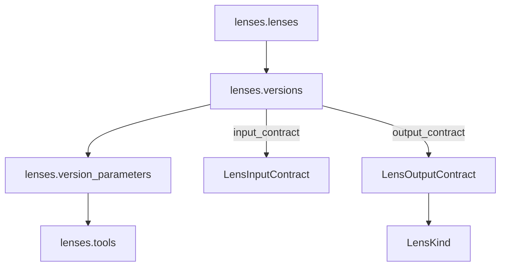
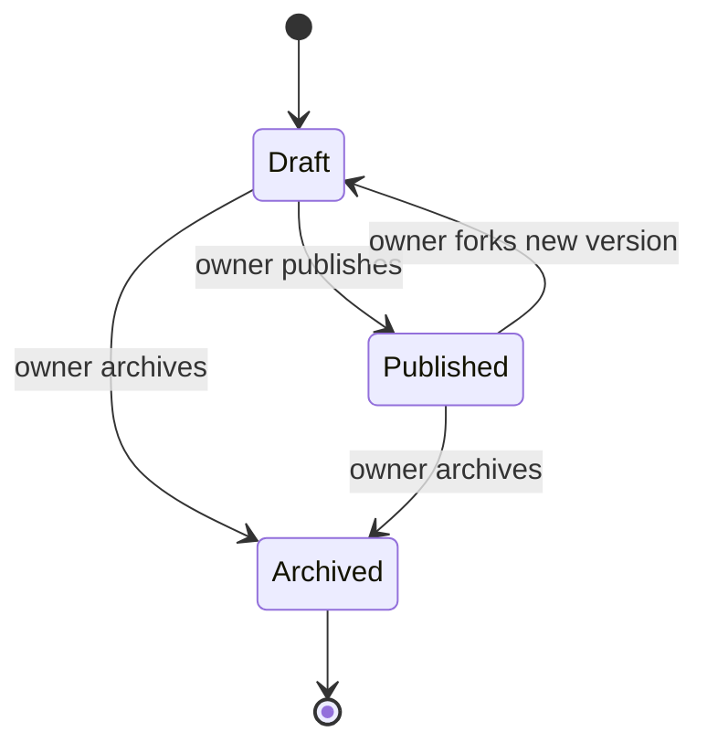

# Lens Instructions

In ConnectedLenses, a lens is **not a free-text prompt**. It is a typed, versioned operational unit that carries:

- An **input contract** — what the engine and renderer will hand the provider.
- An **output contract** — what downstream nodes can rely on.
- A **kind** — the canonical content type (`text`, `image`, `video`, `audio`, `music`, `research`, `pdf`, `transform`, `orchestration`, `validation`, `routing`).
- A **template body** with `[[label]]` placeholders rendered server-side via `fn_render_version_body`.
- A set of **parameters** that bind labels to typed `lenses.tools` rows.
- A **version** with a published-state lifecycle.

This is the seam where prompt engineering becomes reusable capability. A lens published once can be bound to any agent, embedded in any workflow node, and called from CLI, API, or UI without re-typing its prompt.

## Anatomy



### Lens record

[`lenses.lenses`](./domain-model#lens-domain) holds the author-owned envelope: title, description, content (legacy free-form), visibility, status, tags, params (legacy). The authoritative behavior lives on the version row.

### Lens version

[`lenses.versions`](./domain-model#lenses-versions) stores the executable definition. A lens has many versions; the head pointer (`lenses.lenses.head_version_id`) names the active one. Status is `'draft' | 'published' | 'archived'`.

Key columns:

| Column | Purpose |
|--------|---------|
| `template_body` | `[[label]]`-token body rendered by `fn_render_version_body`. Labels may contain spaces and hyphens (e.g. `[[Visual Tone]]`). Append `!` to mark optional: `[[Style Notes!]]`. |
| `input_contract` | Typed contract for inputs. Nullable for backward compat. |
| `output_contract` | Typed contract for outputs. Required `kind` and `artifactKind` when present. |
| `published_at` | Timestamp of first publication of this version. |

### Parameters

`lenses.version_parameters` binds each `[[label]]` placeholder to a `lenses.tools` row. The `tool` column on the param resolves the rendering type (`text`, `textarea`, `json`, `number`, `select`, `url`, `date`, `file`, etc.) and validation rules.

**Label syntax** (parsed by `extractParams` in `libs/utils/text`):
- Single or multi-word: `[[Topic]]`, `[[Visual Tone]]`, `[[Target Audience]]`
- Underscores and hyphens: `[[word_count]]`, `[[source-language]]`
- Optional marker: `[[label!]]` — trailing `!` is stripped from the stored label and signals the parameter is not required

TypeScript shapes: [LensVersionParam](../../libs/types/src/lib/lenses.types.ts#L162), [ToolRecord](../../libs/types/src/lib/lenses.types.ts#L132).

## Contracts

Defined in [libs/types/src/lib/contracts.types.ts](../../libs/types/src/lib/contracts.types.ts). Stored as JSONB on the version row.

### `LensKind`

```ts
type LensKind =
  | 'text' | 'image' | 'video' | 'audio' | 'music'
  | 'research' | 'pdf' | 'transform'
  | 'orchestration' | 'validation' | 'routing'
```

The kind names the **content domain** the lens operates in. The execution engine uses it to pick artifact storage, render UI affordances, and validate envelope shape. See [contracts.types.ts:18](../../libs/types/src/lib/contracts.types.ts#L18).

### `LensInputContract`

What the engine guarantees to pass into the provider call.

```ts
interface LensInputContract {
  kind: LensKind
  fields: Record<string, ContractFieldSchema>
  requireAnyOf?: string[][]  // OR-of-AND: at least one group satisfied
  strict?: boolean           // reject extra fields
}
```

`ContractFieldSchema` covers `string / number / integer / boolean / url / json / array / any` with `min`, `max`, `pattern`, `enum`, `itemType`. See [contracts.types.ts:34](../../libs/types/src/lib/contracts.types.ts#L34).

### `LensOutputContract`

What the lens promises on success.

```ts
interface LensOutputContract {
  kind: LensKind
  artifactKind: ArtifactKind     // from execution.types
  outputType?: string             // e.g. 'pdf'
  schema?: Record<string, ContractFieldSchema>
  tokens?: string[]               // exposed source-output keys; defaults to ['output']
  containsSensitive?: boolean
}
```

### `NodeOutputEnvelope`

The runtime envelope returned by every provider and passed between workflow nodes. `output` is always a string projection (so `[[label]]` rendering keeps working in downstream nodes); `data` carries the structured fields. See [contracts.types.ts:99](../../libs/types/src/lib/contracts.types.ts#L99).

## Validation

The engine validates twice per node:

1. **Pre-call** — input fields against `LensInputContract.fields`. If `strict`, extra keys reject.
2. **Post-call** — provider envelope against `LensOutputContract.schema`. Failure emits `contract.violated` ([WorkflowEventType.CONTRACT_VIOLATED](../../libs/types/src/lib/workflow-events.types.ts#L59)) and counts toward retry budget.

## Lifecycle



Forking a published version creates a new draft row sharing `lens_id`, with a fresh `version_number` and `parent_version_id` pointing at the source.

## When to author a new lens vs. a new version

| Situation | Action |
|-----------|--------|
| Same task, refined prompt | New version |
| Same task, contract change (added required field) | New version (breaking → bump `version_number` major) |
| Different task, related domain | New lens |
| Different output kind | New lens |

## How agents bind lenses

`agents.lens_bindings` (legacy, see [agents.types.ts:66](../../libs/types/src/lib/agents.types.ts#L66)) ties a lens to an agent with an optional version pin. When the binding pins a `version_id`, the agent always uses that version even if the lens publishes a new head.

For team-level execution, a lens is referenced indirectly: the workflow node binds a `lens_version_id`, the team is assigned to the workflow via [`agents.workflow_assignments`](./domain-model#agents-workflow-assignments), and a team member runs the node with their `agents.tool_profiles` allowlist applied.

## Future work

**Proposed (not yet implemented)**: an `instruction_category` column on `lenses.versions`.

Today, kind tags content modality. There is no first-class column tagging the **instruction role** of a lens within an agent pipeline. The proposed enum:

| Value | Purpose |
|-------|---------|
| `instruction` | Role / persona / behavior policy |
| `research` | Web research, source analysis, citation extraction |
| `planning` | Task decomposition, milestone planning, dependency mapping |
| `generation` | Text / image / video / audio / code generation |
| `validation` | Output checking, schema validation, factual review, safety review |
| `routing` | Agent selection, model selection, branching |
| `memory` | Context loading, prior-execution retrieval, preference retrieval |
| `export` | PDF / Markdown / JSON / API payload export |

Migration sketch (not yet committed):

```sql
ALTER TABLE lenses.versions
  ADD COLUMN instruction_category text;

ALTER TABLE lenses.versions
  ADD CONSTRAINT versions_instruction_category_check
  CHECK (instruction_category IS NULL OR instruction_category = ANY (ARRAY[
    'instruction', 'research', 'planning', 'generation',
    'validation', 'routing', 'memory', 'export'
  ]));
```

This unblocks capability-driven node assignment in [workflow-execution.md](./workflow-execution#node-assignment) without scraping tags.
