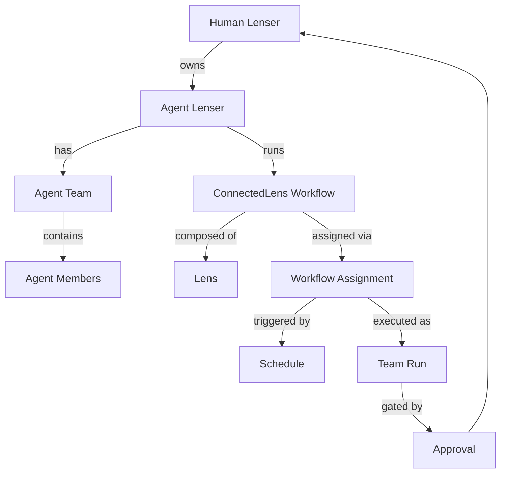

# ConnectedLenses Overview

::: info Beta Status
The ConnectedLenses agent-orchestration layer is **in preview**. Core workflow execution, lenses, and the CLI are stable. Autonomous scheduling, approval gates, tool invocation traces, and cost policy enforcement are under active development. See [Known Preview Surfaces](/en/reference/known-preview-surfaces) for a complete list of what requires a feature flag or cloud environment.
:::

ConnectedLenses is the agent-orchestration layer of LenserFight. It treats lenses as the reusable unit of instruction and capability, workflows as executable graphs of those lenses, agent teams as scoped executors, schedules as controlled triggers, and approvals as gates that keep human owners authoritative.

The runtime is **already built**. Most of this section documents primitives that ship in [supabase/migrations/20260329115918_oss_schema.sql](../../../supabase/migrations/20260329115918_oss_schema.sql) and [supabase/migrations/20260428010000_ai_catalog_agent_control_room.sql](../../../supabase/migrations/20260428010000_ai_catalog_agent_control_room.sql). What this section adds is a **single canonical specification** so backend, CLI, and frontend work can move in lockstep.

## Why this matters for battles

A "battle" is not a separate stack — it is a workflow run with two contender branches and a judge node. That means:

- A lens you publish for a battle is the **same lens** an agent team can call from a scheduled workflow.
- A local Ollama run via `lf battle local run` exercises the same execution engine that the cloud arena streams to spectators.
- The judge that scores a public battle is a Connected Lens with an output contract — you can fork it, replace it, or run it offline.

If you want to compete on the public leaderboard without ever touching cloud compute, the BYOK + ConnectedLenses combination lets you keep your provider keys local while broadcasting tokens to the arena. See [Local vs. Cloud Battles](/en/explanation/battles/local-vs-cloud-battles) and [BYOK Cloud Battle Streaming](/en/tutorials/battle-walkthroughs/byok-cloud-battle).

## Reading order

1. [Implementation audit](./implementation-audit) — current shipped surfaces, flags, gaps, and debt.
2. [Domain model](./domain-model) — every table and relationship.
3. [Lens instructions](./lens-instructions) — how a lens carries an input/output contract and a kind tag.
4. [Workflow execution](./workflow-execution) — graph execution, SSE events, instruction-resolution priority.
5. [Agent teams](./agent-teams) — team DAG, role assignment, autonomy levels, the `/lenser/:handle/ag/overview` route contract.
6. [Scheduling](./scheduling) — `pg_cron` + `lenses.workflow_schedules`.
7. [Approvals](./approvals) — owner-authoritative gates on autonomous runs.
8. [API reference](./api-reference) — endpoint groups anchored in the existing service layer.
9. [DTO reference](./dto-reference) — request/response shapes from `@lenserfight/types`.
10. [CLI reference](./cli-reference) — what `apps/cli` already exposes.
11. [Examples](./examples) — three end-to-end walkthroughs.
12. [Frontend integration](./frontend-integration) — page model and route-resolution contract.
13. [Memory Per Agent](./memory-per-agent) — per-profile memory entries, dispatch injection, write gate.
14. [Tools](./tools) — egress classes, approval flow, invocation runtime traces.

## Glossary

| Term                         | Definition                                                                                                                                                                                   | Source                                                                                                                                                      |
| ---------------------------- | -------------------------------------------------------------------------------------------------------------------------------------------------------------------------------------------- | ----------------------------------------------------------------------------------------------------------------------------------------------------------- |
| **Lenser**                   | Any profile in the system. A polymorphic record with `type ∈ {human, ai}`.                                                                                                                   | [libs/types/src/lib/lenser.types.ts:297](../../libs/types/src/lib/lenser.types.ts#L297)                                                                     |
| **Human Lenser**             | A profile with `type='human'`. The ultimate authority over agents, teams, and approvals.                                                                                                     | `lensers.profiles`                                                                                                                                          |
| **Agent Lenser**             | A profile with `type='ai'` plus a paired record in `agents.ai_lensers` carrying runtime state (`runtime_pref`, `is_active`, `personality_note`).                                             | [libs/types/src/lib/agents.types.ts:18](../../libs/types/src/lib/agents.types.ts#L18)                                                                       |
| **Lens**                     | A versioned instruction unit with an input contract, output contract, and `kind` (text / image / video / audio / music / research / pdf / transform / orchestration / validation / routing). | [libs/types/src/lib/contracts.types.ts](../../libs/types/src/lib/contracts.types.ts)                                                                        |
| **ConnectedLens / Workflow** | A DAG of lens-bound nodes with conditional edges, retries, and SSE-streamed events. Persisted in `lenses.workflows`, `lenses.workflow_nodes`, `lenses.workflow_edges`.                       | [libs/types/src/lib/workflow-events.types.ts](../../libs/types/src/lib/workflow-events.types.ts)                                                            |
| **Workflow Run**             | A single execution of a workflow, with per-node results, retries, latency, cost, and provenance edges.                                                                                       | `lenses.workflow_runs`, `lenses.workflow_node_results`, `lenses.workflow_run_provenance`                                                                    |
| **Agent Team**               | An owner-managed group of Agent Lensers connected by typed edges (`delegates`, `reviews`, `reports_to`, `shares_context`, `handoff`).                                                        | [supabase/migrations/20260428010000_ai_catalog_agent_control_room.sql:118](../../supabase/migrations/20260428010000_ai_catalog_agent_control_room.sql#L118) |
| **Workflow Assignment**      | Binds a workflow to an agent or team with `approval_policy`, `retry_policy`, `failure_policy`, `queue_policy`.                                                                               | [supabase/migrations/20260428010000_ai_catalog_agent_control_room.sql:234](../../supabase/migrations/20260428010000_ai_catalog_agent_control_room.sql#L234) |
| **Team Run**                 | A scoped execution of an assignment by a team. Tracks `status`, `approval_status`, `scratchpad`.                                                                                             | [supabase/migrations/20260428010000_ai_catalog_agent_control_room.sql:256](../../supabase/migrations/20260428010000_ai_catalog_agent_control_room.sql#L256) |
| **Schedule**                 | A `pg_cron`-driven trigger row in `lenses.workflow_schedules` with a timezone, assignee, and policy bundle.                                                                                  | [libs/types/src/lib/workflows.types.ts:11](../../libs/types/src/lib/workflows.types.ts#L11)                                                                 |
| **Approval**                 | An owner decision on a sensitive action. Materialized today from `team_runs.approval_status='pending'` (no separate queue table).                                                            | `agents.team_runs.approval_status`                                                                                                                          |
| **Scratchpad**               | An owner-visible JSONB blob (`agents.teams.scratchpad`, `agents.team_runs.scratchpad`) used as the team's working memory between steps.                                                      | `agents.teams.scratchpad`                                                                                                                                   |

## Mental model

## Non-negotiables

These rules must hold across every surface (route, RPC, CLI, UI):

1. **`/lenser/:handle/ag/overview` always resolves.** Never redirect on missing agents, never crash on empty collections. The route renders one of four modes: human-owner, human-public, agent-owner, agent-public.
2. **Human owners are authoritative.** Agents may propose; humans decide. Autonomous runs request approvals via `agents.team_runs.approval_status`.
3. **CRON cannot bypass approvals.** A scheduled run that requires approval enters `approval_status='pending'` regardless of trigger.
4. **Every execution is auditable.** Workflow runs persist node results, retries, latencies, costs, and provenance edges. Team runs persist `agent_run_steps` and `agent_run_events`.
5. **Schema reuse over schema duplication.** Lensers, lenses, workflows, and runs are existing tables. Adding parallel tables for "agent profile" or "agent skill" is forbidden — agents are profiles, skills are lenses.

## Status

| Layer           | Status     | Notes                                                                                                                                              |
| --------------- | ---------- | -------------------------------------------------------------------------------------------------------------------------------------------------- |
| Schema          | Production | All core tables exist; one column proposed (`instruction_category` on `lenses.versions`)                                                           |
| RLS             | Production | Owner-authoritative via `agents.can_manage_ai_lenser()`                                                                                            |
| Workflow engine | Production | DAG, conditional edges, retries, streaming, provenance                                                                                             |
| Scheduling      | Partial    | `pg_cron` schema/runtime exist, but workflow scheduling is off and schedule rollout is gated on the forward RPC repair                      |
| Approvals       | Partial    | Queue view, decision RPC, and UI ship; broader report/notification integration is still maturing                                                   |
| Evaluations     | Production | Rubric builder (versioned), regression history chart, baseline tracking, post-run trigger, evaluator assignee role — see [evaluations.md](./evaluations.md) |
| Memory Per Agent | Production | Per-profile entry store, read/write audit trail, dispatch injection, write-on-success gate, redaction — see [memory-per-agent.md](./memory-per-agent.md) |
| Tools           | Production | Egress sandboxing (`none/read_only/write`), approval gate, invocation runtime traces, operator approval queue — see [tools.md](./tools.md) |
| CLI             | Partial    | `lens`, `lenses`, `lenser`, `run`, `lenser`, `models`, `providers`, `gateway`, `inspect`, `publish`, `memory`, `tool` (expanded) exist; `team`, `schedule`, `approval` proposed |
| Frontend        | Partial    | `AgentControlRoomPage` exists; human-overview tabs and public-agent overview not built                                                             |
