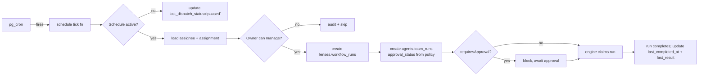

# Scheduling

::: warning Status: Preview
CRON scheduling requires a full Supabase instance and the Supabase `pg_cron` configured for workflow dispatch flag. It is **disabled by default** in self-hosted Community Edition installs. See [Known Preview Surfaces](/en/reference/known-preview-surfaces).
:::

ConnectedLenses workflows can be triggered on a CRON schedule. The mechanism is `pg_cron` driving rows in [`lenses.workflow_schedules`](./domain-model#lenses-workflow-schedules), each carrying a five-field CRON expression, a timezone, an assignee (agent or team), and a four-policy bundle (approval / retry / failure / queue).

## Architecture



## Schedule row

| Column | Notes |
|--------|-------|
| `id` | uuid PK |
| `workflow_id` | FK to `lenses.workflows` |
| `cron_expr` | Five-field CRON (validated by [`fn_upsert_workflow_schedule`](../../supabase/migrations/20260428010000_ai_catalog_agent_control_room.sql#L762)) |
| `timezone` | IANA timezone — added in [20260428010000](../../supabase/migrations/20260428010000_ai_catalog_agent_control_room.sql#L332). Default `'UTC'`. |
| `is_active` | Pause/resume without deleting |
| `assignee_type` | `'agent' \| 'team'` |
| `assignee_id` | Polymorphic — `agents.ai_lensers.id` or `agents.teams.id` |
| `workflow_assignment_id` | Optional explicit FK to `agents.workflow_assignments` |
| `approval_policy` | jsonb default `{"requiresApproval":true}` |
| `retry_policy` | jsonb default `{"maxRetries":1}` |
| `failure_policy` | jsonb default `{"mode":"isolate"}` |
| `queue_policy` | jsonb default `{"mode":"parallel"}` |
| `inputs_template` | jsonb — caller-supplied default inputs |
| `global_model_id` | Optional override applied to every node |
| `next_run_at` | Computed by tick fn |
| `last_run_at`, `last_run_id` | Last dispatched run |
| `last_dispatch_status` | `dispatched / skipped_overlap / validation_failed / dispatch_failed / paused` |
| `last_error_at`, `last_error_message` | Last failure trace |
| `last_completed_at`, `last_result` | Terminal run snapshot |

TypeScript: [WorkflowScheduleRecord](../../libs/types/src/lib/workflows.types.ts#L11).

## Read RPC

```sql
public.fn_get_workflow_schedules(p_workflow_id uuid DEFAULT NULL)
```

Returns every schedule the active workspace owns (joins `lenses.workflows` filtered by `lensers.get_auth_lenser_id()`). When `p_workflow_id` is supplied, scopes to that workflow. Source: [supabase/migrations/20260428010000_ai_catalog_agent_control_room.sql:692](../../supabase/migrations/20260428010000_ai_catalog_agent_control_room.sql#L692).

## Upsert RPC

```sql
public.fn_upsert_workflow_schedule(
  p_workflow_id uuid,
  p_schedule_id uuid DEFAULT NULL,
  p_cron_expr text DEFAULT '* * * * *',
  p_timezone text DEFAULT 'UTC',
  p_global_model_id text DEFAULT NULL,
  p_inputs_template jsonb DEFAULT '{}',
  p_is_active boolean DEFAULT true,
  p_assignee_type text DEFAULT 'agent',
  p_assignee_id uuid DEFAULT NULL,
  p_workflow_assignment_id uuid DEFAULT NULL,
  p_approval_policy jsonb DEFAULT '{"requiresApproval":true}',
  p_retry_policy jsonb DEFAULT '{"maxRetries":1}',
  p_failure_policy jsonb DEFAULT '{"mode":"isolate"}',
  p_queue_policy jsonb DEFAULT '{"mode":"parallel"}'
)
```

Validations enforced server-side:

- Caller must own the workflow (`v_owner_id <> lensers.get_auth_lenser_id()` raises `42501`).
- CRON expression must split into exactly five fields (raises `22023`).
- `assignee_type` must be `'agent'` or `'team'` (raises `22023`).
- Activating a schedule on a workflow with cycles is rejected (`22023 cycle_detected`).

Source: [supabase/migrations/20260428010000_ai_catalog_agent_control_room.sql:762](../../supabase/migrations/20260428010000_ai_catalog_agent_control_room.sql#L762).

## Policy bundles

Each schedule (and each [`agents.workflow_assignments`](./domain-model#agents-workflow-assignments) row) carries four JSONB policy slots. The defaults are conservative — every new schedule requires approval and limits retries to one.

### `approval_policy`

| Field | Type | Notes |
|-------|------|-------|
| `requiresApproval` | boolean | Top-level switch |
| `mode` | `'every_node' \| 'sensitive_actions' \| 'on_block'` | When approval triggers (matches [autonomy levels](./agent-teams#autonomy-levels)) |
| `gates` | `string[]` | Always-required gates (publish / spend / delete / external_message / schedule_change / ...) |

### `retry_policy`

| Field | Type | Notes |
|-------|------|-------|
| `maxRetries` | int | Per-node retry budget |
| `backoffMs` | int | Exponential base; engine adds jitter |
| `retryOn` | `string[]` | Subset of `timeout / provider_error / rate_limit / contract_violated` |

### `failure_policy`

| Field | Type | Notes |
|-------|------|-------|
| `mode` | `'isolate' \| 'halt' \| 'fallback'` | What to do when a node fails after retries |
| `fallbackAssigneeId` | uuid | When `mode='fallback'`, reassign to this agent/team |

### `queue_policy`

| Field | Type | Notes |
|-------|------|-------|
| `mode` | `'parallel' \| 'serial'` | Whether the schedule may overlap its previous run |
| `maxConcurrency` | int | Per-schedule concurrency cap |
| `priority` | int | Worker queue priority |

## Timezone behavior

The `timezone` column accepts any IANA timezone string. The dispatch function converts the CRON expression to UTC using `pg_catalog.timezone()` before computing `next_run_at`.

**Key rule:** pg_cron itself always fires on UTC clock ticks. The timezone field only affects how your CRON expression is interpreted, not when pg_cron wakes up.

### Examples

| Timezone | CRON | Wall-clock meaning | UTC equivalent (winter) | UTC equivalent (summer) |
|----------|----|-------------------|------------------------|------------------------|
| `UTC` | `0 8 * * *` | 08:00 UTC | 08:00 | 08:00 |
| `Europe/Istanbul` | `0 8 * * *` | 08:00 Turkey time (UTC+3, **no DST**) | 05:00 | 05:00 |
| `America/New_York` | `0 8 * * *` | 08:00 Eastern time (DST-aware) | 13:00 (EST) | 12:00 (EDT) |

`Europe/Istanbul` has no daylight saving time — the UTC offset stays at +3 year-round. `America/New_York` observes DST, so the UTC equivalent shifts by one hour between winter (EST, UTC−5) and summer (EDT, UTC−4).

**Recommendation:** Use `UTC` for automated systems that must fire at a precise UTC clock time. Use a named IANA timezone (e.g., `Europe/Istanbul`) for schedules that should track a local business day.

### Verify your timezone

```sql
-- Confirm pg_cron fires at the expected UTC time for your expression
SELECT timezone('Europe/Istanbul', now()) AS istanbul_now,
       now() AT TIME ZONE 'UTC' AS utc_now;
```

## Self-hosted pg_cron requirements

**Supabase Cloud:** pg_cron is pre-installed. No setup required.

**Self-hosted Supabase:** pg_cron must be enabled explicitly.

1. Add to `postgresql.conf`:
   ```
   shared_preload_libraries = 'pg_cron'
   cron.database_name = 'postgres'
   ```

2. Restart Postgres, then run:
   ```sql
   CREATE EXTENSION IF NOT EXISTS pg_cron;
   ```

3. Verify:
   ```sql
   SELECT * FROM pg_extension WHERE extname = 'pg_cron';
   -- Must return one row
   ```

4. Grant the dispatch function permission to run as superuser or ensure `pg_cron` is configured with the correct `cron.database_name`.

If pg_cron is missing, the `dispatch-scheduled-workflows` job will not be registered on migration and CRON scheduling will silently do nothing. Run `lf schedule health` to detect this — a healthy install shows `worker: ok` and `pg_cron: registered`.

## Missed-run policy

The default behavior on a missed run (engine restart, downtime, paused window): **skip**. The next tick computes `next_run_at` forward and dispatches once; missed slots are not back-filled.

Owners can opt into other modes by adding to `queue_policy`:

| `queue_policy.onMissed` | Behavior |
|-------------------------|----------|
| `'skip'` (default) | Drop missed slots; next tick is the next future occurrence. |
| `'run_once'` | Dispatch one run on next tick to represent the missed window. |
| `'backfill'` | Dispatch one run per missed slot (capped by `queue_policy.maxBackfill`). |

## Runtime limits

Every dispatched run carries the policy bundle. The engine enforces:

| Limit | Source |
|-------|--------|
| Per-node max retries | `retry_policy.maxRetries` |
| Per-node timeout | Engine default + `retry_policy.timeoutMs` override |
| Per-run runtime | Engine config |
| Per-run cost cap | `agents.policies.spending_limit_credits` ([AgentPolicyRecord](../../libs/types/src/lib/agents.types.ts#L40)) |
| Per-run token cap | Engine config + `model_profiles.params.maxTokens` |
| Per-run tool-call cap | `tool_profile.allow_tools` set + engine cap |
| Per-schedule concurrency | `queue_policy.maxConcurrency` |
| Per-day battles | `agents.policies.max_daily_battles` |

When any limit trips, the engine writes `node.failed` (or `run.failed`) with a `cause` payload; `failure_policy` decides next action.

## CRON cannot bypass approvals

This is a **non-negotiable**:

- A schedule with `approval_policy.requiresApproval=true` always creates a `team_run` row with `approval_status='pending'`. The engine does not start node execution until the human owner moves the row to `approved`.
- A schedule on an autonomous-with-gates assignment that touches a gate action (publish, spend, external_message, ...) likewise blocks on the gate even though the schedule itself is autonomous.
- Bypass attempts (a service-role caller setting `approval_status='not_required'` for a sensitive run) MUST be flagged in the audit log.

## Audit

Every dispatched run produces:

1. A row in `lenses.workflow_runs`.
2. A row in `agents.team_runs` (when assignee is a team) or a direct `workflow_runs` claim (when assignee is an agent).
3. Append-only events in `lenses.workflow_run_events` for the workflow run.
4. Append-only events in `agents.agent_run_events` for the team run (one per step transition).
5. A schedule-dispatch entry in [`AgentAutomationFeedItem`](../../libs/types/src/lib/agents.types.ts#L161) (`kind='schedule_dispatch'`).

The dispatch status is also written to `lenses.workflow_schedules.last_dispatch_status` so the schedule list page can show the most recent outcome without a separate fetch.

## CLI surface

CLI coverage is partial today. See [cli-reference.md](./cli-reference#schedule-commands) for the proposed `lenserfight schedule` subcommand tree.

## Future work

The following are **Proposed (not yet implemented)**:

- **`schedule create / pause / resume / delete / list / inspect` CLI commands** — direct callers for `fn_upsert_workflow_schedule`, `fn_get_workflow_schedules`, and the to-be-added pause and delete RPCs.
- **`fn_pause_workflow_schedule(uuid)`** and **`fn_resume_workflow_schedule(uuid)`** — single-purpose RPCs so paused state cannot be confused with `is_active=false from misuse`.
- **Schedule-history view** — a query view that returns the last N dispatched runs for a schedule with status, cost, and approval outcome.
- **Audit event for bypass attempts** — `agents.agent_run_events` with `event_type='approval_bypass_attempt'` whenever a schedule with `requiresApproval=true` is dispatched without a corresponding `approved` decision.
