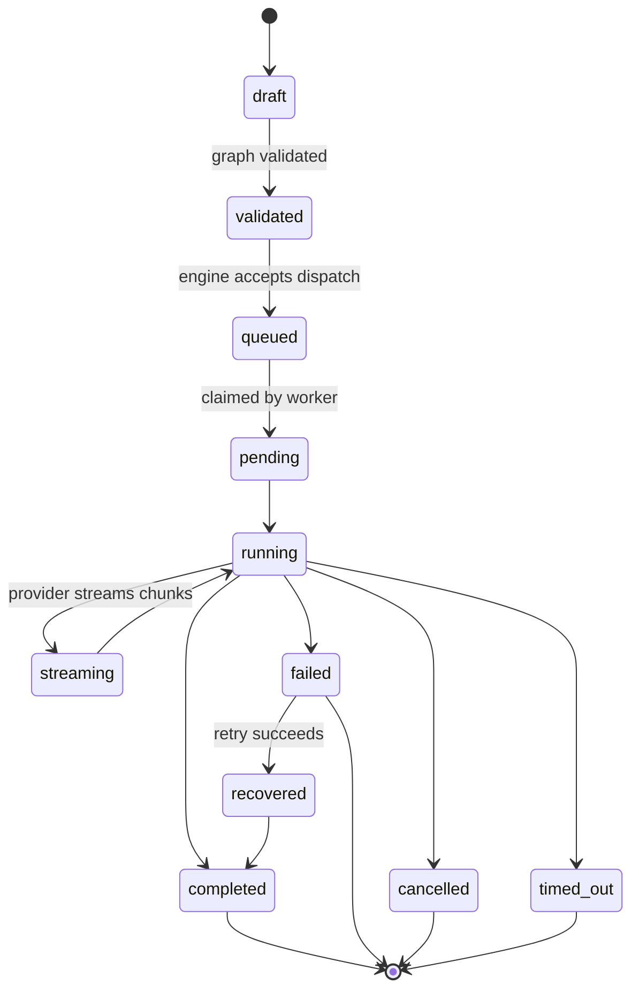
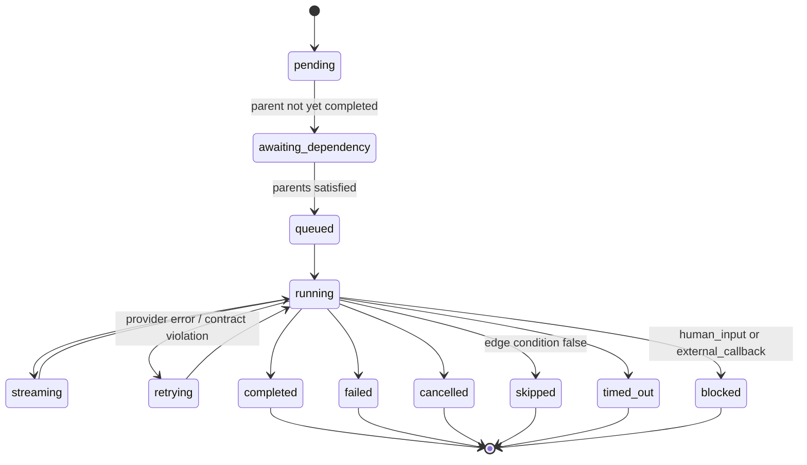
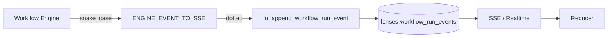
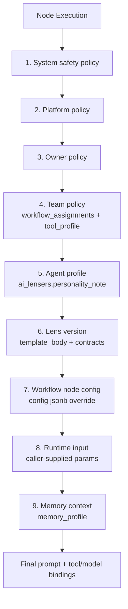
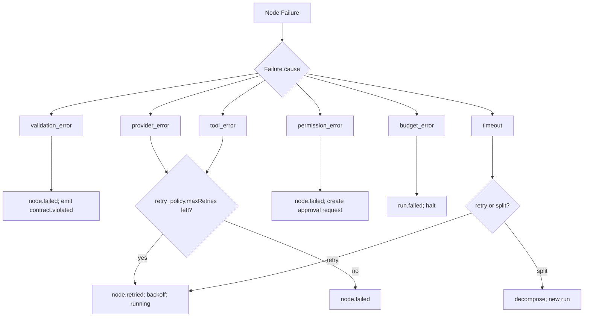

# Workflow Execution

A ConnectedLens workflow is a DAG. Nodes bind a lens version, edges declare data flow with merge strategy and an optional condition, and the engine runs nodes in dependency order with parallel lanes where the DAG allows it. This page is grounded in [`lenses.workflows`](./domain-model#workflow-domain) plus the canonical event taxonomy in [libs/types/src/lib/workflow-events.types.ts](../../libs/types/src/lib/workflow-events.types.ts).

## Run lifecycle

Authoritative status enum: [WORKFLOW_RUN_STATUSES](../../libs/types/src/lib/workflow-events.types.ts#L236). Mirrored on the DB CHECK constraint.

## Node lifecycle

Authoritative enum: [WORKFLOW_NODE_STATUSES](../../libs/types/src/lib/workflow-events.types.ts#L252).

## Waiting reasons

When a node is in `awaiting_dependency`, `queued`, or `retrying`, its `waiting_reason` column tells the inspector why. The taxonomy (mirrored in [WORKFLOW_WAITING_REASONS](../../libs/types/src/lib/workflow-events.types.ts#L331)):

| Reason | Meaning |
|--------|---------|
| `dependency` | Waiting on parent node |
| `condition_false` | Edge condition evaluated false (terminal — node skipped) |
| `rate_limit` | Provider rate-limit backoff |
| `retry_backoff` | Generic retry backoff |
| `human_input` | Awaiting an approval or human-supplied value |
| `external_callback` | Awaiting an external webhook (e.g. async generation) |
| `queued` | Worker capacity backpressure |

## Conditional edges

Edges support a `condition` JSONB (added in [20260417140000_lens_output_contract.sql](../../supabase/migrations/20260417140000_lens_output_contract.sql)). When the condition evaluates false, the engine writes the target node's status to `skipped` with `waiting_reason='condition_false'`.

Merge strategies on edges: `last_write_wins | concat | array | json_object`.

## Browser vs worker execution

- **Browser path** (`useWorkflowExecution`): structural `validateWorkflow` plus `validateBrowserExecutionPlan` run before `startRun`. The engine resolves **per-node** `config.model_id` (or the run default) to an execution provider. Edges use **`source_output_key`** with dotted paths into upstream `output_data` (see `resolveMappedOutputValue` in `@lenserfight/infra/execution`). **Cloud BYOK** manual runs are not executed in the browser in production keys mode; the UI blocks Execute until a supported funding path is chosen.
- **Scheduled worker** (`scheduled-workflow-worker`): claims runs via the worker RPC, loads lens template bodies with `fn_worker_get_lens_template_body`, resolves providers per node, and persists full **`output_data` jsonb** plus optional **`resolved_input_snapshot`** / **`provider_route`** on `lenses.workflow_node_results` through `fn_worker_upsert_node_result`.

## Parallel lanes

The DAG implicitly defines parallelism: any nodes whose parents are all completed run concurrently. For team runs, [`agents.team_members.lane`](./domain-model#agents-team-members) gives the owner an explicit lane index for queue policy purposes.

## Streaming and the SSE event taxonomy

Every event the engine emits goes through one canonical map: [WorkflowEventType](../../libs/types/src/lib/workflow-events.types.ts#L27). Engine-side snake_case (`node_completed`) and transport-side dotted (`node.completed`) are reconciled by [ENGINE_EVENT_TO_SSE](../../libs/types/src/lib/workflow-events.types.ts#L193).

### Run-scoped events

| Event | When |
|-------|------|
| `run.started` | Worker claims the run |
| `run.status.changed` | Status enum transition |
| `run.completed` | Terminal success |
| `run.failed` | Terminal failure |
| `run.cancelled` | Owner cancels |
| `run.timed_out` | Run-level timeout |
| `run.recovered` | Failed run successfully retried |
| `heartbeat` | Transport keep-alive |

### Node-scoped events

| Event | Payload |
|-------|---------|
| `node.queued` | Node enters queue |
| `node.waiting` | Carries `waitingReason` (n8n-style) |
| `node.started` | Provider call begins |
| `node.stream.delta` | Per-chunk text/image delta with monotonic `deltaIndex` |
| `node.log` | Engine log line |
| `node.retried` | `attempt`, `cause` (`timeout / provider_error / rate_limit / contract_violated`), `delayMs` |
| `node.completed` | `envelope`, `creditsCharged`, `durationMs` |
| `node.failed` / `node.cancelled` / `node.skipped` / `node.timed_out` / `node.blocked` / `node.invalidated` | Terminal transitions |
| `node.provenance` | Field-level lineage edge written |
| `moderation.flagged` | Moderation gate verdict |
| `contract.violated` | Contract validator emitted a failing field |

### Envelope

Persisted to `lenses.workflow_run_events` and framed onto SSE as [WorkflowSseEventEnvelope](../../libs/types/src/lib/workflow-events.types.ts#L123). `eventId` is monotonic per `runId` via advisory-lock allocation in `fn_append_workflow_run_event`.

## Run state projection

One round trip rebuilds the entire inspector. [`fn_get_workflow_run_state(p_run_id)`](../../supabase/migrations/20260426010000_n8n_execution_model.sql) returns:

- `active_node_id` — the node currently executing (status in `running / streaming / retrying`).
- `pending_count`, `waiting_count`, `in_flight_count`, `executed_count`, `failed_count`.
- Ordered `node_results` with status, waiting reason, latency, retries, output snapshot, error message.
- Provenance edge counts (upstream, downstream).
- `parent_run_id` and `recursion_depth` for sub-workflow runs.

TypeScript: [WorkflowRunStateProjection](../../libs/types/src/lib/workflow-events.types.ts#L369).

## Provenance

Field-level lineage is recorded on every cross-node hand-off in `lenses.workflow_run_provenance`: source run / workflow / node / output_path → target run / workflow / node / input_path, with optional `transform jsonb`. Returned per-run by [`fn_get_run_provenance(run_id)`](../../supabase/migrations/20260426010000_n8n_execution_model.sql).

UI uses provenance to render data-flow arrows in the inspector and to support cross-run replay.

## Node assignment for team runs

When a workflow is dispatched as a [team run](./agent-teams#team-runs), the engine maps each node to a team member. The default assignment algorithm:

1. Filter team members where `is_active = true`.
2. Filter by `tool_profile.allow_tools` containing the lens's required tools (or `tool_profile.requires_approval = true` flagged for the approval step).
3. Filter by `model_profile.support_level` matching the lens's required tier.
4. Order by `lane`, then `sort_order`.
5. Assign first eligible member; otherwise mark node `blocked` with `waiting_reason='human_input'` so the owner can resolve.

The proposed [`instruction_category` column](./lens-instructions#future-work) would let the matcher prefer members whose role responsibility matches the lens's role tag (e.g., a `validation`-categorized lens routes preferentially to a member with `role='reviewer'`).

## Instruction resolution priority

When a node executes, the system assembles a single prompt from layered sources. Higher-priority sources win on conflict.

| Layer | Source |
|-------|--------|
| 1 | Hard-coded engine guardrails |
| 2 | Platform-wide policies (moderation gate, content rules) |
| 3 | Owner policy on `agents.policies` ([AgentPolicyRecord](../../libs/types/src/lib/agents.types.ts#L40)) |
| 4 | Team policy bundle on `agents.workflow_assignments` (`approval_policy`, `retry_policy`, `failure_policy`, `queue_policy`) + member's `tool_profile` |
| 5 | `agents.ai_lensers.personality_note` and the member's `personality_profile.system_prompt_patch` |
| 6 | The lens version: `template_body`, `input_contract`, `output_contract` |
| 7 | Workflow node `config jsonb` override (e.g. `model_id`) |
| 8 | Runtime caller input (CLI flag, API body, UI form) |
| 9 | Memory context loaded per `memory_profile` |

Conflicts: a stricter (lower-numbered) layer overrides a looser one. A team policy that forbids tool X cannot be relaxed by a lens that asks for tool X — the engine rejects with `contract.violated`.

## Failure handling

Per-assignment policy lives in [`agents.workflow_assignments.failure_policy`](./domain-model#agents-workflow-assignments) (`{"mode":"isolate"}` default — keep failed branch isolated from siblings).

## Recovery

A failed run can be re-claimed by the engine's recovery sweeper (added in [20260422000000_workflow_recovery.sql](../../supabase/migrations/20260422000000_workflow_recovery.sql)). On success, the engine emits `run.recovered` and transitions to `recovered`, then `completed`.

Idempotency: every run carries an idempotency key on the run row; recovery uses it to avoid double-charging credits.

## Cancellation

Owners cancel via `workflowsService.updateRunStatus(runId, 'cancelled')`. The engine drains in-flight nodes to `cancelled` and emits `run.cancelled`. No new nodes start once a run is cancelling.

## Sub-workflows

A node may dispatch a sub-run with `parent_run_id` set on the new run row. `recursion_depth` enforces a hard cap (engine-configured, 5 by default). Provenance edges cross run boundaries naturally because the provenance table keys on (run_id, node_id, path).
