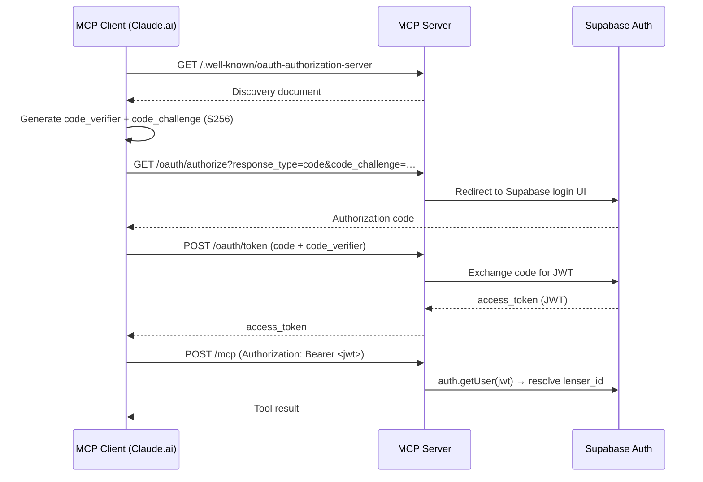

# Authentication

The MCP server supports three authentication strategies depending on how it is deployed.

---

## Token types

### Service role key (stdio mode only)

In stdio mode the server reads `SUPABASE_SERVICE_ROLE_KEY` from the environment at startup. No Bearer header is required — the service role key is pre-configured and shared for all requests. This bypasses Supabase RLS, so restrict stdio mode to trusted local environments.

### Supabase JWT (HTTP mode — OAuth users)

When using the HTTP transport or the Supabase Edge Function, every request must include:

```http
Authorization: Bearer <supabase-jwt>
```

The server validates the token by calling `sb.auth.getUser(token)` on the service-role Supabase client. On success it resolves the caller's `lenser_id` via the RPC `fn_mcp_resolve_lenser_id(auth_user_id)` and creates an `AuthContext`:

```ts
interface AuthContext {
  lenserId: string;  // the lenser UUID the tools operate on behalf of
  userId: string;    // Supabase auth user UUID
  userJwt: string;   // the original JWT, forwarded to the user-scoped client
}
```

### MCP token (long-lived app tokens)

MCP tokens are long-lived credentials that bypass the Supabase session expiry. They follow the format `lf_mcp_<32 hex characters>`.

**Resolution flow:**

1. Token is extracted from `Authorization: Bearer lf_mcp_…`.
2. RPC `fn_mcp_resolve_token(token)` returns `{ lenser_id, supabase_refresh_token }`.
3. The refresh token is exchanged for a fresh Supabase JWT.
4. The fresh JWT is used to build the user-scoped Supabase client.

MCP tokens are suitable for CI pipelines, agent automations, or any context where re-triggering the OAuth flow is impractical. Generate them from the LenserFight web app under **Settings → Developer → MCP Tokens**.

---

## OAuth PKCE flow (HTTP mode)

When a client such as Claude.ai connects to the HTTP server or the Supabase Edge Function, it reads the OAuth discovery document and starts a PKCE authorization flow.

### Discovery document

```
GET /.well-known/oauth-authorization-server
```

Response shape:

```json
{
  "issuer": "https://your-server-base-url",
  "authorization_endpoint": "https://your-server-base-url/oauth/authorize",
  "token_endpoint": "https://your-server-base-url/oauth/token",
  "userinfo_endpoint": "https://<project>.supabase.co/auth/v1/user",
  "jwks_uri": "https://<project>.supabase.co/auth/v1/jwks",
  "response_types_supported": ["code"],
  "grant_types_supported": ["authorization_code"],
  "code_challenge_methods_supported": ["S256"],
  "scopes_supported": ["openid", "email", "profile"],
  "token_endpoint_auth_methods_supported": ["client_secret_post"]
}
```

The `issuer`, `authorization_endpoint`, and `token_endpoint` are derived from `MCP_OAUTH_BASE_URL`. The `userinfo_endpoint` and `jwks_uri` point to your Supabase project's auth service.

### Flow summary



---

## Request headers

| Header | Value | Required |
|---|---|---|
| `Authorization` | `Bearer <supabase-jwt>` or `Bearer lf_mcp_<hex>` | Yes (HTTP mode) |
| `mcp-session-id` | Opaque string issued at session start | Recommended |
| `Content-Type` | `application/json` | Yes |

The `mcp-session-id` header is used to route requests to the correct in-memory session. If omitted, the server creates a new session for each request, which is less efficient but still correct.

---

## Security considerations

- The service role key bypasses RLS on every Supabase table. Never expose it in client-side code or commit it to source control.
- In stdio mode, access to the running process is equivalent to access to the service role key.
- Supabase JWTs expire after the configured session lifetime (default 1 hour). MCP tokens do not expire unless revoked.
- Revoke MCP tokens from **Settings → Developer → MCP Tokens** in the LenserFight web app.
