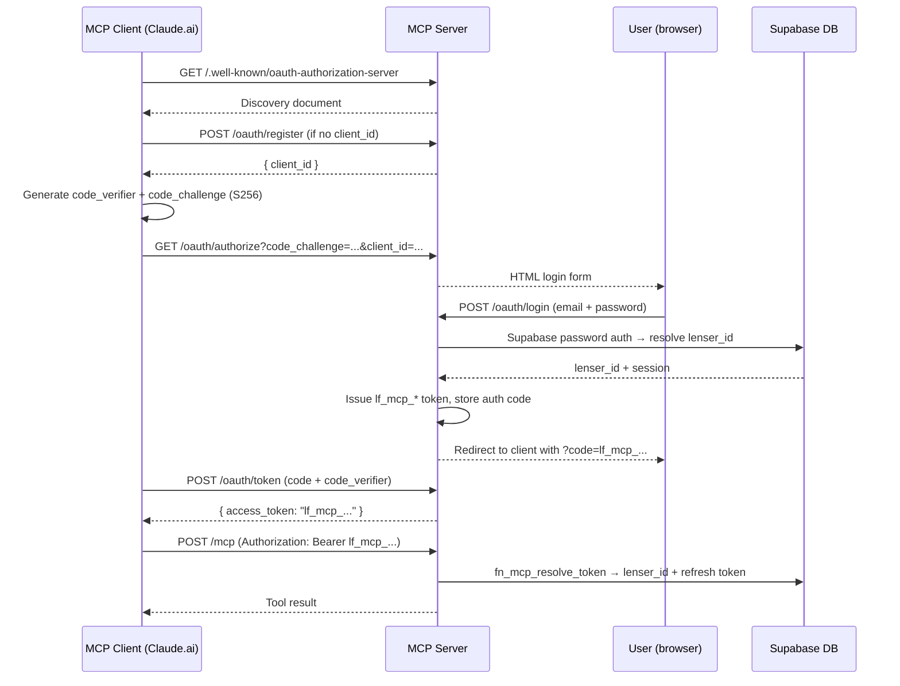

# Authentication

The MCP server supports three authentication strategies depending on how it is deployed.

---

## Token types

### Service role key (stdio mode only)

In stdio mode the server reads `SUPABASE_SERVICE_ROLE_KEY` from the environment at startup. No Bearer header is required — the service role key is pre-configured and used for all requests. This bypasses Supabase RLS entirely, so restrict stdio mode to trusted local environments.

### MCP token (`lf_mcp_*`)

MCP tokens are long-lived credentials issued by the MCP server's OAuth flow. They follow the format `lf_mcp_<64 hex characters>`.

**Resolution flow:**

1. Token is extracted from `Authorization: Bearer lf_mcp_…`.
2. RPC `fn_mcp_resolve_token(token)` returns `{ lenser_id, supabase_refresh_token }`.
3. The refresh token is exchanged for a fresh Supabase JWT.
4. The fresh JWT is used to build the user-scoped Supabase client (RLS applies normally).

MCP tokens are suitable for AI agent automations or CI pipelines where re-triggering the OAuth login flow is impractical.

### Supabase JWT (advanced)

When using the HTTP transport with a short-lived Supabase JWT, include:

```http
Authorization: Bearer <supabase-jwt>
```

The server validates the token via `sb.auth.getUser(token)`, resolves the caller's `lenser_id` via RPC, and creates a user-scoped client. Supabase JWTs expire after the configured session lifetime (default 1 hour) — MCP tokens do not expire unless revoked.

---

## OAuth 2.1 PKCE flow

When Claude.ai or another HTTP client connects, it reads the OAuth discovery document and starts a PKCE authorization flow.

### Discovery documents

```
GET /.well-known/oauth-authorization-server
GET /.well-known/oauth-protected-resource
GET /.well-known/oauth-protected-resource/mcp
```

The authorization server document advertises:

```json
{
  "issuer": "https://<server-base-url>",
  "authorization_endpoint": "https://<server-base-url>/oauth/authorize",
  "token_endpoint": "https://<server-base-url>/oauth/token",
  "registration_endpoint": "https://<server-base-url>/oauth/register",
  "response_types_supported": ["code"],
  "grant_types_supported": ["authorization_code"],
  "code_challenge_methods_supported": ["S256"],
  "token_endpoint_auth_methods_supported": ["none"]
}
```

### Dynamic client registration

The server supports [RFC 7591](https://datatracker.ietf.org/doc/html/rfc7591) dynamic client registration. Clients call `POST /oauth/register` to receive a `client_id`:

```http
POST /oauth/register
Content-Type: application/json

{
  "client_name": "Claude",
  "redirect_uris": ["https://claude.ai/api/mcp/auth_callback"]
}
```

Response:
```json
{
  "client_id": "lf_mcp_client_<generated>",
  "redirect_uris": ["https://claude.ai/api/mcp/auth_callback"],
  "token_endpoint_auth_method": "none"
}
```

> **LF Cloud note:** Dynamic registration works correctly via `https://mcp.lenserfight.com` — the Cloudflare proxy serves the MCP server at the domain root, so OAuth discovery resolves as expected.

### Flow summary



### Key design notes

- The `code` returned in the redirect **is** the `lf_mcp_*` bearer token. On `POST /oauth/token`, if the code already starts with `lf_mcp_`, the server returns it directly. This makes the flow compatible with clients (like Claude.ai) whose token exchange call comes from a cloud backend that cannot reach localhost.
- The local dev client `lf_mcp_client_localdev` is created automatically on every server boot via `fn_mcp_ensure_local_dev_client`. It is PKCE-only (`requires_secret = false`) and is never lost by a DB reset.

---

## Request headers (HTTP mode)

| Header | Value | Required |
|---|---|---|
| `Authorization` | `Bearer lf_mcp_<hex>` or `Bearer <supabase-jwt>` | Yes |
| `mcp-session-id` | Opaque string issued at session start | Recommended |
| `Content-Type` | `application/json` | Yes |

If `mcp-session-id` is omitted, the server creates a new in-memory session for each request, which is less efficient but still correct.

---

## Security considerations

- The service role key bypasses RLS on every table. Never expose it in client-side code or commit it to a public repository.
- In stdio mode, shell access is equivalent to service role key access — restrict it to your own machine.
- MCP tokens are long-lived. Avoid logging them. If a token is leaked, revoke it by deleting the corresponding row from `lensers.mcp_tokens`.
- The HTML login form uses `escapeHtml` to prevent XSS in error messages.
