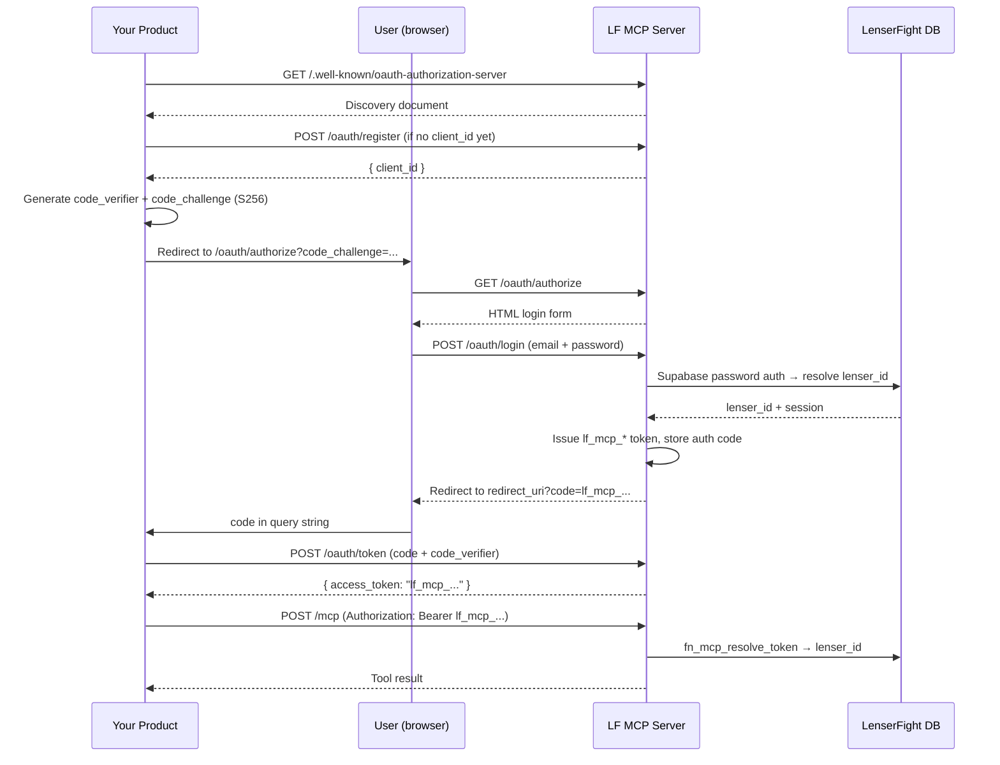

# OAuth & Authentication

This page covers every authentication mechanism the LenserFight MCP server supports. Implement this correctly once and your users will authorize with a single click — with no credentials stored in your product.

---

## Token types

| Token type | Format | Lifespan | When to use |
|---|---|---|---|
| **MCP token** | `lf_mcp_<64 hex>` | Long-lived (no expiry) | Standard. Issued at end of OAuth flow. Use for all production requests. |
| **Supabase JWT** | Standard JWT | 1 hour (configurable) | Advanced. Use when you already have a short-lived Supabase session token. |
| **Service role key** | Supabase JWT with `service_role` claim | Permanent until rotated | stdio mode only. Never expose in production. Bypasses all RLS. |

For virtually all provider integrations, you will use **MCP tokens** exclusively.

---

## OAuth endpoints

All endpoints are served from the same base URL as the MCP server:

```
https://mcp.lenserfight.com
```

| Endpoint | Method | Purpose |
|---|---|---|
| `/.well-known/oauth-authorization-server` | GET | RFC 8414 discovery document |
| `/.well-known/oauth-protected-resource` | GET | RFC 9728 protected resource metadata |
| `/oauth/register` | POST | RFC 7591 dynamic client registration |
| `/oauth/authorize` | GET | Authorization endpoint — renders login form |
| `/oauth/token` | POST | Token endpoint — exchanges code for access token |

---

## Full OAuth 2.1 PKCE flow

### Overview



---

### Step 1 — Discover the server (optional but recommended)

```bash
curl https://mcp.lenserfight.com/.well-known/oauth-authorization-server
```

```json
{
  "issuer": "https://mcp.lenserfight.com",
  "authorization_endpoint": "https://mcp.lenserfight.com/oauth/authorize",
  "token_endpoint": "https://mcp.lenserfight.com/oauth/token",
  "registration_endpoint": "https://mcp.lenserfight.com/oauth/register",
  "response_types_supported": ["code"],
  "grant_types_supported": ["authorization_code"],
  "code_challenge_methods_supported": ["S256"],
  "token_endpoint_auth_methods_supported": ["none"]
}
```

Parse and cache this. Use the endpoint values instead of hard-coding paths — they may change if the infrastructure moves.

---

### Step 2 — Register your client

Call this once per product (or once per deployment). Save the `client_id` permanently.

```http
POST https://mcp.lenserfight.com/oauth/register
Content-Type: application/json

{
  "client_name": "Acme AI Assistant",
  "redirect_uris": ["https://acme.example.com/api/mcp/callback"]
}
```

Response:
```json
{
  "client_id": "lf_mcp_client_a1b2c3d4...",
  "client_name": "Acme AI Assistant",
  "redirect_uris": ["https://acme.example.com/api/mcp/callback"],
  "token_endpoint_auth_method": "none",
  "grant_types": ["authorization_code"],
  "response_types": ["code"]
}
```

> **No client secret is issued.** The server uses PKCE exclusively. Do not send a `client_secret` field — it is ignored.

Multiple redirect URIs are allowed. Every authorization request must use one of the registered URIs exactly.

---

### Step 3 — Generate PKCE parameters

```typescript
import crypto from 'crypto'

// Generate code verifier (43–128 URL-safe chars)
const codeVerifier = crypto.randomBytes(32).toString('base64url')

// Derive code challenge (S256 = SHA-256 of verifier, base64url-encoded)
const codeChallenge = crypto
  .createHash('sha256')
  .update(codeVerifier)
  .digest('base64url')
```

Store `codeVerifier` in your server-side session. You will need it in Step 5.

---

### Step 4 — Redirect the user to the authorization endpoint

Construct the URL:

```
https://mcp.lenserfight.com/oauth/authorize
  ?response_type=code
  &client_id=lf_mcp_client_a1b2c3d4...
  &redirect_uri=https://acme.example.com/api/mcp/callback
  &code_challenge=<base64url_sha256_of_verifier>
  &code_challenge_method=S256
  &state=<random_csrf_token>
```

The server renders a login form. The user enters their LenserFight credentials.

> **Important:** Users must have a Lenser profile (a handle chosen at [lenserfight.com](https://lenserfight.com)) before they can authorize. If they have not completed onboarding, the login form will return an error.

---

### Step 5 — Handle the callback

After successful login, the server redirects to:

```
https://acme.example.com/api/mcp/callback?code=lf_mcp_abc123...&state=<your_state>
```

**Always verify `state` matches what you issued in Step 4** to prevent CSRF.

---

### Step 6 — Exchange the code for an access token

```http
POST https://mcp.lenserfight.com/oauth/token
Content-Type: application/x-www-form-urlencoded

grant_type=authorization_code
&code=lf_mcp_abc123...
&redirect_uri=https://acme.example.com/api/mcp/callback
&client_id=lf_mcp_client_a1b2c3d4...
&code_verifier=<the_verifier_from_step_3>
```

Response:
```json
{
  "access_token": "lf_mcp_abc123...",
  "token_type": "bearer"
}
```

> **Design note:** The `code` returned in the redirect callback *is* the `lf_mcp_*` bearer token. On `POST /oauth/token`, if the code already starts with `lf_mcp_`, the server returns it directly as the access token. This makes the flow compatible with clients (like Claude.ai) whose token exchange call comes from a cloud backend that cannot reach localhost — the token travels to the client through the browser redirect, not a server-to-server call.

---

### Step 7 — Call the MCP server

Include the token on every request:

```http
POST https://mcp.lenserfight.com/mcp
Authorization: Bearer lf_mcp_abc123...
Content-Type: application/json
mcp-session-id: <your_session_id>

{
  "jsonrpc": "2.0",
  "id": 1,
  "method": "tools/call",
  "params": { "name": "list_lenses", "arguments": { "limit": 5 } }
}
```

---

## Request headers reference

| Header | Value | Required |
|---|---|---|
| `Authorization` | `Bearer lf_mcp_<hex>` | Yes |
| `Content-Type` | `application/json` | Yes |
| `mcp-session-id` | Opaque string you generate per conversation session | Recommended |

`mcp-session-id` is not required but improves performance for multi-turn sessions. The server creates a new in-memory session context for each request when it is absent.

---

## Token lifecycle

MCP tokens are long-lived. They do not expire unless:
- The user revokes the integration from the LenserFight settings.
- A LenserFight admin deletes the row from `lensers.mcp_tokens`.

You do not need to implement token refresh. Store the token securely (e.g., encrypted in your database) and reuse it for all future calls from that user.

---

## Using a Supabase JWT instead (advanced)

If you already have a short-lived Supabase JWT for the user (e.g., from a direct Supabase auth integration in your product), you can use it directly:

```http
Authorization: Bearer <supabase_jwt>
```

The server calls `sb.auth.getUser(token)` to validate it, resolves the `lenser_id` via RPC, and creates a user-scoped client. Supabase JWTs expire after the session lifetime configured for the project (default 1 hour). For long-lived integrations, use MCP tokens instead.

---

## Security considerations

- **Never log MCP tokens.** They are long-lived and equivalent to credentials.
- **Verify `state` in the callback** to prevent CSRF.
- **Never send a `client_secret`.** The server is PKCE-only; no secret exists.
- **One token per user per product.** If a user authorizes your product multiple times, each flow issues a new token. Old tokens remain valid until revoked.
- **The service role key bypasses all RLS.** Only use it in stdio mode, never in production.

---

## Re-authorization

If a token is revoked or returns `401`, send the user back through the full OAuth flow (Steps 3–7). The `client_id` from Step 2 is reusable — you do not need to re-register.
