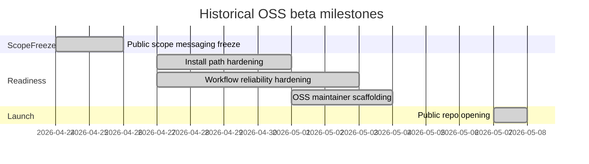

# Beta Roadmap

This page records the **Community Edition** public-repo direction. Historical milestones stay below for context; current work follows [CHANGELOG](https://github.com/conectlens/lenserfight/blob/main/CHANGELOG.md) and [OSS Launch Scope](/en/explanation/community/oss-launch-scope).

## Current focus (2026)

- **First-public readiness** — docs truth, contributor CI gates (`pnpm smoke`), permissive **MIT** license, brand guidelines, Trust Gateway preview boundaries.
- **Connector alpha** — in-repo `@lenserfight/adapters/connector` and RPCs; stable npm **v1** remains Phase 16 (RFC-0001).
- **Trust Gateway** — source-first rollout; see [OSS cutover](/en/explanation/gateway/oss-cutover) and [release readiness](/en/explanation/gateway/release-readiness).

## Explicitly out of scope for Community Edition promises

- public battles as a default-on OSS promise
- benchmark UI as a public promise
- enterprise billing or private workspaces in this repo
- advanced analytics as a self-host guarantee
- autonomous connector automation claims before implementation lands

## Scope later

- stable public SDK on npm and governance for breaking changes
- better workflow templates and recovery UX
- community governance basics beyond lightweight maintainer model
- sponsorships after support operations stabilize

---

## Historical timeline (archived)

The first public OSS beta window targeted **2026-05-07**. Subsequent releases (e.g. `0.10.0-alpha.x`) track connector and licensing milestones — see `CHANGELOG.md` for authoritative dates.

