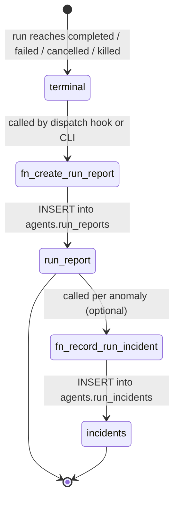

# Run Reports & Incidents

Run reports and incidents are **immutable post-run artifacts**. Once a team run reaches a terminal state, `fn_create_run_report` creates a single `run_reports` row that summarises everything that happened. If anomalies were detected, `fn_record_run_incident` attaches structured incident rows to that report.

Neither table supports `UPDATE` or `DELETE` for the `authenticated` role. Both serve as an audit trail.

---

## Creation flow



---

## Outcome values

| Outcome | When set |
|---------|---------|
| `success` | All steps completed without error; cost within budget |
| `partial` | Some steps completed; at least one step failed but the run was not aborted |
| `failed` | An unrecoverable error stopped the run before completion |
| `cancelled` | An operator or the system cancelled the run before completion |
| `killed` | The kill switch was activated while the run was active |

---

## RunReportRecord DTO

| Field | Type | Description |
|-------|------|-------------|
| `id` | `uuid` | Immutable report identifier |
| `team_run_id` | `uuid` | The team run this report covers |
| `ai_lenser_id` | `uuid` | The AI lenser that ran |
| `workflow_id` | `uuid \| null` | Workflow executed, if applicable |
| `outcome` | `text` | `success`, `partial`, `failed`, `cancelled`, or `killed` |
| `total_steps` | `integer` | Count of `agent_steps` rows for this run |
| `total_tool_invocations` | `integer` | Count of `tool_invocations` rows for this run |
| `total_memory_writes` | `integer` | Count of memory entries committed on success |
| `total_cost_estimate` | `numeric` | Summed `cost_estimate` across all tool invocations (USD) |
| `started_at` | `timestamptz` | When the team run started |
| `ended_at` | `timestamptz` | When the team run reached its terminal state |
| `duration_ms` | `integer` | Computed: `ended_at - started_at` in milliseconds |
| `summary` | `text \| null` | Optional human-readable or LLM-generated summary |
| `created_at` | `timestamptz` | When this report row was inserted |

---

## RunIncidentRecord DTO

| Field | Type | Description |
|-------|------|-------------|
| `id` | `uuid` | Immutable incident identifier |
| `run_report_id` | `uuid` | The report this incident belongs to |
| `ai_lenser_id` | `uuid` | The AI lenser involved |
| `incident_type` | `text` | See incident types table below |
| `severity` | `text` | `low`, `medium`, `high`, or `critical` |
| `message` | `text` | Short description of what happened |
| `context` | `jsonb` | Structured diagnostic data (step id, tool id, cost delta, etc.) |
| `occurred_at` | `timestamptz` | When the incident event occurred within the run |
| `created_at` | `timestamptz` | When this row was inserted |

---

## Incident types

| Type | Description |
|------|-------------|
| `step_error` | An agent step threw an unhandled exception |
| `tool_timeout` | A tool invocation exceeded its configured timeout |
| `tool_rejection` | A write-class tool invocation was rejected by an operator |
| `budget_overrun` | The run's cumulative cost exceeded the configured budget ceiling |
| `memory_write_failed` | A buffered memory write could not be committed after run completion |
| `policy_denial` | A policy check denied the run or a tool invocation mid-run |
| `kill_switch_activated` | The kill switch was activated while this run was active |

---

## Severity levels

| Severity | Meaning |
|----------|---------|
| `low` | Informational; run completed successfully despite the event |
| `medium` | Run degraded (partial outcome) but did not abort |
| `high` | Run aborted; operator review recommended |
| `critical` | Security or safety concern; immediate operator action required |

---

## RPCs

### `fn_create_run_report`

```sql
SELECT fn_create_run_report(
  p_team_run_id := '<run-uuid>',
  p_outcome     := 'success',
  p_summary     := 'Completed 12 steps, 3 tool calls, $0.04'
);
```

**Signature:**

```sql
CREATE OR REPLACE FUNCTION fn_create_run_report(
  p_team_run_id uuid,
  p_outcome     text,
  p_summary     text DEFAULT NULL
)
RETURNS uuid   -- the new run_report id
LANGUAGE plpgsql
SECURITY DEFINER;
```

The function aggregates step/tool/memory counts from the run tables. Callers only need to provide outcome and an optional summary.

---

### `fn_record_run_incident`

```sql
SELECT fn_record_run_incident(
  p_run_report_id := '<report-uuid>',
  p_incident_type := 'budget_overrun',
  p_severity      := 'high',
  p_message       := 'Cumulative cost $12.80 exceeded ceiling $10.00',
  p_context       := '{"cost_usd": 12.80, "ceiling_usd": 10.00}'::jsonb,
  p_occurred_at   := now()
);
```

**Signature:**

```sql
CREATE OR REPLACE FUNCTION fn_record_run_incident(
  p_run_report_id uuid,
  p_incident_type text,
  p_severity      text,
  p_message       text,
  p_context       jsonb        DEFAULT '{}',
  p_occurred_at   timestamptz  DEFAULT now()
)
RETURNS uuid   -- the new run_incident id
LANGUAGE plpgsql
SECURITY DEFINER;
```

---

## CLI commands

Fetch the report for a completed run:

```bash
lf run report <run-id>
```

Example output:

```
Run Report  run_abc123
──────────────────────────────────
  outcome             success
  steps               12
  tool invocations    3
  memory writes       2
  cost estimate       $0.04
  duration            4 231 ms
  summary             Completed sentiment analysis across 10 inputs.
```

List incidents for a run:

```bash
lf run incidents <run-id>
```

Example output:

```
Incidents for run_abc123
  none
```

```bash
lf run incidents run_xyz789
```

```
Incidents for run_xyz789
  [high]    budget_overrun     Cumulative cost $12.80 exceeded ceiling $10.00
  [medium]  tool_timeout       Tool search_web timed out after 30s on step 4
```

---

## Immutability

`run_reports` rows are written once by `fn_create_run_report` and are never modified. The `authenticated` role has `INSERT` and `SELECT` only. `run_incidents` follows the same pattern. This ensures that post-incident investigation always sees the state as it was at run time, not a later mutation.

---

## Related

- [Autonomous Agent OS](/en/explanation/agents/autonomous-agent-os) — run lifecycle diagram and outcome flow
- [Policy Engine](/en/reference/platform-api/policy-engine) — `policy_denial` and `kill_switch_activated` incident origins
- [Agent Lifecycle Commands (Phase 8)](/en/reference/cli/agent-lifecycle) — full CLI reference
- [Tool Sandboxing](/en/explanation/agents/tool-sandboxing) — `tool_rejection` and `tool_timeout` context
