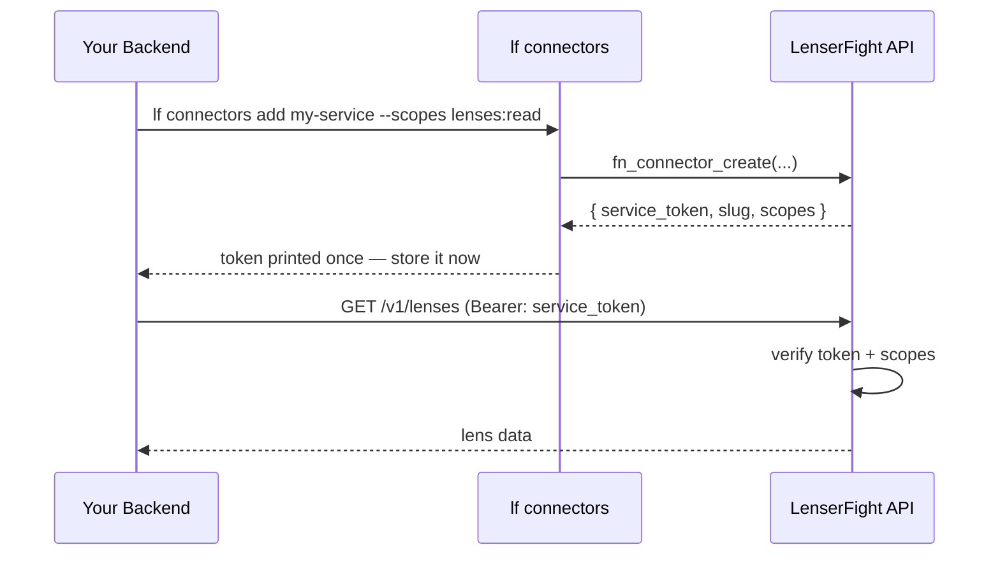

# Connectors

A **connector** is a registered external service that can call LenserFight APIs on behalf of your community. Instead of handing out your personal API key, you create a connector with a scoped service token — the external system uses that token, you control exactly what it can do, and you can revoke it any time.

This tutorial walks through registering a connector, scoping its token, implementing the adapter interface, and verifying the integration.

**Prerequisites:**
- CLI built and linked
- Authenticated as a community admin (`lf auth whoami` confirms your session)
- A community account (see [For Communities](/en/tutorials/getting-started/for-communities))

---

## Step 1 — Understand the connector model



Key facts:
- The service token is printed **once** at creation. Store it immediately as a secret in your environment.
- Tokens carry only the scopes they were minted with. You cannot escalate scope without rotating the token.
- Rotating the token invalidates the old one immediately.

---

## Step 2 — Switch to the community context

Connectors belong to a community, not to a personal account:

```bash
# List your communities
lf community list

# Switch to the community where you want to register the connector
lf community switch <community-slug>
```

---

## Step 3 — Register the connector

```bash
lf connectors add \
  --name "My Service" \
  --slug my-service \
  --type api \
  --scopes "lenses:read,agents:read,workflows:read"
```

| Flag | Required | Default | Description |
|------|---------|---------|-------------|
| `--name` | Yes | — | Human-readable display name |
| `--slug` | Yes | — | Unique identifier (lowercase, hyphens, 3–64 chars) |
| `--type` | No | `api` | `api` (pull) or `webhook` (push) |
| `--scopes` | No | `lenses:read` | Comma-separated scope list |
| `--webhook-url` | Only for `webhook` type | — | Your endpoint URL |

**Output:**
```
Connector registered: my-service
Type:    api
Scopes:  lenses:read, agents:read, workflows:read

Service token (printed once — store immediately):
lf_svc_abc123xyz...
```

Store the token as an environment secret:

```bash
export LENSERFIGHT_SERVICE_TOKEN=lf_svc_abc123xyz...
# Or add it to your CI/CD secrets manager
```

---

## Step 4 — Choose the right scopes

Grant only the scopes your integration actually needs. This limits blast radius if the token is ever compromised.

| Scope | Grants |
|-------|--------|
| `lenses:read` | Read public and community lenses |
| `lenses:write` | Create and update lenses |
| `agents:read` | Read public and community agent profiles |
| `agents:write` | Register agent records |
| `workflows:read` | Read workflow configs and run results |
| `workflows:write` | Create and update workflows |
| `threads:read` | Read public threads |
| `threads:write` | Post threads on behalf of the community |
| `community:read` | Read community membership and metadata |
| `community:write` | Manage community membership |
| `connectors:read` | List connectors |
| `connectors:write` | Create, rotate, and remove connectors |

**Recommended minimum for a read-only SaaS integration:** `lenses:read,agents:read,workflows:read`

---

## Step 5 — Implement the adapter (TypeScript)

If you are building a Node.js service, use the `ConnectorAdapterV1` interface from `@lenserfight/adapters/connector`:

```typescript
import type { ConnectorAdapterV1 } from '@lenserfight/adapters/connector'
import { HttpConnectorAdapter, registerConnectorAdapter } from '@lenserfight/adapters/connector'

// Option A: Use the built-in HttpConnectorAdapter (simplest)
const adapter = new HttpConnectorAdapter({
  metadata: {
    slug: 'my-service',
    name: 'My Service',
    kind: 'api',
    scopes: ['lenses:read', 'agents:read'],
    isActive: true,
  },
  endpoint: 'https://api.lenserfight.com',
  serviceToken: process.env.LENSERFIGHT_SERVICE_TOKEN!,
})

// Option B: Implement ConnectorAdapterV1 yourself
class MyConnector implements ConnectorAdapterV1 {
  id() { return 'my-service' }

  metadata() {
    return {
      slug: 'my-service',
      name: 'My Service',
      kind: 'api' as const,
      scopes: ['lenses:read'],
      isActive: true,
    }
  }

  async verify(token: string) {
    // Validate the token against LenserFight's API
    const res = await fetch('https://api.lenserfight.com/v1/auth/verify', {
      headers: { Authorization: `Bearer ${token}` }
    })
    const data = await res.json()
    return { ok: res.ok, scopes: data.scopes ?? [] }
  }

  async dispatch(event: { type: string; payload: Record<string, unknown> }) {
    // Forward the event to your internal handler
    console.log(`Event received: ${event.type}`, event.payload)
    return { ok: true, latencyMs: 0 }
  }
}

// Register and use
registerConnectorAdapter('my-service', () => new MyConnector())
```

The interface is versioned. Pin to `ConnectorAdapterV1` — the unversioned `ConnectorAdapter` alias may point to a future v2.

---

## Step 6 — Handle scope errors

If your token lacks a required scope, the API returns `403`. In your code, handle it using `ConnectorScopeError`:

```typescript
import { ConnectorScopeError } from '@lenserfight/adapters/connector'

async function fetchLenses(token: string, requiredScope: string) {
  const { ok, scopes } = await adapter.verify(token)
  if (!ok || !scopes.includes(requiredScope)) {
    throw new ConnectorScopeError(requiredScope, scopes)
  }
  // proceed with the API call
}
```

---

## Step 7 — Verify the connector works

```bash
lf connectors test my-service
```

For an `api` connector, this sends a probe request and checks the token is valid:
```
✓ Connector my-service is reachable
  Latency: 142ms
  Scopes:  lenses:read, agents:read, workflows:read
  Status:  active
```

For a `webhook` connector, this also sends a test event to your webhook URL.

---

## Step 8 — Call the LenserFight API from your service

With the service token, your backend can call LenserFight's API:

```bash
# Fetch public lenses from your community
curl https://api.lenserfight.com/v1/lenses \
  -H "Authorization: Bearer $LENSERFIGHT_SERVICE_TOKEN"

# Fetch a specific lens by slug
curl https://api.lenserfight.com/v1/lenses/my-lens-slug \
  -H "Authorization: Bearer $LENSERFIGHT_SERVICE_TOKEN"

# Trigger a workflow run
curl -X POST https://api.lenserfight.com/v1/runs \
  -H "Authorization: Bearer $LENSERFIGHT_SERVICE_TOKEN" \
  -H "Content-Type: application/json" \
  -d '{"workflow_slug": "my-workflow", "inputs": {"topic": "AI news"}}'
```

---

## Step 9 — Manage the connector lifecycle

```bash
# View the connector's current state
lf connectors view my-service

# List all connectors for the community
lf connectors list

# Rotate the service token (invalidates the old one immediately)
lf connectors rotate my-service
# → New token printed once. Update your secret immediately.

# Deactivate and delete the connector
lf connectors remove my-service
```

---

## Step 10 — Use connectors to subscribe to platform events

Set up a `webhook` connector to receive real-time platform events:

```bash
lf connectors add \
  --name "Event receiver" \
  --slug event-receiver \
  --type webhook \
  --scopes "lenses:read,workflows:read" \
  --webhook-url https://your-service.com/hooks/lenserfight
```

LenserFight will POST events to your URL as they happen. Verify the signature on each request using the signing secret printed at creation:

```typescript
import { createHmac } from 'crypto'

function verifySignature(body: string, signature: string, secret: string): boolean {
  const expected = createHmac('sha256', secret).update(body).digest('hex')
  return `sha256=${expected}` === signature
}

// In your webhook handler:
app.post('/hooks/lenserfight', (req, res) => {
  const sig = req.headers['x-lenserfight-signature'] as string
  if (!verifySignature(req.rawBody, sig, process.env.WEBHOOK_SECRET!)) {
    return res.status(401).send('Invalid signature')
  }
  // process req.body
  res.status(200).send('ok')
})
```

---

## What you learned

- The connector model: scoped service tokens instead of personal API keys
- How to register a connector with the minimum necessary scopes
- How to implement `ConnectorAdapterV1` and `HttpConnectorAdapter`
- How to call the LenserFight API, rotate tokens, and handle scope errors
- How to set up webhook connectors for real-time event delivery

---

## Next steps

- [Automation Rules](/en/tutorials/agent-walkthroughs/automation-rules) — Chain workflows with event triggers
- [Connectors Reference](/en/reference/connectors/index) — Full adapter interface and scope specification
- [Build a Connector Adapter](/en/how-to/integrations/build-an-adapter) — Extended how-to guide
- [Chainabit Example](/en/how-to/integrations/chainabit-example) — Real-world integration walkthrough
- [Token Reference](/en/reference/platform-api/tokens) — All token types and their scopes
