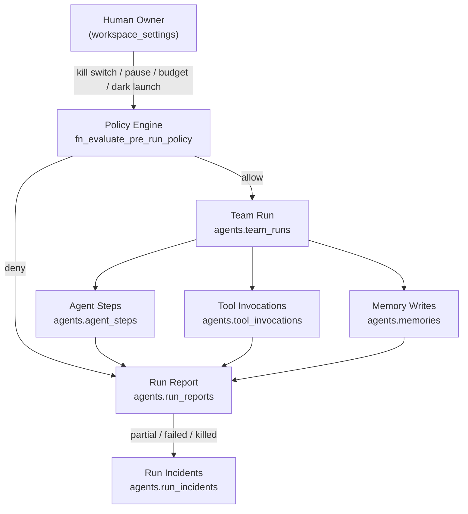
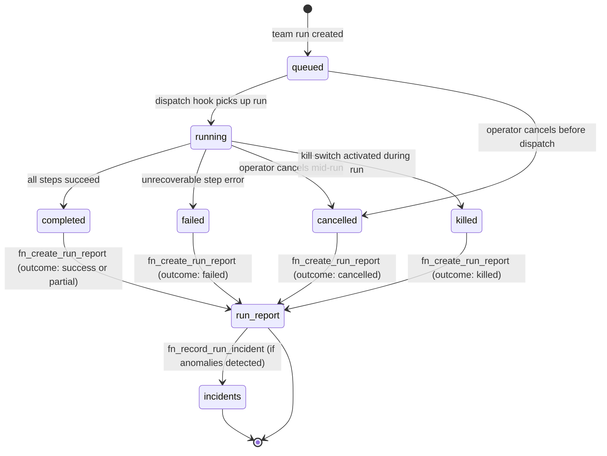

# Autonomous Agent Operating System

## What changed in Phase 8

Phases 2 through 7 delivered isolated primitives: schedule dispatch, attribution scoring, evaluation pipelines, per-agent memory, tool registries, and approval gates. Each was independently useful but not coordinated — there was no shared concept of a *run* across all of them, and no platform-level ability to stop, inspect, or constrain agent execution at runtime.

Phase 8 does not add new primitives. It unifies the existing ones into a coherent operating system layer:

- Every run produces a **durable run report** (immutable, cross-primitive).
- Failures, budget overruns, and policy violations produce **incidents** attached to that report.
- A **policy engine** evaluates pre-run conditions and emits a verdict before any agent step executes.
- A **unified read model** (`v_run_unified`) joins all layers for operators and dashboards.

---

## Architecture layers



---

## Core primitives

| Primitive | Description | Key columns |
|-----------|-------------|-------------|
| `agents.run_reports` | Immutable post-run artifact created once a team run reaches a terminal state | `id`, `team_run_id`, `ai_lenser_id`, `outcome`, `total_steps`, `total_tool_invocations`, `total_cost_estimate`, `started_at`, `ended_at`, `summary` |
| `agents.run_incidents` | Structured problem records attached to a run report | `id`, `run_report_id`, `incident_type`, `severity`, `message`, `context`, `occurred_at` |
| `agents.policy_evaluations` | Append-only audit log row per policy check, INSERT-only | `id`, `ai_lenser_id`, `team_run_id`, `tool_invocation_id`, `evaluation_point`, `policy_type`, `verdict`, `reason`, `context`, `evaluated_at` |
| `agents.v_run_unified` | Read model joining team runs, run reports, incidents, and policy evaluations | `run_id`, `lenser_handle`, `workflow_id`, `status`, `outcome`, `incident_count`, `policy_verdict`, `total_cost_estimate`, `started_at`, `ended_at` |

---

## Policy engine evaluation priority

When `fn_evaluate_pre_run_policy` is called, it walks conditions in this order and stops at the first match:

1. **Kill switch active** → verdict `deny` (reason: `kill_switch_active`)
2. **Lenser paused** → verdict `pause` (reason: `runner_paused`)
3. **Budget ceiling exceeded** — cumulative cost for the billing period exceeds `workspace_settings.budget_ceiling_usd` → verdict `deny` (reason: `budget_ceiling_exceeded`)
4. **Max parallel runs exceeded** — active team run count ≥ `workspace_settings.max_parallel_runs` → verdict `deny` (reason: `max_parallel_runs_exceeded`)
5. **Dark launch inactive for this workflow** — dark launch is enabled but `md5(workflow_id) % 100 >= dark_launch_percentage` → verdict `deny` (reason: `dark_launch_excluded`)
6. **Require approval** — a pending approval exists for this agent or workflow → verdict `require_approval`
7. **All checks pass** → verdict `allow`

---

## Dark launch

Dark launch provides a deterministic percentage rollout for a workflow without modifying any workflow code.

The routing is computed as:

```
position = md5(workflow_id::text)::bit(32)::int % 100
```

If `position < dark_launch_percentage`, the run is **included** in the launch window and allowed to proceed (assuming no higher-priority denial). Otherwise the run is denied with `dark_launch_excluded`.

**Why deterministic?** A given workflow will always be inside or outside the launch window regardless of when the check runs. This makes rollout observable: you can predict exactly which workflow IDs are included at 10%, at 50%, and at 100% without any state mutation.

---

## Human governance controls

| Control | What it does | Scope |
|---------|-------------|-------|
| **Kill Switch** | Immediately denies all new runs for this AI lenser | Per-lenser |
| **Pause** | Halts new run dispatch; active runs complete normally | Per-lenser |
| **Budget Ceiling** | Denies runs once cumulative cost exceeds the configured USD limit | Per-workspace |
| **Max Parallel Runs** | Denies new runs when active run count hits the limit | Per-workspace |
| **Dark Launch** | Restricts a workflow to a deterministic percentage of runs | Per-workflow |

All of these are read from `workspace_settings` at evaluation time — no code deploy required to change them.

---

## Run lifecycle



---

## Related

- [Policy Engine](/reference/platform-api/policy-engine) — full evaluation table, RPC spec, and verdict definitions
- [Run Reports & Incidents](/reference/platform-api/run-reports) — DTO tables, RPC spec, immutability rules
- [Agent Lifecycle Commands (Phase 8)](/reference/cli/agent-lifecycle) — CLI reference for kill switch, pause, budget, dark launch
- [Using the Kill Switch](/how-to/kill-switch) — step-by-step operator guide
- [Dark Launch Rollout](/how-to/dark-launch) — ramp procedure and hash routing explanation
- [Tool Sandboxing](/explanation/agents/tool-sandboxing) — egress classes, approval gates
- [Memory Architecture](/explanation/agents/memory-architecture) — write-on-success gate, scopes
