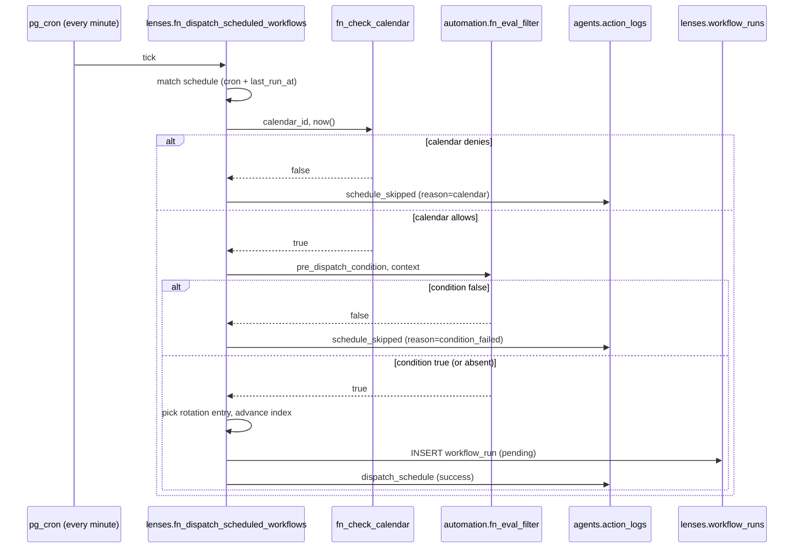

# Scheduling v2

CRON v2 keeps the existing minute-granularity dispatcher (see [Scheduling](/explanation/automation/scheduling)) and layers three additional primitives on top. None of them replace the cron expression; they each gate or shape what happens when the expression matches.

## What CRON v2 adds

- **Calendars** — date overlays that skip a tick (`skip_dates`) or only allow listed dates (`only_dates`).
- **Conditions** — a per-schedule pre-dispatch predicate, evaluated against runtime context using the frozen Phase U filter DSL.
- **Rotation** — round-robin selection from an array of input templates so successive ticks dispatch with different inputs.

## Tick lifecycle

Every minute, `pg_cron` calls the dispatcher. For each schedule whose cron expression matches the current minute, the guards run in a fixed order before any `workflow_run` is inserted.



A skip exits the loop iteration cleanly — nothing is inserted into `workflow_runs` and the schedule's `last_run_at` is not advanced (the next tick re-evaluates from scratch).

## Calendars

A calendar is a per-lenser overlay attached to one or more schedules. Two kinds:

| Kind | Semantics |
|---|---|
| `skip_dates` | If today is in `dates`, skip the tick. |
| `only_dates` | If today is **not** in `dates`, skip the tick. |

The "today" comparison uses the calendar's IANA `timezone` field, resolved at evaluation time — so `now()` is converted to the wall-clock date in that zone before checking membership. A schedule and its calendar can live in different timezones; the calendar timezone wins for date-membership.

### Built-in seeds

Three seed calendars ship with the migration. They are read-only — operators clone or build their own for any other window.

| Name | Kind | Timezone | Coverage |
|---|---|---|---|
| `us-federal-holidays-2026` | `skip_dates` | `America/New_York` | 11 US federal holidays (observed dates) |
| `tr-public-holidays-2026` | `skip_dates` | `Europe/Istanbul` | Turkish national + religious holidays |
| `weekends-only` | `only_dates` | `UTC` | Every Saturday and Sunday in 2026 |

Seeds are visible to all authenticated users (RLS opens read access when `is_seed=true`); writes are blocked by policy. Operators create their own calendars per-account through `lf schedule calendar create`.

## Conditions

A schedule's optional `pre_dispatch_condition` is evaluated by `automation.fn_eval_filter` — the same frozen DSL used by [trigger rules](/explanation/automation/event-bus-architecture#filter-dsl). The grammar is JSON-Pointer paths plus the five operators `eq | neq | gt | lt | contains`; multiple keys are combined with logical AND. See [`trigger-rule-schema`](/reference/automation/trigger-rule-schema) for the full reference.

The dispatcher builds a fresh context object per evaluation:

```json
{
  "prior_run_result": { "...": "..." },
  "last_24h_stats": {
    "succeeded": 3,
    "failed": 1,
    "total": 4
  },
  "signal_rpc_result": null
}
```

| Field | Source |
|---|---|
| `prior_run_result` | `metadata.result` from the most recent `lenses.workflow_runs` row for this workflow (any trigger). `NULL` if no prior run exists. |
| `last_24h_stats.succeeded` | Count of `workflow_runs` with `status='completed'` for this workflow in the last 24 h. |
| `last_24h_stats.failed` | Count of `workflow_runs` with `status='failed'` in the last 24 h. |
| `last_24h_stats.total` | Total count of `workflow_runs` in the last 24 h (any status). |
| `signal_rpc_result` | Reserved hard-`NULL` extension hook. Operators may patch the context builder to call an external KPI RPC and merge results here; today the dispatcher always passes `NULL`. |

If the filter throws (malformed condition, unsupported operator), the dispatcher fails closed — the tick is skipped and logged as `condition_failed`.

```yaml
# Example: only dispatch when the prior run succeeded and the 24h failure count is low.
pre_dispatch_condition:
  /prior_run_result/status:
    eq: "completed"
  /last_24h_stats/failed:
    lt: 3
```

## Rotation

When `inputs_rotation` is a non-empty JSON array, the dispatcher uses it instead of `inputs_template`:

- Index = `last_rotation_index % array_length`.
- The selected entry becomes the run's `context_inputs`.
- `last_rotation_index` is incremented **after** a successful dispatch — skips do not advance the counter.

```json
{
  "inputs_rotation": [
    { "audience": "tech",     "tone": "punchy" },
    { "audience": "business", "tone": "measured" },
    { "audience": "research", "tone": "neutral" }
  ]
}
```

Three ticks in a row with the array above produce three runs with the three audience/tone combinations, in order; the fourth tick wraps back to index 0. Clearing rotation (`lf schedule rotation clear`) resets the array and the index together.

## Observability

- **Dry-run preview.** `lf schedule preview <id>` calls `lenses.fn_preview_schedule_ticks(schedule_id, n)` and walks forward minute-by-minute, returning each upcoming tick with `decision ∈ {dispatch, skip}` and `reason`. It does not mutate the rotation index — preview shows what *would* happen if the schedule fired right now.
- **Historical skips.** Every skip writes one row to `agents.action_logs` with `action_type='schedule_skipped'` and `payload.reason ∈ {'calendar', 'condition_failed', 'budget_exceeded', 'overlap_in_flight', 'cycle_detected', 'schedule_slot_exists'}`. The two new reasons land alongside the pre-existing ones.
- **Dispatch metadata.** Successful rotation dispatches add `rotation_index_used` to the `dispatch_schedule` action log so the picked entry is auditable.

## Limits

- **Preview window.** The minute-walk is capped at `~31 days` ahead and `200` results, whichever comes first. Larger windows would need a real cron parser; today the function reuses `fn_cron_matches_now` as the oracle.
- **Minute precision.** `pg_cron` granularity is unchanged — there is no per-second precision and no push mode in CRON v2.
- **Snapshot context.** Preview computes `prior_run_result` and `last_24h_stats` once and reuses them for every tick. It is a snapshot, not a simulation — preview cannot show how a condition would change after a hypothetical dispatch.
- **Calendar mutation.** Seed calendars are read-only and cannot be detached after attach without a new calendar replacement (`detach` clears the FK, then `attach` rebinds).

## Related

- [Scheduling](/explanation/automation/scheduling) — base cron, timezone handling, conflict policies, missed-run behaviour.
- [Event Bus Architecture](/explanation/automation/event-bus-architecture#filter-dsl) — the filter DSL reused here.
- [Trigger rule schema](/reference/automation/trigger-rule-schema) — full DSL reference.
- [`lf schedule` CLI](/reference/cli/schedule) — command reference, including the v2 subcommands.
