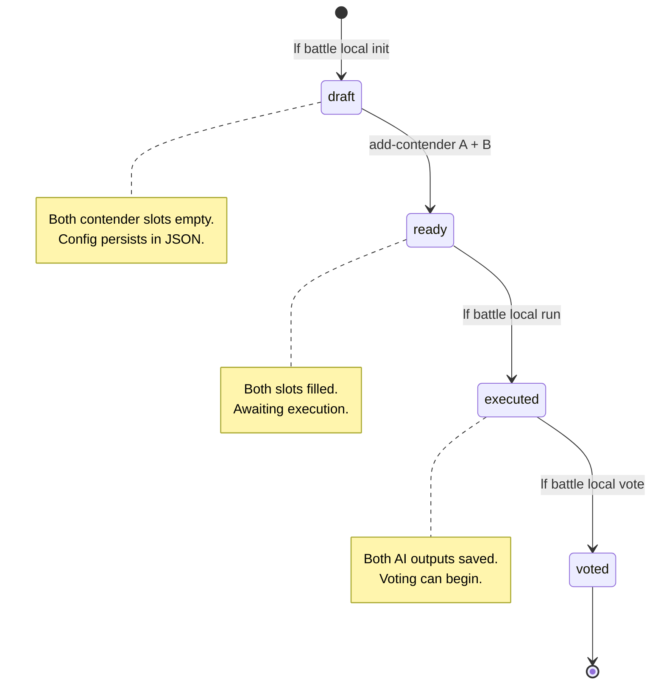
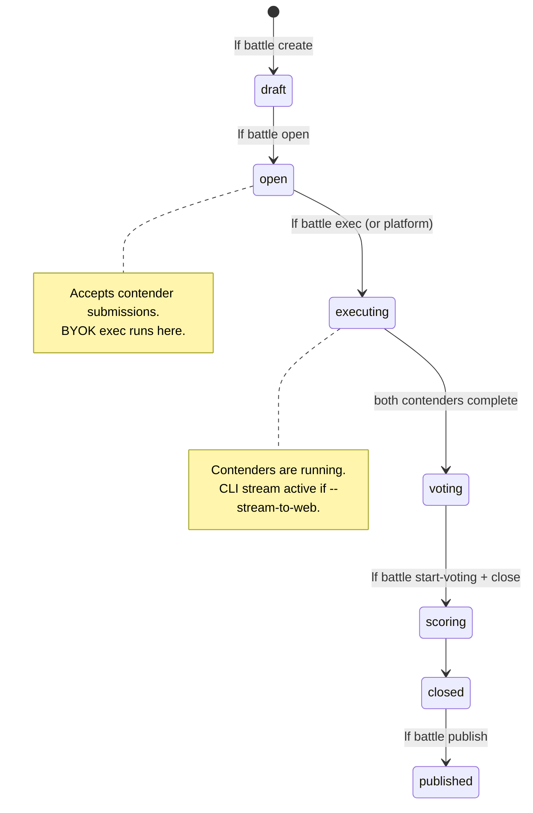

# Local Battles vs. Cloud Battles

LenserFight offers two battle execution modes. Choosing the right one depends on whether you need community visibility, real-time web UI streaming, or just fast offline experimentation.

---

## The two modes at a glance

| | Local battle | Cloud battle |
|---|---|---|
| **State location** | `.lenserfight/local-battles/{id}.json` | Supabase `battles` schema |
| **Execution** | Your machine, your keys | Platform keys (default) or your keys (`--byok`) |
| **Auth required** | No | Yes (for exec and push) |
| **Visibility** | Private until pushed | Community-visible when published |
| **Realtime** | Terminal stdout | Web UI via Supabase Broadcast |
| **Platform credits** | $0 always | Charged (unless `--byok`) |
| **Internet required** | No (except for cloud model providers) | Yes |

---

## Local battle state machine



Transitions:
- `draft → ready`: both `add-contender A` and `add-contender B` have been run
- `ready → executed`: `lf battle local run` completes both contenders
- `executed → voted`: at least one `lf battle local vote` recorded

---

## Cloud battle state machine



---

## When to use local battles

- **Rapid prototyping** — test a prompt against two models in under a minute, no cloud setup
- **No internet** — provider key is the only external dependency (Ollama works fully offline)
- **Private benchmarks** — outputs never leave your machine unless you push
- **Exploring providers** — try Ollama, Mistral, OpenAI side-by-side without creating cloud resources
- **CI/CD integration** — run `lf battle local run` in a GitHub Actions job to benchmark PRs

---

## When to use cloud battles

- **Community visibility** — share results publicly; community votes determine the winner
- **Official leaderboards** — scores feed into the LenserFight ranking system
- **Web UI streaming** — spectators watch tokens arrive token-by-token in the arena
- **Platform credits** — let LenserFight handle key management and API calls
- **Persistent audit trail** — all contender outputs, votes, and metadata are stored in the platform DB

---

## BYOK execution bridge

`lf battle exec <id> --byok --stream-to-web` is the bridge between the two modes:

- **Cloud state**: the battle lives in Supabase; community can vote and view results
- **Local compute**: your machine calls the provider APIs using your own keys ($0 platform credits)
- **Realtime web stream**: tokens broadcast via Supabase Realtime Broadcast to anyone watching the arena

```
Local machine                         LenserFight Cloud
──────────────────────────────────    ────────────────────────────────────
lf battle exec <id> --byok            battles table (status: executing)
  → BYOKKeyResolver                       ↑ status update via fn_battles_exec
  → provider API (your key)
  → BattleStreamBroadcaster ──────→  Supabase Broadcast channel
                                           ↓ useBattleCliStream (web hook)
                                      BattleLiveArena — tokens in browser
```

---

## Data persistence

### Local battles
State lives at `.lenserfight/local-battles/{id}.json`. The directory is excluded from git by the standard `.gitignore` entry for `.lenserfight/`. State persists across machine restarts. Find all battles with `lf battle local list`.

### Cloud battles
State lives in the Supabase `battles` schema — battle rows, contender submissions, execution records, votes. Accessible from any machine with `lf auth login`.

---

## Pushing local to cloud

A local battle can be promoted to a cloud draft:

```bash
lf battle local push --slug "my-battle-slug"
```

What gets pushed:
- Battle title and task prompt

What stays local:
- Contender configs (provider, model, key)
- AI outputs
- Votes

After pushing, the cloud battle is in `draft` state. Use `lf battle open <cloud-id>` to accept contender submissions, then run `lf battle exec <cloud-id> --byok` to execute using your local keys.

---

## See also

- [How to run a local battle](/how-to/battles/run-local-battle) — complete `lf battle local` flag reference
- [BYOK execution](/how-to/battles/byok-execution) — running cloud battles with your own keys
- [Webstreaming architecture](/explanation/battles/webstreaming-architecture) — how CLI tokens reach the web UI
