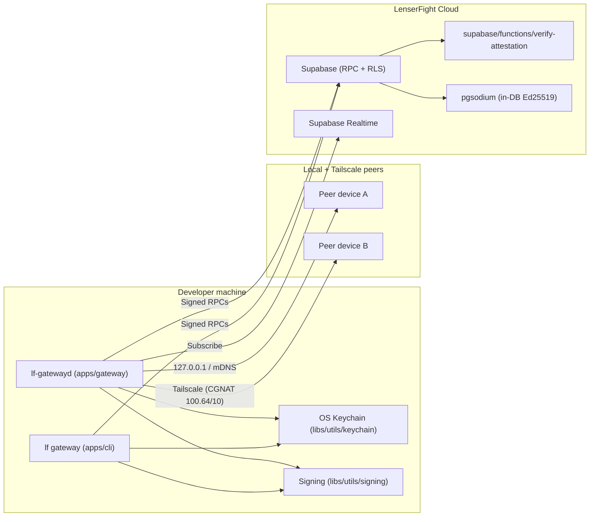
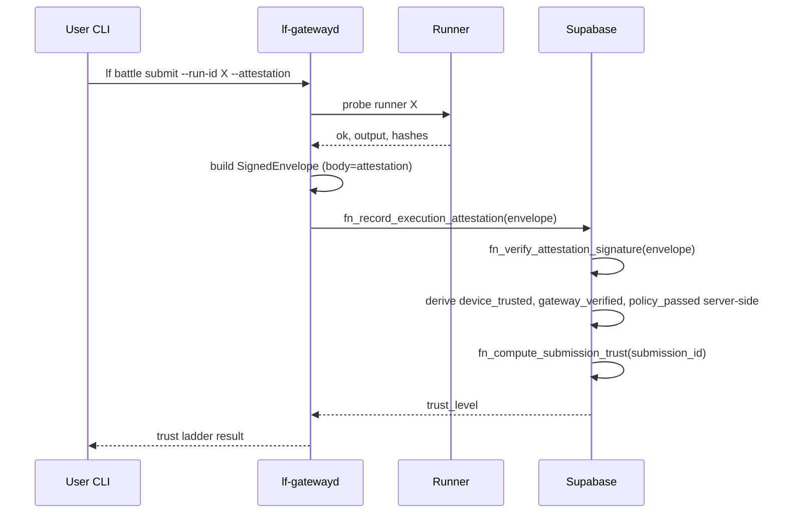

# Gateway Architecture

The LTG is a **layered, additive** evolution of `lf gateway`. Nothing in the existing CLI is removed; new capabilities live alongside in new libs and a new app.

## Component map

## Apps

| App | Role |
|-----|------|
| [`apps/cli`](../../../apps/cli) | Existing `lf gateway` command tree. Preserves all current behavior. Adds new subcommands that delegate to libs. |
| [`apps/gateway`](../../../apps/gateway) | NEW. Long-running daemon. Holds the active Ed25519 key, signs envelopes, runs sync loops, hosts loopback (and optional Tailscale) HTTP/WS server. |
| [`apps/web`](../../../apps/web) | Existing web app. Uses [`libs/features/devices`](../../../libs/features) to display peers, approve devices, surface conflicts. |

## Libs

| Lib | Layer | Role |
|-----|-------|------|
| [`libs/types/src/lib/gateway.types.ts`](../../../libs/types/src/lib/gateway.types.ts) | `types` | `SignedEnvelope`, `DeviceIdentity`, `SyncEnvelope`, `PeerRole`, object class enums. |
| [`libs/utils/signing`](../../../libs/utils/signing) | `utils` | Pure Ed25519 sign/verify, JCS canonicalization (RFC 8785), nonce generator, replay-window helpers. No DOM. |
| [`libs/utils/keychain`](../../../libs/utils/keychain) | `utils` | OS keychain abstraction over `keytar` (macOS Keychain / libsecret / Windows Credential Manager). Lazy import. File-fallback for CI only. |
| [`libs/infra/gateway`](../../../libs/infra/gateway) | `infra` | Sync engine, outbox runner, conflict resolver, leader election, Tailscale interface detector. |
| [`libs/data/repositories/gateway*`](../../../libs/data/repositories) | `data` | `deviceRepository`, `runnerBindingRepository`, `attestationRepository`, `syncRepository`. Thin wrappers over RPC. |
| [`libs/features/devices`](../../../libs/features) | `feature` | Web UI for approve / peers / sync / conflict resolution. |

## Supabase

| Schema | New / changed |
|--------|---------------|
| `devices` | Adds `public_key`, `signing_algo`, `last_heartbeat_at`, `daemon_version`. New tables: `sync_outbox`, `sync_watermarks`, `nonce_cache`, `device_challenges`, `peer_leases`. |
| `execution` | New `runners` and `runner_adapters` table reconciliation; tightened RLS on `attestations` and `trust_evaluations`. |
| `audit` | Extends `hash_chains` with `chain_kind = 'gateway'`. |
| `xp` | No schema change. New triggers/RPCs invoke `xp.apply` only after server-verified attestation. |

Edge functions: `supabase/functions/verify-attestation/` provides Ed25519 verification when in-DB `pgsodium` is unavailable.

## Data flow — happy path battle submission

The CLI is never trusted to set `gateway_verified = true`. The daemon is never trusted with `service_role`.

## Where each concern lives

- **Identity** — `libs/utils/keychain` + `libs/utils/signing` + `apps/gateway` (orchestration only). Private key never enters `libs/data` or `apps/cli`.
- **Routing (provider/model catalog)** — preserved in [`apps/cli/src/commands/gateway.ts`](../../../apps/cli/src/commands/gateway.ts) (`gateway models`). Unchanged.
- **Sync** — `libs/infra/gateway/src/lib/sync-engine.ts` + DB tables. Daemon owns the loop; CLI exposes `lf gateway sync`.
- **Trust evaluation** — Postgres RPCs only. The client never derives trust.
- **Audit** — `audit.hash_chains`, queried via `libs/data/repositories/auditRepository`.

## Compatibility

- All existing `fn_device_*`, `fn_runner_*`, `fn_record_execution_attestation`, `fn_compute_submission_trust`, and `fn_get_submission_trust` RPCs keep their signatures.
- New RPCs are introduced alongside; old ones are wrapped in deprecation comments only after Phase F flips the verification gate.
- The single existing reference to Tailscale / private-network IP space ([`libs/utils/dom/src/lib/authReturnUrl.ts`](../../../libs/utils/dom/src/lib/authReturnUrl.ts)) becomes formalized in the daemon.
