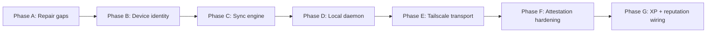

# Rollout Roadmap

The LTG is delivered across seven phases, each with explicit migrations, libs, apps, and acceptance criteria. Phases are strictly additive until Phase F, when client-supplied trust booleans are server-overwritten.

## Phase A — Repair gaps

**Theme:** Make the existing surface internally consistent before adding new behavior.

| Item | Files |
|------|-------|
| Author missing `fn_runner_register` and `fn_runner_probe` | `supabase/migrations/*_fn_runner_register_and_probe.sql` |
| Tighten `execution.attestations` and `execution.trust_evaluations` RLS | new migration |
| Reconcile `execution.links` referenced by `fn_battles_submit` | new migration |
| Reconcile `runner_paused` vs `agent_paused` | migration + code rename |
| Fix Eslint layer drift (`layer:feature` → `layer:providers`) | [`eslint.config.js`](../../../eslint.config.js) |

**Acceptance:**

- `apps/cli/src/commands/runner.ts` calls succeed against a fresh DB. (No `function_does_not_exist`.)
- `lf inspect submission <id>` shows trust info only when caller owns the submission.
- `nx run-many -t lint` passes without layer-violation warnings.

## Phase B — Device identity

**Theme:** Per-device Ed25519 identity and OS keychain residency.

| Item | Files |
|------|-------|
| Add `public_key`, `signing_algo`, `last_heartbeat_at`, `daemon_version` columns | `supabase/migrations/*_device_identity_and_heartbeat.sql` |
| `libs/utils/signing` (Ed25519 + JCS + nonce) | `libs/utils/signing/**` |
| `libs/utils/keychain` (keytar wrapper, lazy import) | `libs/utils/keychain/**` |
| `libs/types/src/lib/gateway.types.ts` (envelopes, identity) | `libs/types/src/lib/gateway.types.ts` |
| `fn_device_register_with_key`, `fn_device_post_challenge`, `fn_device_heartbeat` | new RPCs |
| Two-step approve in `lf gateway approve-device` | [`apps/cli/src/commands/gateway.ts`](../../../apps/cli/src/commands/gateway.ts) |

**Acceptance:**

- A device can register with a public key, post a challenge, and be approved.
- Cross-Lenser approval is rejected.
- Heartbeats updating `last_heartbeat_at` are verifiable in the DB.

## Phase C — Sync engine

**Theme:** Outbox + watermarks + nonce cache + repository wrappers.

| Item | Files |
|------|-------|
| `devices.sync_outbox`, `devices.sync_watermarks`, `devices.nonce_cache` | `supabase/migrations/*_sync_outbox_and_watermarks.sql` |
| `fn_sync_push`, `fn_sync_pull`, `fn_sync_status`, `fn_sync_resolve_conflict` | same migration |
| `libs/data/repositories/gateway*.ts` | new |
| `libs/infra/gateway/src/lib/sync-engine.ts` | new |
| `libs/infra/gateway/src/lib/object-classes.ts` (per-class authority + merge) | new |

**Acceptance:**

- Outbox pushes succeed; pulls advance watermarks atomically.
- Nonce replay returns `nonce_replay`.
- Local-only class push attempt returns `local_only_class`.
- Cloud-authoritative class push attempt returns `cloud_authoritative`.

## Phase D — Local daemon

**Theme:** Long-running daemon process with loopback HTTP/WS, mDNS, and leader election.

| Item | Files |
|------|-------|
| `apps/gateway/` Nx Node app (`@nx/node:application`) | `apps/gateway/**` |
| `lf-gatewayd` long-running binary | `apps/gateway/src/main.ts` |
| `lf-gateway-init` one-shot bootstrapper | `apps/gateway/src/init.ts` |
| Loopback HTTP/WS server | `apps/gateway/src/server.ts` |
| Heartbeat / outbox / pull / lease loops | `apps/gateway/src/loops/**` |
| Leader election table `devices.peer_leases` and `fn_acquire_leader_lease` | new migration |
| `lf gateway serve`, `doctor`, `identity`, `peers`, `sync`, `policy` subcommands | [`apps/cli/src/commands/gateway.ts`](../../../apps/cli/src/commands/gateway.ts) |

**Acceptance:**

- Daemon starts only when all preconditions pass.
- `lf gateway doctor` exit code is non-zero on any failed precondition.
- Two daemons under one Lenser elect a single leader and never both flush the outbox.

## Phase E — Tailscale transport

**Theme:** Opt-in private-network bind with strict transport ≠ authn separation.

| Item | Files |
|------|-------|
| `libs/infra/gateway/src/lib/tailscale-detector.ts` | new |
| `lf gateway serve --tailscale` flag | `apps/cli/src/commands/gateway.ts` |
| `lf gateway doctor --check transport` | same |

**Acceptance:**

- Tailscale interface auto-detected by CIDR `100.64.0.0/10`.
- Bind without `--tailscale` rejects Tailscale traffic.
- A Tailscale peer without a valid signed envelope is rejected.

## Phase F — Attestation hardening

**Theme:** Server-verified signatures replace client-trusted booleans.

| Item | Files |
|------|-------|
| `execution.fn_verify_attestation_signature` (uses `pgsodium`) | [`supabase/migrations/20270512700000_phase_f_attestation_verification.sql`](../../../supabase/migrations/20270512700000_phase_f_attestation_verification.sql) |
| `execution.fn_record_signed_attestation` + public wrapper | same migration |
| Side table `execution.attestation_verifications` (append-only RLS) | same migration |
| `fn_compute_submission_trust` requires `attestation_verifications.verified=true` for `execution_verified+` | same migration |
| `gatewayAttestationRepository.recordSignedAttestation` port | [`libs/data/repositories/src/lib/repositories/gatewayAttestationRepository.ts`](../../../libs/data/repositories/src/lib/repositories/gatewayAttestationRepository.ts) |

**Acceptance:**

- An attestation with a forged signature is rejected (verified=false, invalid_reason='signature_invalid').
- A submission cannot reach `execution_verified` unless `attestation_verifications.verified = true`.
- Existing pre-Phase-F attestations are conservatively backfilled as `unsigned_legacy_attestation`.
- `pgsodium` absence yields `pgsodium_unavailable` and trust stays capped — never silently elevated.

## Phase G — XP + reputation wiring

**Theme:** Mint XP for new platform/battle rules only after server-verified attestations.

| Item | Files |
|------|-------|
| `execution.fn_xp_apply_safe` wrapper (no rule -> NOTICE, never aborts) | [`supabase/migrations/20270512800000_phase_g_xp_triggers.sql`](../../../supabase/migrations/20270512800000_phase_g_xp_triggers.sql) |
| Trigger `xp_on_device_registered` → `DEVICE_REGISTERED` | same migration |
| Trigger `xp_on_device_trust_elevated` → `DEVICE_VERIFIED` | same migration |
| Trigger `xp_on_runner_bound` → `RUNNER_CONNECTED` | same migration |
| Trigger `xp_on_full_trust` → `VERIFIED_LOCAL_EXECUTION_COMPLETED` | same migration |
| Trigger `xp_on_submission_evaluated` → `BATTLE_SUBMISSION_COMPLETED` | same migration |
| `audit.hash_chains` extended with `chain_kind='gateway'` + per-Lenser sub-chain | [`supabase/migrations/20270512900000_phase_g_audit_hash_chain_gateway.sql`](../../../supabase/migrations/20270512900000_phase_g_audit_hash_chain_gateway.sql) |
| `audit.fn_chain_verify(p_lenser_id, 'gateway')` for incident response | same migration |

**Acceptance:**

- `BATTLE_SUBMISSION_COMPLETED` mints on the *first* trust evaluation per submission (not on re-evaluations).
- `VERIFIED_LOCAL_EXECUTION_COMPLETED` mints only when `trust_level` transitions to `fully_trusted` (i.e. signature verified server-side).
- Device registrations and trust elevations append to `audit.hash_chains` with `chain_kind='gateway'`.
- `audit.fn_chain_verify` returns `ok=true` on a healthy chain and identifies the first break otherwise.
- A failed `xp.apply` is logged via `RAISE NOTICE` and does NOT roll back the trust state mutation.

## Cross-cutting acceptance criteria

- Every new RPC ships with: `SECURITY DEFINER`, `SET search_path`, explicit `GRANT EXECUTE`, RLS policies on touched tables, append-only triggers where appropriate.
- `lf gateway doctor` exit code is non-zero on any failed precondition.
- No client may set `gateway_verified = true` directly.
- `service_role` is never present in `apps/gateway/` or `apps/cli/` runtime config.
- Every phase ships behind a feature flag where appropriate; rollback is achievable by disabling the flag and reverting migrations in dependency order.

## Out of scope (per RFC)

- E2E encryption between peers beyond TLS-on-loopback / WireGuard.
- Cross-Lenser federation.
- Replacing Supabase Realtime.
- Public battles enablement (still gated by [`docs/reference/platform-api/beta-roadmap.md`](../../reference/platform-api/beta-roadmap.md)).
