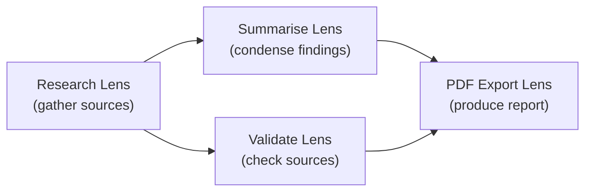

# Workflow Concepts

A **Workflow** in LenserFight is a directed acyclic graph (DAG) of **Lens** invocations connected by **typed edges**. Each node in the graph is one Lens call. Edges carry the output of one Lens into the input of another.

Workflows let you compose simple Lenses into powerful, multi-step pipelines without writing application code.

## Core building blocks

| Concept | What it is |
|---------|-----------|
| **Lens** | A versioned prompt template with typed input and output contracts |
| **Node** | A single Lens invocation inside a Workflow, with its own config overrides |
| **Edge** | A connection from a source node's output key to a target node's parameter |
| **Run** | One execution of a Workflow with a specific set of root inputs |
| **Node Result** | The output, status, and timing of a single node within a run |
| **Artifact (Ray)** | A durable output produced by a Lens run, stored in the media layer |

## The DAG model

Workflows are DAGs — directed and acyclic. This means:

- **Directed**: data flows in one direction (no feedback loops)
- **Acyclic**: no node can appear on a path that leads back to itself

The engine enforces acyclicity at save time. Any edit that would introduce a cycle is rejected.



In this example, nodes B and C both depend on A and can run in parallel. Node D depends on both B and C and runs after both complete.

## Nodes

A node wraps a specific Lens version and adds:

- **Config overrides** — temperature, timeout, retry policy, moderation settings
- **Failure policy** — how to handle an upstream failure (`skip`, `propagate`, `substitute_default`)
- **Merge strategy** — how to combine multiple incoming edges for the same parameter

```bash
# Add a node to an existing workflow
lf workflow node add <workflow-slug> \
  --lens my-research-lens \
  --version latest

# Update a node's config
lf workflow node update <workflow-slug> <node-id> \
  --timeout 60000 \
  --retry-attempts 3
```

## Edges

An edge maps a **source output key** to a **target parameter label**. The engine uses this mapping to thread data through the DAG.

| Edge field | Meaning |
|-----------|---------|
| `source_node_id` | Which node produces the value |
| `source_output_key` | Which key in that node's output envelope to read |
| `target_node_id` | Which node receives the value |
| `target_param_label` | Which parameter slot on the target lens to fill |
| `merge_strategy` | What to do if multiple edges target the same parameter |

```bash
# Connect two nodes
lf workflow edge add <workflow-slug> \
  --from <source-node-id>:output \
  --to <target-node-id>:input_text
```

## Root inputs and parameters

When you run a Workflow, you provide **root inputs** — values for parameters that have no incoming edges. These act as the starting data for the pipeline.

Each Lens node can declare parameters that must be satisfied either by:
1. An incoming edge from an upstream node
2. A root input provided at run time
3. A default value defined in the Lens version

## Runs and results

A **run** is one execution of a Workflow. It has:

- A status: `pending`, `running`, `completed`, `failed`, `cancelled`
- An `idempotency_key` derived from `(workflow_id, rootInputsHash)` — duplicate runs with identical inputs are deduplicated
- A budget envelope that caps token and compute spend

Runs produce **node results** — one per node, storing the output envelope, status, token usage, and timing. Node results are also the source for **Artifacts (Rays)** — durable media objects stored in the platform.

## Execution order: topological waves

The engine executes nodes in **topological waves**:

1. Find all nodes with zero unmet dependencies → **Wave 1**
2. Execute Wave 1 nodes in parallel (`Promise.all`)
3. Mark their dependents' in-degrees as satisfied
4. Repeat until all nodes are done or a failure stops the run

This means independent branches always run in parallel. Dependent nodes wait for all their inputs.

## Failure policies

Each node declares how it behaves when an upstream node fails:

| Policy | What happens |
|--------|-------------|
| `skip` (default) | Node is skipped; downstream nodes inherit the skip |
| `propagate` | Node is marked failed with `error_message: "upstream_failure"` |
| `substitute_default` | Missing values are replaced with empty string (legacy) |

## Related

- [Open Source Workflows](/explanation/workflows/open-source-workflows) — Architecture, lens kinds, and the 25-task matrix
- [Workflow Types](/explanation/workflows/workflow-types) — Sequential, parallel, conditional, and scheduled workflows
- [Execution Engine Reference](/reference/workflows/execution-engine) — Low-level execution specification
- [Build a Lens Chain](/how-to/workflows/build-a-lens-chain) — Hands-on guide to building your first workflow
