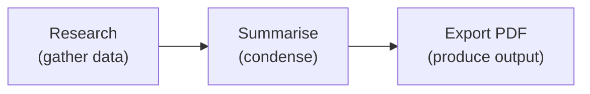
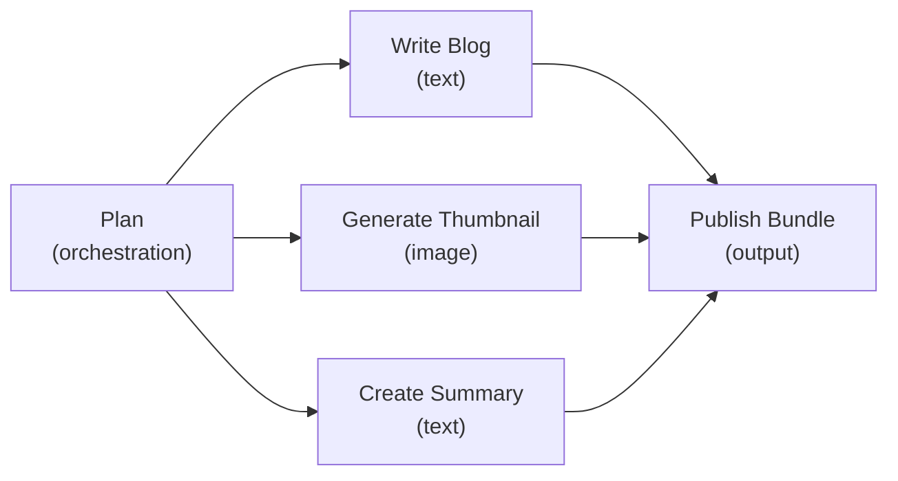
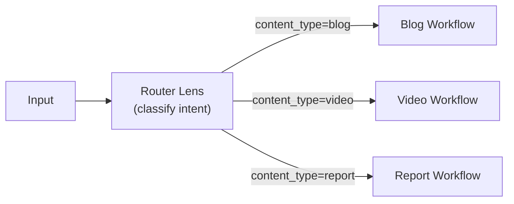
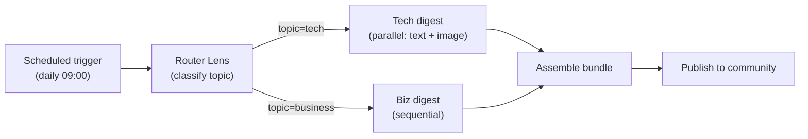

# Workflow Types

LenserFight Workflows are built on a DAG execution engine that supports a range of composition patterns. The four primary patterns are: **sequential**, **parallel**, **conditional**, and **scheduled**. These patterns can be freely combined within a single Workflow.

## Sequential Workflows

A sequential Workflow is the simplest pattern: Node B runs after Node A completes, and Node C runs after Node B completes. Data flows forward through a single chain.



**When to use**: Tasks that have a strict ordering — each step depends on the full output of the previous step.

**Examples**:
- Research → write article → translate
- Gather data → validate → format → publish

```bash
lf workflow create --name "research-to-pdf"
# Add nodes in order, connect with edges
lf workflow node add research-to-pdf --lens research-lens
lf workflow node add research-to-pdf --lens summarise-lens
lf workflow edge add research-to-pdf --from node-1:output --to node-2:input_text
```

## Parallel Workflows

A parallel Workflow splits into two or more independent branches that run at the same time. A final node (or merge node) collects their outputs.



**When to use**: Independent tasks that do not depend on each other's outputs — running them in parallel reduces total wall-clock time.

**Examples**:
- Generate blog post, thumbnail, and social caption simultaneously
- Run three validation lenses on the same input in parallel
- Produce text, image, and audio from the same brief at the same time

The engine runs all nodes with zero unmet dependencies in the same wave using `Promise.all`. No special configuration is needed — the parallelism emerges from the DAG structure.

## Conditional Workflows

A conditional Workflow uses a **routing Lens** (kind: `routing`) to classify input and select a downstream branch. The routing lens outputs a JSON decision, and downstream nodes use that decision to determine which path to take.



**When to use**: Tasks where the correct next step depends on the nature of the input — you don't know in advance which branch to take.

**Examples**:
- Route a user request to text, image, or video generation based on intent
- Classify content moderation severity and route to the appropriate review flow
- Detect language and route to the correct localization Lens

```bash
# A routing lens outputs a JSON decision object
# Downstream nodes reference fields from that object to decide whether to run
lf lens create --kind routing --name "content-router"
```

> **Note:** Conditional branching in LenserFight uses the `routing` lens kind combined with `on_parent_failure: skip` on branches that should not run. Full conditional gate primitives are on the roadmap.

## Scheduled Workflows

A scheduled Workflow runs automatically on a **cron expression** rather than being triggered manually. The platform's scheduler creates a new run at each scheduled time, passing in a default set of root inputs.

```bash
# Schedule a workflow to run every weekday at 09:00 UTC
lf schedule create \
  --workflow "daily-digest" \
  --cron "0 9 * * 1-5" \
  --timezone "UTC"

# List all active schedules
lf schedule list

# Pause a schedule without deleting it
lf schedule pause <schedule-id>

# Resume a paused schedule
lf schedule resume <schedule-id>
```

**When to use**: Recurring tasks that should run without manual intervention on a time-based trigger.

**Examples**:
- Generate a daily news digest every morning
- Produce a weekly performance report every Monday
- Run nightly content moderation sweeps

Scheduled runs behave identically to manual runs: they produce node results, artifacts, and run history. They can be monitored, retried, and cancelled in the same way.

## Combining patterns

All four patterns can be combined in a single Workflow. A common real-world example:



This Workflow is:
- **Scheduled** (runs daily)
- **Conditional** (router picks the branch)
- **Parallel** (tech branch generates text and image simultaneously)
- **Sequential** (business branch runs steps one at a time)

## Related

- [Workflow Concepts](/explanation/workflows/workflow-concepts) — DAG model, nodes, edges, and runs
- [Open Source Workflows](/explanation/workflows/open-source-workflows) — Architecture and the 25-task matrix
- [Build a Lens Chain](/how-to/workflows/build-a-lens-chain) — Hands-on guide
- [Create a Workflow](/tutorials/walkthroughs/create-a-workflow) — Beginner walkthrough
