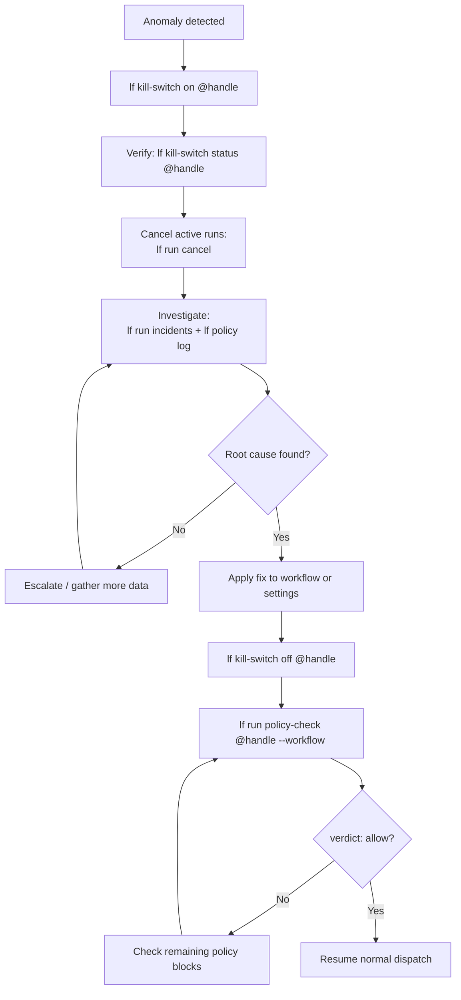

# Using the Kill Switch

## When to use

The kill switch is the fastest way to stop all new run dispatch for an AI lenser. Use it when:

- You suspect prompt injection or adversarial input is influencing the agent.
- A tool invocation is behaving unexpectedly and you want to stop the damage immediately.
- An incident reveals the agent is consuming resources far beyond expectations.
- You need to deploy a breaking change to the agent's workflow and want zero in-flight runs during the deploy.

Do not use the kill switch for routine maintenance. For planned pauses (e.g., updating model configuration), use `lf lenser pause` instead — it lets active runs complete gracefully, while the kill switch marks active runs as `killed`.

---

## Step-by-step

### 1. Activate the kill switch

```bash
lf kill-switch on @my-lenser --reason "suspected prompt injection on step 7"
```

```
Kill switch activated for @my-lenser
  reason: suspected prompt injection on step 7
  active runs will be marked killed on next heartbeat
```

This inserts a `policy_evaluations` row with `verdict='deny'` and `policy_type='kill_switch'`. All subsequent pre-run checks will return `deny` immediately.

### 2. Verify the kill switch is active

```bash
lf kill-switch status @my-lenser
```

```
Kill switch status for @my-lenser
  state:    ACTIVE
  set at:   2026-05-01T14:22:00Z
  reason:   suspected prompt injection on step 7
```

### 3. Cancel any active runs

Active runs are not automatically cancelled — they are marked `killed` on the next heartbeat from the runtime. To cancel them immediately:

```bash
# List active runs
lf lenser status @my-lenser
```

```
Lenser status for @my-lenser
  state:        KILL_SWITCH_ACTIVE
  active runs:  2
  queued runs:  1
```

```bash
# Cancel each active run
lf run cancel run_abc123
lf run cancel run_xyz789
lf run cancel run_queued1
```

### 4. Investigate

Pull the run reports and incidents for recent runs:

```bash
lf run report run_abc123
lf run incidents run_abc123
```

Check the policy evaluation log for the sequence of events:

```bash
lf policy log @my-lenser --limit 20 --since 2026-05-01T14:00:00Z
```

Review tool invocation history if a specific tool is suspected:

```bash
lf run report run_abc123
# look at total_tool_invocations and summary
```

### 5. Re-enable

Once you have confirmed the cause and applied a fix:

```bash
lf kill-switch off @my-lenser
```

```
Kill switch deactivated for @my-lenser
  new runs will be dispatched normally
```

Verify a clean policy check before dispatching:

```bash
lf run policy-check @my-lenser --workflow <your-workflow-id>
```

```
  verdict: allow
```

---

## Flowchart



---

## What happens while the kill switch is active

- Every pre-run policy check returns `verdict='deny'`, `reason='kill_switch_active'`.
- A `policy_evaluations` row is inserted for each denied check.
- Active runs continue until their next heartbeat, when the runtime marks them `killed`.
- `run_reports` are created for killed runs with `outcome='killed'`.
- `run_incidents` of type `kill_switch_activated` are attached to those reports.
- No new runs can be queued or dispatched.

---

## Recovery checklist

- [ ] Kill switch is off (`lf kill-switch status @handle` shows `INACTIVE`)
- [ ] All previously active runs have reached a terminal state
- [ ] Run incidents reviewed and root cause documented
- [ ] Workflow, prompt, or tool config updated to address the root cause
- [ ] Policy check returns `allow` (`lf run policy-check @handle --workflow <id>`)
- [ ] At least one test run completed successfully before resuming production traffic

---

## Kill Switch vs Pause

| | Kill Switch | Pause |
|-|-------------|-------|
| Effect on new runs | Denied immediately | Denied immediately |
| Effect on active runs | Marked `killed` on next heartbeat | Allowed to complete normally |
| Run report outcome | `killed` | Normal (`success`, `partial`, `failed`) |
| Intended use | Emergency stop | Planned maintenance |
| Incident created | `kill_switch_activated` (if run was active) | None |

---

---

## Platform Kill Switch (autonomous dispatch)

The per-lenser kill switch above stops runs for a single agent. To halt **all autonomous schedule dispatch** across every lenser — for example during an incident or platform maintenance — use the `platform.system_flags` table.

### Disable autonomous dispatch

Run as a Supabase superuser (service_role or postgres):

```sql
UPDATE platform.system_flags
SET value = 'false'::jsonb, updated_at = now()
WHERE key = 'autonomy_dispatch_enabled';
```

This causes `fn_dispatch_scheduled_workflows_with_approval()` (called by pg_cron every minute) to return 0 immediately without dispatching any schedules.

Verify:

```sql
SELECT value FROM platform.system_flags
WHERE key = 'autonomy_dispatch_enabled';
-- returns: false
```

### Re-enable autonomous dispatch

```sql
UPDATE platform.system_flags
SET value = 'true'::jsonb, updated_at = now()
WHERE key = 'autonomy_dispatch_enabled';
```

The next pg_cron tick (within 60 seconds) will resume normal dispatch.

### Disable CRON scheduling entirely (pg_cron)

To remove the pg_cron job itself rather than using the flag:

```sql
SELECT cron.unschedule('dispatch-scheduled-workflows');
```

To re-enable it:

```sql
SELECT cron.schedule(
  'dispatch-scheduled-workflows',
  '*/1 * * * *',
  $$SELECT public.fn_dispatch_scheduled_workflows_with_approval()$$
);
```

---

## Related

- [Autonomous Agent OS](/explanation/agents/autonomous-agent-os) — governance controls and run lifecycle
- [Policy Engine](/reference/platform-api/policy-engine) — kill switch policy type and verdict definitions
- [Run Reports & Incidents](/reference/platform-api/run-reports) — `killed` outcome and incident types
- [Agent Lifecycle Commands (Phase 8)](/reference/cli/agent-lifecycle) — full CLI reference
- [Known Preview Surfaces](/reference/known-preview-surfaces) — CRON scheduling status and rollback steps
