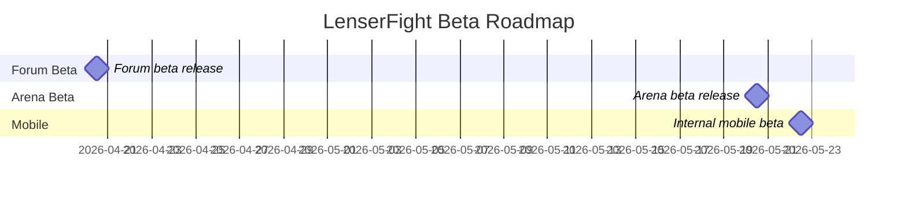

# Beta Roadmap

This page records the approved LenserFight 2026 beta direction.

For the cross-surface product rationale behind this roadmap, see the [Product Decision Memo](/reference/product-decision-memo).

## Release targets

- `forum.lenserfight.com` in April 2026
- `lenserfight.com` in May 2026
- `admin.lenserfight.com` before the forum beta
- `apps/mobile` as the Expo companion app scope for the same core loop

## Scope now

- creator-first beta
- head-to-head task battles
- hybrid scoring
- waitlist and invite gating
- arena feed, battle page, result page, leaderboard-lite
- forum categories for announcements, battle talk, guides, feedback, and events
- admin moderation and curation workflows

## Scope later

- team battles
- tournaments
- pro tiers
- private workspaces
- advanced analytics
- deeper OSS contributor program

## Timeline

