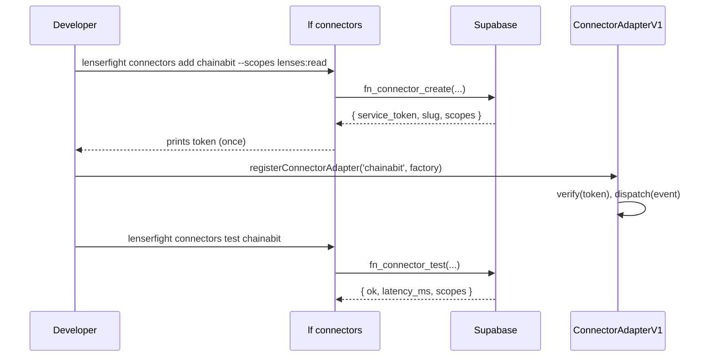

# Connectors Reference

The connector SDK lets external systems integrate with LenserFight: register adapters, dispatch events, and verify scoped service tokens. The interface ships in **alpha** under `@lenserfight/adapters/connector` and is locked to the v1 grammar via [RFC-0001](/rfcs/RFC-0001-connector-interface).

## Quick links

- [Adapter Interface](adapter-interface.md) — `ConnectorAdapterV1` shape and lifecycle.
- [Token Scopes](scopes.md) — the v1 scope grammar (additive-only).
- [CLI: `lf connectors`](/reference/cli/connectors) — register, view, rotate, test connectors.
- [Build an adapter](/how-to/integrations/build-an-adapter) — quickstart for new integrations.
- [Chainabit example](/how-to/integrations/chainabit-example) — runnable reference walkthrough.

## Lifecycle

## Stability

The interface is marked `@experimental`. Phase 16 promotes it to v1 with a stable export from `@lenserfight/sdk`. Until then:

- **Additive changes** (new optional fields, new helper functions) may land in minor releases.
- **Breaking changes** require an RFC + bump of the versioned symbol (`ConnectorAdapterV2`).
- Pin to the versioned symbol (`ConnectorAdapterV1`) if you want to opt out of any future default-alias migration.

## Source

- Library: [`libs/adapters/connector`](https://github.com/connectlens/lenserfight-web/tree/main/libs/adapters/connector)
- Contract types: [`libs/api/contracts`](https://github.com/connectlens/lenserfight-web/tree/main/libs/api/contracts)
- Reference example: [`examples/connectors/chainabit-example`](https://github.com/connectlens/lenserfight-web/tree/main/examples/connectors/chainabit-example)
