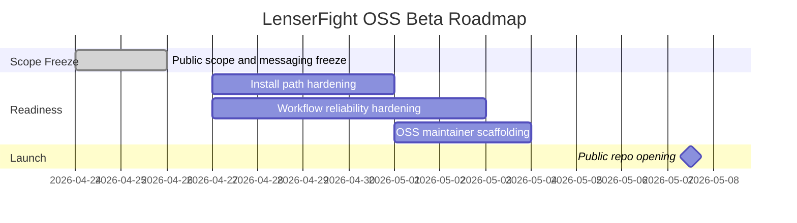

# Beta Roadmap

This page records the approved LenserFight Community Edition beta direction for the public repo.

## Release target

- public OSS beta window ending **May 7, 2026**

## Scope now

- developer-first Community Edition
- local installability and truthful docs
- lenses and workflow authoring
- supported workflow execution paths
- workflow retry, stop, and observability hardening
- minimal OSS maintainer operations

## Explicitly out of scope for this OSS beta

- public battles
- benchmark UI as a public promise
- enterprise billing or private workspaces
- advanced analytics
- autonomous connector automation claims

## Scope later

- connector RFC and first stable public connector example
- better workflow templates and recovery UX
- contributor onboarding cleanup
- community governance basics
- sponsorships after support operations stabilize

## Timeline

