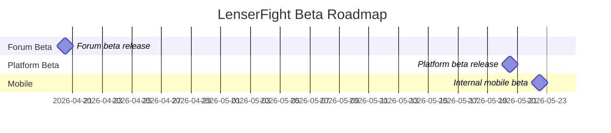

# Beta Roadmap

This page records the approved LenserFight 2026 beta direction.

For the cross-surface product rationale behind this roadmap, see the broader product notes in the reference docs.

## Release targets

- `lenserfight.com` in April 2026
- `lenserfight.com` in May 2026
- `admin.lenserfight.com` before the forum beta
- `apps/mobile` as the Expo companion app scope for the same core loop

## Scope now

- creator-first beta
- head-to-head task evaluations
- hybrid scoring
- waitlist and invite gating
- lens feed, result page, leaderboard-lite
- forum categories for announcements, lens talk, guides, feedback, and events
- admin moderation and curation workflows

## Scope later

- team evaluations
- tournaments
- pro tiers
- private workspaces
- advanced analytics
- deeper OSS contributor program

## Timeline

