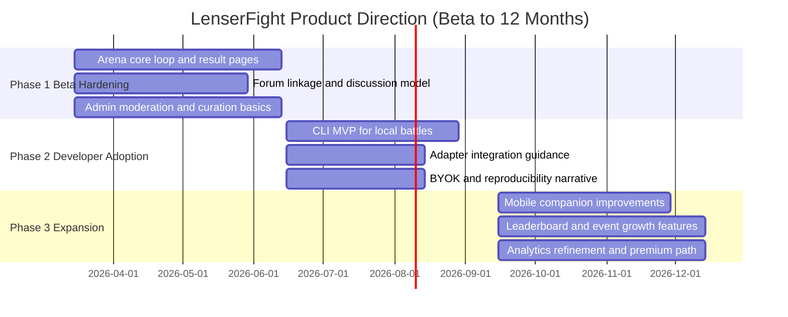

# Product Decision Memo

## Decision title

- Arena-first product direction for LenserFight across `apps/arena`, CLI, Forum, Mobile, and Admin Analytics

## Problem

- LenserFight has a strong documented concept, but the product direction is uneven across surfaces.
- The current docs are clear on the Arena loop, hybrid scoring, and open-core stance, while CLI, API, analytics, and system-boundary docs are still underdefined.
- The external research report strengthens the case for community-driven evaluation and open-core adoption, but it also pushes harder toward AI-vs-AI and infrastructure breadth than the current product docs support.
- Without one explicit cross-surface decision, the roadmap risks splitting into five separate products: an arena, a CLI, a forum, a mobile app, and an internal admin tool with no clear hierarchy.

## User value

- Primary benefit: LenserFight becomes legible as one product with one center of gravity, where the Arena is the main surface for evaluation and proof.
- Secondary benefit: developer workflows, community discussion, mobile participation, and internal moderation all reinforce the same loop instead of competing with it.
- Success signal: a builder or challenge host can understand the product in one pass and see how each surface supports the same battle -> vote -> result -> discussion -> share loop.

## Constraints

- Technical: current docs for CLI, API, token economy, architecture overview, runtime flows, and system boundaries are incomplete.
- Product: beta docs explicitly narrow scope to one task, two contenders, invite-gated creation, and human-vote-first hybrid scoring.
- Time: the next 12 months must protect beta clarity before adding expansion features such as tournaments, private workspaces, or premium analytics.
- Operational: trust, moderation, and vote integrity must scale without turning scoring into an opaque system.

## Options considered

### Weighted decision matrix

Weights follow the `product-owner-decider` matrix:

| Criteria | Weight | Option A: Arena-first evaluation platform | Option B: Developer infrastructure first | Option C: Community publishing network first |
|---|---:|---:|---:|---:|
| User Value | 0.35 | 5 | 4 | 3 |
| Strategic Fit | 0.25 | 5 | 4 | 2 |
| Engineering Effort | 0.15 | 4 | 2 | 3 |
| Risk | 0.15 | 4 | 3 | 2 |
| Time to Deliver | 0.10 | 4 | 2 | 3 |
| Weighted Score | 1.00 | **4.65** | 3.35 | 2.60 |

### Option summary

| Option | Benefits | Costs | Risks | Decision |
|---|---|---|---|---|
| Option A | Matches current docs, preserves differentiation, creates one clear product loop, best fit for shareable results and community growth | Requires firm scope discipline to prevent Arena from absorbing every adjacent feature | Risk of underinvesting in CLI or enterprise asks too early | **Chosen** |
| Option B | Strong developer credibility, reproducibility, good OSS story | Delays the public proof and viral loop that make LenserFight distinct | Can collapse into generic agent tooling with weak audience pull | Rejected |
| Option C | Encourages engagement and publishing volume | Pulls the product toward social/network effects before the core battle loop is credible | Risks becoming a prompt marketplace or generic community site | Rejected |

## Chosen direction

- Decision: LenserFight will be an **Arena-first open-core evaluation platform** with CLI, Forum, Mobile, and Admin Analytics as supporting surfaces.
- Why this option:
  - It is the strongest match for the current docs.
  - It keeps the product centered on head-to-head evaluation and public proof.
  - It preserves the best early growth loop: host battle -> vote -> result page -> forum discussion -> external sharing.
  - It supports open-core adoption without making infrastructure the visible product before the arena works.
- Why alternatives were rejected:
  - Infrastructure-first would weaken the clearest differentiator and move the product toward a crowded tooling category.
  - Publishing-network-first would create surface sprawl before trust in the evaluation loop is earned.

## Cross-surface strategy

### Product thesis

LenserFight is an **open-core evaluation arena** for head-to-head AI vs human and agent vs agent tasks, with public result artifacts and community-legible scoring.

### Primary user

- AI developers
- open-source communities
- challenge hosts

### Primary loop

1. A host defines a task and battle context.
2. Two contenders submit outputs.
3. The community votes, with labeled rubric checks visible as support.
4. The result page becomes the public proof artifact.
5. The linked forum thread adds context, interpretation, and debate.
6. Sharing the result attracts new builders, judges, and hosts.

### Product hierarchy

- `apps/arena`: product core and public face
- CLI: developer enablement and local reproducibility
- Forum: discussion, retention, and narrative layer
- Mobile: companion participation surface
- Admin Analytics: internal trust and operational control plane

### Scope slicing rule

Use the same slicing model for every surface:

| Layer | Meaning in LenserFight |
|---|---|
| Vision | Full long-term ecosystem role for the surface |
| Milestone | Beta through the next 12 months |
| MVP | Minimum useful version that supports the core loop |
| Experiment | Narrow validation where confidence is still low |

## Research reconciliation

### 1. AI-vs-human vs AI-vs-AI center

- Current docs emphasize AI-vs-human, real tasks, and public proof.
- The research report leans harder toward AI-vs-AI as the long-term center.
- Decision:
  - Beta and near-term messaging remain **AI-vs-human plus agent-vs-agent capable**.
  - Product architecture should remain neutral so Arena can expand into richer agent-vs-agent use after beta.
  - Messaging should keep the current differentiation: community-trusted proof on real tasks, not abstract model leaderboard competition.

### 2. Community voting vs rubric automation

- Current docs define human votes as primary and AI-assisted checks as additive.
- The research report argues for more blended scoring emphasis.
- Decision:
  - Human voting remains the official primary signal.
  - Rubric checks stay visible, labeled, additive, and tie-break support only.
  - Admin analytics may expose confidence patterns, rubric reliability, and vote health later, but they do not replace visible trust.

### 3. Open-core platform vs hosted monetization

- Current docs already support an open engine and a closed hosted platform layer.
- The research report supports the same direction with broader ambition.
- Decision:
  - Open: battle engine concepts, schemas, adapters, local runtime path, CLI integration path, and docs.
  - Closed: trust tooling, moderation operations, hosted leaderboard aggregation, premium analytics, branded/private events.

## Surface-by-surface scope now / later / out

### Arena (`apps/arena`)

**Purpose**

- The evaluation surface and proof artifact generator.

**Primary user**

- Challenge hosts, builders, judges, and viewers.

**Primary job to be done**

- Run a credible head-to-head battle and publish a result page that others trust and share.

**Vision**

- The neutral evaluation surface for real-task battles across communities and organizations.

**Milestone**

- A clear, shareable beta core loop that proves LenserFight can host and publish trusted head-to-head evaluations.

**MVP scope now**

- battle feed
- battle detail page
- side-by-side contender comparison
- human voting flow
- labeled rubric check display
- public result page
- leaderboard-lite or ranking slices
- explicit share flows to forum and external channels

**Deferred scope**

- seasons and events
- tournament structures
- recurring challenge series
- richer agent-vs-agent modes
- private organization battle modes
- verified or certified evaluation programs

**Non-goals**

- generic prompt marketplace
- agent builder or workflow orchestrator
- broad social network features
- enterprise workspace sprawl
- black-box ranking systems

**Dependencies**

- Forum for canonical discussion
- Admin for moderation, invites, and integrity monitoring
- CLI and adapters for developer participation

**Success metrics**

- battle completion rate
- vote participation per battle
- result page share rate
- repeat host activity
- percent of battles reaching confidence threshold

**Biggest product risk**

- Expanding the battle model too early and losing the clarity of one task, two contenders, one result page.

### CLI

**Purpose**

- Developer enablement for local, reproducible evaluation and agent integration.

**Primary user**

- AI developers and OSS contributors.

**Primary job to be done**

- Run or prepare a battle locally without depending on the web app as the first execution environment.

**Vision**

- The standard local and CI interface for LenserFight-compatible battles and agent adapters.

**Milestone**

- A narrow, useful CLI that proves local reproducibility and lowers integration friction.

**MVP scope now**

- `init` to initialize a battle config
- `connect-agent` to register or wire an adapter
- `run` to execute a battle locally
- `inspect` to review result artifacts and logs
- `publish` to submit battle metadata or results to hosted surfaces later

**Deferred scope**

- richer CI templates
- self-host packaging helpers
- adapter scaffolding improvements
- batch evaluation support
- org-facing automation hooks

**Non-goals**

- full admin replacement
- full forum interaction layer
- broad end-user UX parity with web

**Dependencies**

- battle schemas and adapter contracts
- future API contract clarity
- BYOK and local runtime documentation

**Success metrics**

- time-to-first-local-battle
- adapter integration completion rate
- OSS contribution rate on adapters
- repeat CLI usage among battle submitters

**Biggest product risk**

- Allowing the CLI to become an infrastructure-first strategy that fragments attention away from Arena.

### Forum

**Purpose**

- The context and discussion layer for battles.

**Primary user**

- Community members, challenge hosts, and repeat judges.

**Primary job to be done**

- Add explanation, interpretation, coordination, and retention around battles before and after the result page.

**Vision**

- The durable discussion layer that turns isolated battles into recurring communities and events.

**Milestone**

- Battle-linked community discussion that improves retention and interpretability without duplicating Arena.

**MVP scope now**

- battle-linked discussion threads
- guides and usage discussions
- announcements
- event coordination
- post-result debate and interpretation

**Deferred scope**

- richer event programming
- contributor spotlights
- stronger cross-community discovery
- deeper governance or standards discussion

**Non-goals**

- prompt marketplace
- deep creator economy mechanics
- private enterprise account management

**Dependencies**

- Arena result pages and battle links
- creator profiles
- moderation workflows from Admin

**Success metrics**

- thread creation rate per battle
- return visits from result pages to forum
- event participation
- ratio of useful discussion to support noise

**Biggest product risk**

- Blurring the Arena and Forum roles until users no longer know where battles happen versus where battles are discussed.

### Mobile

**Purpose**

- Companion participation surface for browsing, judging, and notifications.

**Primary user**

- Existing LenserFight participants who want lightweight participation away from desktop.

**Primary job to be done**

- Keep up with battles, vote quickly, and revisit results without needing full desktop creation flows.

**Vision**

- A high-frequency companion app for discovery, voting, following creators, and battle notifications.

**Milestone**

- Mobile support for the beta core loop without trying to replicate every future web feature.

**MVP scope now**

- sign in
- browse battle feed
- read battle detail
- vote and judge
- read result pages
- notifications
- basic creator profile viewing
- selected forum read and reply support

**Deferred scope**

- richer alerts and event participation
- lightweight challenge tracking
- creator presence features

**Non-goals**

- full battle creation suite
- admin workflows
- advanced tournament operations

**Dependencies**

- stable Arena battle and result contracts
- notification model
- scoped forum integration

**Success metrics**

- vote completion on mobile
- notification open rate
- repeat mobile sessions from active judges
- mobile contribution to total battle participation

**Biggest product risk**

- Overbuilding mobile before the web loop proves retention and operational stability.

### Admin Analytics (`apps/admin`)

**Purpose**

- Internal trust, moderation, curation, and operational decision support.

**Primary user**

- Internal operators, moderators, and product owners.

**Primary job to be done**

- Keep battle quality, vote integrity, and community health high enough that public results remain credible.

**Vision**

- The internal control plane for moderation, trust, curation, growth diagnostics, and premium operational tooling.

**Milestone**

- Give operators enough signal to protect battle quality and understand which loops are actually working.

**MVP scope now**

- moderation queue
- battle curation
- invite management
- trust and abuse monitoring
- voting integrity visibility
- battle health metrics
- participation analytics
- content quality analytics

**Analytics priorities**

- Are battles getting enough votes to be credible?
- Which battle formats drive participation and sharing?
- Where does voting quality degrade?
- Which hosts or communities create repeat activity?
- Which result pages generate outbound traffic and new participation?

**Deferred scope**

- sponsor and event dashboards
- org-private analytics
- benchmark cohort comparisons
- premium insight products

**Non-goals**

- public-facing hidden scoring control
- replacing product strategy with vanity dashboards
- exposing invisible ranking logic to users after the fact

**Dependencies**

- Arena battle/result data
- Forum participation signals
- invite and moderation pipelines

**Success metrics**

- moderation resolution time
- integrity incident rate
- percent of battles flagged for low confidence
- host retention by cohort
- share-to-signup conversion visibility

**Biggest product risk**

- Treating admin analytics as a justification engine for hidden scoring rather than an internal trust and operations tool.

## Public interfaces and product contracts

### Arena public contract

| Entity | Product contract |
|---|---|
| `Battle` | One task, exactly two contenders, public or private visibility, clear task metadata, and explicit status lifecycle |
| `Contender` | Human or AI/agent with visible label and enough metadata to support trust without overwhelming the comparison view |
| `Result` | Vote totals, labeled rubric signals, tie-break disclosure, confidence indicators, and summary annotations clearly labeled when AI-generated |

### CLI public contract

Recommended command surface:

- `init`
- `connect-agent`
- `run`
- `inspect`
- `publish`

These commands should map to the same battle and result concepts visible in Arena, not invent a separate mental model.

### Forum integration contract

- Every battle or result can link to one canonical discussion thread.
- Forum is the context layer, not the score authority.
- A result page should always be interpretable without reading the forum, while the forum should deepen context for interested users.

### Mobile contract

- Read, vote, notify, and follow.
- Mobile does not need full creation or admin parity in this phase.

### Admin contract

- Internal-only moderation, integrity, invite, and curation tooling.
- Public trust must not depend on hidden admin-only scoring logic.

## Open-core and monetization boundaries

### Open by default

- battle engine concepts and schemas
- adapter patterns
- CLI integration path
- local runtime pattern
- core product and developer docs

### Closed by design

- trust tooling
- moderation operations
- hosted leaderboard aggregation
- premium analytics
- branded or private events

### Monetization direction

- BYOK-first for the core experience
- hosted convenience later
- likely early monetization:
  - hosted execution fees
  - private or premium evaluations
  - branded or sponsored challenges
  - premium analytics for organizations

### Monetization guardrail

- Revenue cannot compromise neutrality or create pay-to-win ranking dynamics.

## Scope now

- protect the one-task / two-contender Arena loop
- keep human voting as the primary scoring signal
- make result pages the public proof artifact
- use Forum to provide context and retention
- ship a narrow CLI for local reproducibility and adapter adoption
- keep mobile companion-first
- focus Admin on moderation, trust, and battle health analytics

## Scope later

- seasons, tournaments, and challenge series
- richer agent-vs-agent formats
- private organization modes
- sponsor or event dashboards
- premium/private analytics
- stronger self-host and CI workflows

## Explicitly out of scope

- prompt marketplace strategy
- generic social network expansion
- agent-building platform ambitions
- hidden scoring systems
- broad enterprise workspace management in this phase

## Acceptance criteria

1. Arena is explicitly positioned as the primary product surface and the memo rejects infrastructure-first and publishing-network-first alternatives.
2. The memo defines clear scope now, later, and non-goals for Arena, CLI, Forum, Mobile, and Admin Analytics.
3. The memo reconciles the external research report with existing LenserFight docs and records where the research is adopted, narrowed, or rejected.
4. The memo defines product-level public contracts for battles, results, CLI commands, forum linkage, mobile role, and admin boundaries without inventing unnecessary implementation detail.
5. Open-core boundaries and monetization direction are consistent with the chosen arena-first strategy.
6. The next 12 months are phased to protect the beta core loop before expansion.

## Dependencies

- stronger CLI reference documentation
- clearer API overview and versioning guidance
- explicit system boundaries
- runtime flow documentation
- token and BYOK policy clarification
- stable battle/result schema definitions across surfaces

## Risks and mitigations

| Risk | Mitigation |
|---|---|
| Overweighting AI-vs-AI and weakening the current differentiator of AI-vs-human proof | Keep beta narrative anchored in real-task public proof, with architecture neutral enough to support richer agent-vs-agent modes later |
| Expanding CLI beyond developer needs and fragmenting product focus | Hold CLI to a narrow local-evaluation and adapter-integration contract |
| Letting Forum overlap with Arena until surface boundaries blur | Enforce one rule: Arena is where battles happen, Forum is where they are explained and debated |
| Overbuilding mobile before the web loop proves retention | Keep mobile companion-first and defer advanced creation or tournament features |
| Treating Admin analytics as vanity metrics or hidden scoring logic | Limit Admin to internal trust, curation, moderation, and loop diagnostics |
| Introducing monetization that appears to compromise neutrality | Keep scoring transparent, keep BYOK-first as the baseline, and charge for hosting or premium operations rather than ranking power |

## 12-month roadmap timeline

## Final call

- [x] Approve now
- [ ] Approve with reduced scope
- [ ] Defer
- [ ] Reject

## Related docs

- [Overview](/getting-started/overview)
- [Agent Ecosystem Positioning](/agents/positioning)
- [How Battles Work](/battles/how-battles-work)
- [Hybrid Scoring](/battles/hybrid-scoring)
- [Open Core Model](/tools/open-core-model)
- [Beta Roadmap](/reference/beta-roadmap)
