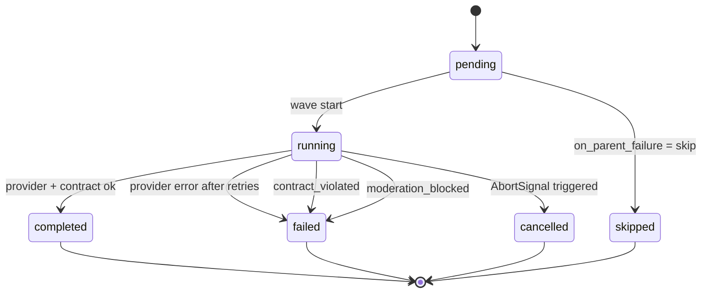

# Workflow Execution Engine

This page is the authoritative specification of `WorkflowExecutionService` in [`libs/infra/execution/src/lib/workflow-execution.service.ts`](../../../libs/infra/execution/src/lib/workflow-execution.service.ts).

## Scope

The engine consumes a validated DAG of `WorkflowNode` + `WorkflowEdge` plus a `WorkflowExecutionContext` and returns a finalised set of `workflow_node_results`. It is intentionally **pure**: side effects (DB writes, moderation, storage) are injected as callbacks or gateways.

## Input types

```ts
interface WorkflowNode {
  id: string
  lens_id: string
  version_id: string | null
  label: string | null
  ordinal: number
  config: WorkflowNodeConfig
}

interface WorkflowEdge {
  id: string
  source_node_id: string
  target_node_id: string
  source_output_key: string         // default 'output'
  target_param_label: string
  merge_strategy?: MergeStrategy    // optional override; falls back to target node's config.merge
}

interface WorkflowExecutionContext {
  getLensTemplate(lensId: string, versionId: string | null): Promise<string>
  getVersionContracts(versionId: string): Promise<{ input: LensInputContract | null; output: LensOutputContract | null }>
  updateNodeResult(nodeId: string, patch: Partial<WorkflowNodeResultRecord>): Promise<void>
  onPartialOutput?(nodeId: string, partial: { text: string }): void
  moderation?: ModerationGateway
  signal?: AbortSignal
  rootInputs: Record<string, unknown>
}
```

## Algorithm

1. **Cycle detection.** Run Kahn against `edges`. If the processed count is less than `nodes.length`, throw `CycleDetected` and abort before any side effect.
2. **In-degree map.** Build `indegree[nodeId] = number of incoming edges`.
3. **Initial wave.** Any node with `indegree === 0` is scheduled.
4. **Wave execution.** For each wave:
   a. Build each node's rendered inputs by resolving `rootInputs` and upstream `results`. Apply the target node's merge strategy when two or more edges share a `target_param_label`.
   b. Validate inputs against `input_contract` — on failure, mark `failed` with `error_message: "input_contract_violation"`.
   c. Call `moderation.check('input')` if `config.moderation ∈ {'input','both'}`.
   d. Call the provider via `IExecutionProvider.execute` (or `IStreamingExecutionProvider.stream` when available) under `Promise.race(provider, timeout(config.timeout_ms))`, cancelled by `ctx.signal`.
   e. Call `moderation.check('output')` if `config.moderation ∈ {'output','both'}`.
   f. Validate output against `output_contract`. If validation fails, either retry or mark `failed` with `error_message: "output_contract_violation"` depending on `config.retry.retry_on`.
   g. Persist the envelope via `updateNodeResult`. Stream partials via `onPartialOutput` when the provider supports it.
5. **Next wave.** After all wave members settle, decrement the in-degree of each dependent. A dependent becomes runnable when its in-degree hits zero **and** its own `on_parent_failure` policy permits running given the aggregated parent statuses.
6. **Termination.** When no runnable nodes remain, compute the run-level status:
   - `completed` if every terminal leaf is `completed` or `skipped`,
   - `cancelled` if any node is `cancelled` and none are `failed`,
   - `failed` otherwise.

## Node status lifecycle



## Failure propagation policy

Each node's `config.on_parent_failure` controls what happens when any upstream parent is `failed` or `cancelled`:

| Value | Behaviour |
|-------|-----------|
| `skip` | Node becomes `skipped`. Its dependents see a parent status of `skipped` and follow their own policy. |
| `propagate` | Node becomes `failed` with `error_message: "upstream_failure"` and no provider call is made. |
| `substitute_default` | Missing upstream substitutions default to `''`. Node runs as if the parent returned an empty string. This reproduces pre-hardening behaviour and should be used only for legacy compatibility. |

## Retry and backoff

Per-node:

```ts
config.retry = {
  attempts: number          // total attempts including the first; default 1 (no retry)
  backoff_ms: number        // base delay; default 500
  max_backoff_ms?: number   // cap; default 8000
  retry_on: RetryCause[]    // ['timeout', 'provider_error', 'rate_limit', 'contract_violated']
}
```

Backoff formula (jittered exponential):

```
delay = min(max_backoff_ms, backoff_ms * 2^(attempt - 1)) * (0.5 + Math.random() * 0.5)
```

Retries reset the `AbortController` subscription but respect the parent `ctx.signal` — if it aborts mid-retry, the node becomes `cancelled`.

## Timeout

`config.timeout_ms` wraps the provider call in `Promise.race`. Timeout is a retryable cause (`retry_on: ['timeout']`).

## Merge strategies

Merge strategy is resolved in this priority order for each inbound edge group:

1. The edge's own `merge_strategy` (if set).
2. The target node's `config.merge`.
3. Default `last_write_wins`.

| Strategy | Semantics |
|----------|-----------|
| `last_write_wins` | The last edge in `edges` array order replaces the value. Template sees a single string. |
| `concat` | All values joined with `\n\n` in edge-array order. |
| `array` | Values wrapped as `JSON.stringify(values)` and rendered into the template. |
| `json_object` | Values collected as `{ [sourceNodeLabel]: value }` and JSON-stringified. |

## Cancellation

- UI triggers `stopExecution` → `AbortController.abort()`.
- All in-flight `fetch` calls abort.
- Pending nodes never enter `running`; `markRemainingCancelled` sets their status to `cancelled`.
- Coordinated with `stopRun` which flips `workflow_runs.status = 'cancelled'`.

## Streaming

Providers that implement `IStreamingExecutionProvider`:

```ts
interface IStreamingExecutionProvider {
  stream(modelId: string, input: ExecutionInput, signal?: AbortSignal): AsyncIterable<StreamChunk>
}

type StreamChunk =
  | { type: 'partial'; text: string }
  | { type: 'media'; url: string; mime: string }
  | { type: 'final'; envelope: NodeOutputEnvelope }
```

The engine calls `onPartialOutput` on every `partial` chunk (throttled client-side) so `WorkflowProgressView` in [`libs/features/workflows/src/lib/components/WorkflowProgressView.tsx`](../../../libs/features/workflows/src/lib/components/WorkflowProgressView.tsx) can reflect live progress.

## Observability

Every status transition emits an `execution.execution_tags` row:

```sql
INSERT INTO execution.execution_tags (run_id, node_id, tag, metadata)
VALUES ($1, $2, $3, $4);
```

Canonical tags:

| Tag | Context metadata |
|-----|------------------|
| `node_started` | `{ attempt, wave }` |
| `node_retried` | `{ attempt, cause, delay_ms }` |
| `moderation_flagged` | `{ phase: 'input'|'output', policy }` |
| `contract_violated` | `{ phase, errors[] }` |
| `timed_out` | `{ timeout_ms }` |
| `node_failed` | `{ error_code, error_message }` |
| `node_completed` | `{ duration_ms, input_tokens, output_tokens }` |
| `node_cancelled` | `{}` |

## Idempotency

`workflow_runs` carries `idempotency_key` (Phase 6). The client derives it from `sha256(workflow_id || rootInputsCanonicalJson)` so that retrying the same submission does not double-charge or double-write.

## Related

- [Open Source Workflows](../../explanation/workflows/open-source-workflows.md)
- [Contract Schema](./contract-schema.md)
- [Test Plan](./test-plan.md)
