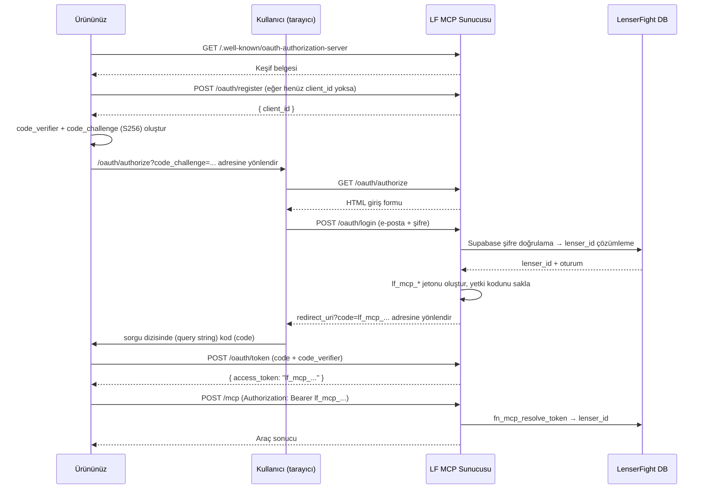

# OAuth ve Kimlik Doğrulama

Bu sayfa, LenserFight MCP sunucusunun desteklediği tüm kimlik doğrulama mekanizmalarını kapsamaktadır. Bunu bir kez doğru şekilde uyguladığınızda kullanıcılarınız tek bir tıklamayla yetkilendirme işlemini tamamlar — ürününüzde hiçbir kimlik bilgisi saklanmaz.

---

## Jeton (Token) türleri

| Jeton türü | Biçim | Ömrü | Ne zaman kullanılır? |
|---|---|---|---|
| **MCP jetonu** | `lf_mcp_<64 onaltılık>` | Uzun ömürlü (süresi dolmaz) | Standarttır. OAuth akışının sonunda verilir. Tüm üretim istekleri için kullanın. |
| **Supabase JWT** | Standart JWT | 1 saat (yapılandırılabilir) | Gelişmiş. Zaten kısa ömürlü bir Supabase oturum jetonunuz olduğunda kullanın. |
| **Service role anahtarı** | `service_role` hak talebine sahip Supabase JWT | Döndürülene (rotated) kadar kalıcı | Yalnızca stdio modunda. Üretim ortamında asla açığa çıkarmayın. Tüm RLS korumalarını atlar. |

Neredeyse tüm sağlayıcı entegrasyonları için yalnızca **MCP jetonlarını** kullanacaksınız.

---

## OAuth uç noktaları (OAuth endpoints)

Tüm uç noktalar, MCP sunucuyla aynı temel URL üzerinden sunulur:

```
https://mcp.lenserfight.com
```

| Uç nokta | Yöntem | Amaç |
|---|---|---|
| `/.well-known/oauth-authorization-server` | GET | RFC 8414 keşif belgesi |
| `/.well-known/oauth-protected-resource` | GET | RFC 9728 korunan kaynak meta verileri |
| `/oauth/register` | POST | RFC 7591 dinamik istemci kaydı |
| `/oauth/authorize` | GET | Yetkilendirme uç noktası — giriş formunu gösterir |
| `/oauth/token` | POST | Jeton uç noktası — yetkilendirme kodunu erişim jetonuyla değiştirir |

---

## Tam OAuth 2.1 PKCE Akışı

### Genel Bakış



---

### Adım 1 — Sunucuyu keşfedin (isteğe bağlı ancak önerilir)

```bash
curl https://mcp.lenserfight.com/.well-known/oauth-authorization-server
```

```json
{
  "issuer": "https://mcp.lenserfight.com",
  "authorization_endpoint": "https://mcp.lenserfight.com/oauth/authorize",
  "token_endpoint": "https://mcp.lenserfight.com/oauth/token",
  "registration_endpoint": "https://mcp.lenserfight.com/oauth/register",
  "response_types_supported": ["code"],
  "grant_types_supported": ["authorization_code"],
  "code_challenge_methods_supported": ["S256"],
  "token_endpoint_auth_methods_supported": ["none"]
}
```

Bunu ayrıştırın ve önbelleğe alın. Yolları sabit olarak kodlamak yerine uç nokta değerlerini kullanın — altyapı taşınırsa yollar değişebilir.

---

### Adım 2 — İstemcinizi kaydedin

> **LF Cloud notu:** Dinamik kayıt `https://mcp.lenserfight.com` üzerinden doğru şekilde çalışmaktadır — Cloudflare proxy, MCP sunucusunu etki alanı kökünde sunduğundan OAuth keşfi beklenen şekilde çözümlenir. Claude.ai bağlayıcısını eklerken Client ID alanını boş bırakabilirsiniz.

Bunu ürün başına bir kez (veya dağıtım başına bir kez) çalıştırın. `client_id` değerini kalıcı olarak kaydedin.

```http
POST https://mcp.lenserfight.com/oauth/register
Content-Type: application/json

{
  "client_name": "Acme AI Assistant",
  "redirect_uris": ["https://acme.example.com/api/mcp/callback"]
}
```

Yanıt:
```json
{
  "client_id": "lf_mcp_client_a1b2c3d4...",
  "client_name": "Acme AI Assistant",
  "redirect_uris": ["https://acme.example.com/api/mcp/callback"],
  "token_endpoint_auth_method": "none",
  "grant_types": ["authorization_code"],
  "response_types": ["code"]
}
```

> **Hiçbir istemci parolası (client secret) verilmez.** Sunucu yalnızca PKCE kullanır. `client_secret` alanı göndermeyin — yoksayılır.

Birden fazla yönlendirme URI'sine izin verilir. Her yetkilendirme isteği, kayıtlı URI'lerden biriyle tam olarak eşleşmelidir.

---

### Adım 3 — PKCE parametrelerini oluşturun

```typescript
import crypto from 'crypto'

// Kod doğrulayıcıyı (code verifier) oluştur (43–128 URL-safe karakter)
const codeVerifier = crypto.randomBytes(32).toString('base64url')

// Kod sınamasını (code challenge) türet (S256 = doğrulayıcının SHA-256 özeti, base64url kodlu)
const codeChallenge = crypto
  .createHash('sha256')
  .update(codeVerifier)
  .digest('base64url')
```

`codeVerifier` değerini sunucu tarafındaki oturumunuzda saklayın. Adım 5'te ihtiyacınız olacak.

---

### Adım 4 — Kullanıcıyı yetkilendirme uç noktasına yönlendirin

URL'yi oluşturun:

```
https://mcp.lenserfight.com/oauth/authorize
  ?response_type=code
  &client_id=lf_mcp_client_a1b2c3d4...
  &redirect_uri=https://acme.example.com/api/mcp/callback
  &code_challenge=<base64url_sha256_of_verifier>
  &code_challenge_method=S256
  &state=<random_csrf_token>
```

Sunucu bir giriş formu gösterir. Kullanıcı LenserFight kimlik bilgilerini girer.

> **Önemli:** Kullanıcıların yetkilendirme yapabilmesi için bir Lenser profiline (adresinde seçilmiş bir kullanıcı adı/kulp: [lenserfight.com](https://lenserfight.com)) sahip olması gerekir. Katılım adımlarını tamamlamamışlarsa, giriş formu bir hata döndürür.

---

### Adım 5 — Geri çağırmayı (callback) işleyin

Başarılı girişten sonra sunucu şuraya yönlendirir:

```
https://acme.example.com/api/mcp/callback?code=lf_mcp_abc123...&state=<your_state>
```

CSRF saldırılarını önlemek için **`state` değerinin Adım 4'te oluşturduğunuz değerle eşleştiğini her zaman doğrulayın**.

---

### Adım 6 — Kodu bir erişim jetonula değiştirin

```http
POST https://mcp.lenserfight.com/oauth/token
Content-Type: application/x-www-form-urlencoded

grant_type=authorization_code
&code=lf_mcp_abc123...
&redirect_uri=https://acme.example.com/api/mcp/callback
&client_id=lf_mcp_client_a1b2c3d4...
&code_verifier=<the_verifier_from_step_3>
```

Yanıt:
```json
{
  "access_token": "lf_mcp_abc123...",
  "token_type": "bearer"
}
```

> **Tasarım notu:** Yönlendirme geri çağırmasında döndürülen `code`, doğrudan `lf_mcp_*` taşıyıcı jetonunun kendisidir. `POST /oauth/token` isteğinde, kod zaten `lf_mcp_` ile başlıyorsa sunucu bunu doğrudan erişim jetonu olarak döndürür. Bu, jeton değişimi çağrısı localhost adresine erişemeyen bir bulut arka ucundan gelen istemcilerle (Claude.ai gibi) akışı uyumlu hale getirir — jeton, sunucular arası bir çağrıyla değil, tarayıcı yönlendirmesi yoluyla istemciye ulaşır.

---

### Adım 7 — MCP sunucusunu çağırın

Jetonu her isteğe ekleyin:

```http
POST https://mcp.lenserfight.com/mcp
Authorization: Bearer lf_mcp_abc123...
Content-Type: application/json
mcp-session-id: <your_session_id>

{
  "jsonrpc": "2.0",
  "id": 1,
  "method": "tools/call",
  "params": { "name": "lens_list", "arguments": { "limit": 5 } }
}
```

---

## İstek üst bilgileri referansı (Headers Reference)

| Üst Bilgi (Header) | Değer | Gerekli mi? |
|---|---|---|
| `Authorization` | `Bearer lf_mcp_<hex>` | Evet |
| `Content-Type` | `application/json` | Evet |
| `mcp-session-id` | Her konuşma oturumu için oluşturduğunuz rastgele dize | Önerilir |

`mcp-session-id` zorunlu değildir ancak çok adımlı oturumlar için performansı artırır. Eksik olduğunda sunucu her istek için yeni bir bellek içi oturum bağlamı oluşturur.

---

## Jeton yaşam döngüsü

MCP jetonları uzun ömürlüdür. Şu durumlar haricinde süreleri dolmaz:
- Kullanıcı, LenserFight ayarlarından entegrasyonu iptal ettiğinde.
- Bir LenserFight yöneticisi `lensers.mcp_tokens` tablosundan ilgili satırı sildiğinde.

Jeton yenileme (token refresh) uygulamanız gerekmez. Jetonu güvenli bir şekilde saklayın (örneğin veritabanınızda şifrelenmiş olarak) ve kullanıcının gelecekteki tüm çağrıları için yeniden kullanın.

---

## Bunun yerine Supabase JWT kullanma (gelişmiş)

Kullanıcı için zaten kısa ömürlü bir Supabase JWT'niz varsa (örneğin ürününüzdeki doğrudan Supabase kimlik doğrulama entegrasyonundan), bunu doğrudan kullanabilirsiniz:

```http
Authorization: Bearer <supabase_jwt>
```

Sunucu, bunu doğrulamak için `sb.auth.getUser(token)` işlevini çağırır, RPC aracılığıyla `lenser_id`yi çözer ve kullanıcı kapsamlı bir istemci oluşturur. Supabase JWT'lerinin süresi, proje için yapılandırılan oturum ömründen (varsayılan 1 saat) sonra dolar. Uzun ömürlü entegrasyonlar için bunun yerine MCP jetonlarını kullanın.

---

## Güvenlik hususları

- **MCP jetonlarını asla günlüğe kaydetmeyin (loglamayın).** Bunlar uzun ömürlüdür ve şifreye eşdeğerdir.
- CSRF saldırılarını önlemek için **geri çağırmada `state` değerini doğrulayın**.
- **Asla `client_secret` göndermeyin.** Sunucu yalnızca PKCE destekler; hiçbir parola yoktur.
- **Kullanıcı başına ürün başına tek jeton.** Bir kullanıcı ürününüzü birden fazla kez yetkilendirirse, her akış yeni bir jeton verir. Eski jetonlar iptal edilene kadar geçerli kalır.
- **Service role anahtarı tüm RLS korumalarını atlar.** Bunu yalnızca stdio modunda kullanın, üretim ortamında asla kullanmayın.

---

## Yeniden yetkilendirme

Bir jeton iptal edilirse veya `401` hatası döndürürse, kullanıcıyı tam OAuth akışına geri gönderin (Adım 3–7). Adım 2'deki `client_id` yeniden kullanılabilir — yeniden kaydolmanız gerekmez.
